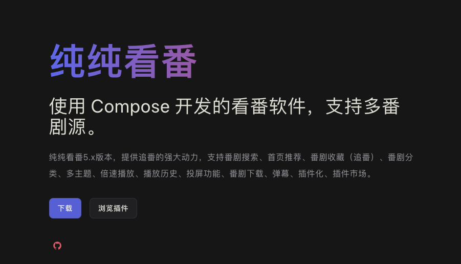

## 🌏好资源

纯纯看番

提供追番的强大动力，支持番剧搜索、首页推荐、番剧收藏（追番）、番剧分类、多主题、倍速播放、播放历史、投屏功能、番剧下载、弹幕、插件化、插件市场。

https://easybangumi.org/

 

learnopengl-cn

https://learnopengl-cn.github.io/

这里是LearnOpenGL教程的中文翻译，英文版的地址为：https://learnopengl.com/

从最基础最简单的知识开始学习OpenGL，个人认为是一份入门的资料。

## 🤡好玩的

SU7 网页的炫酷特效

前端技术采用`three.js`+`Shader`实现，可惜当前没公开源代码。不过看到有老哥实战复刻了。[🚪传送门](https://juejin.cn/post/7352762271003017252)

项目组织Github地址:[gamemcu](https://github.com/gamemcu)

https://gamemcu.com/su7/
 

 ## 📝记录

最近在学`CameraX`一直想计划用`OpenGL`+`CameraX`玩一些有趣的东西。正好看到`CameraX`内部的`OpenGlRenderer`也用到了`OpenGL`可以阅读学习借鉴一下。

 https://github.com/androidx/androidx/blob/androidx-main/camera/camera-core/src/main/java/androidx/camera/core/processing/OpenGlRenderer.java

