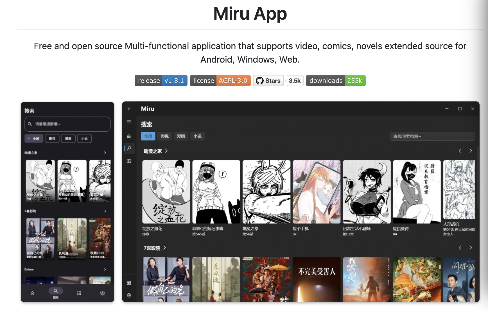

## 📖好文章 

* 📄[Kotlin Multiplatform 跨平台支持鸿蒙](https://juejin.cn/post/7379059228105621556)

* 📄[如何在工作中更好地写作？](https://juejin.cn/post/7399276698619510793)

## 📚好资源

**掘金AGI资源库**

https://km3dl0ffdl.feishu.cn/wiki/UvJPwhfkiitMzhkhEfycUnS9nAm

**miru-app**

https://github.com/miru-project/miru-app

免费，开源的 支持视频，漫画，小说扩展源的多功能应用，支持 Android，Windows，Web.

 

## 🔨好工具

**konachan**

 https://github.com/MiaoMint/Konachan

 一键换壁纸工具

  