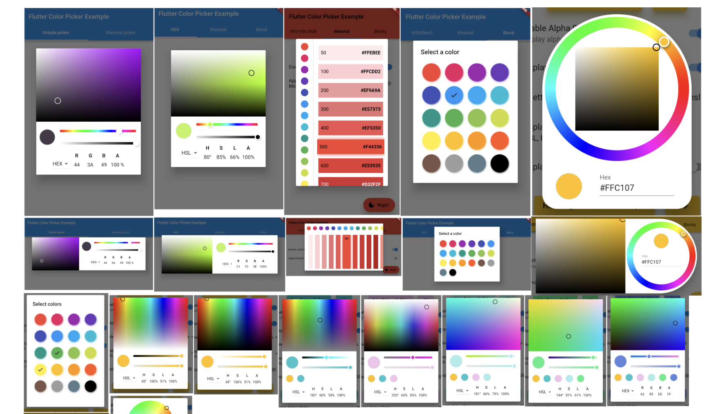
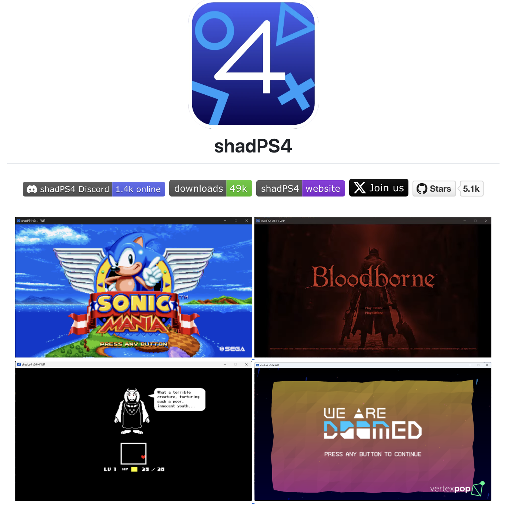
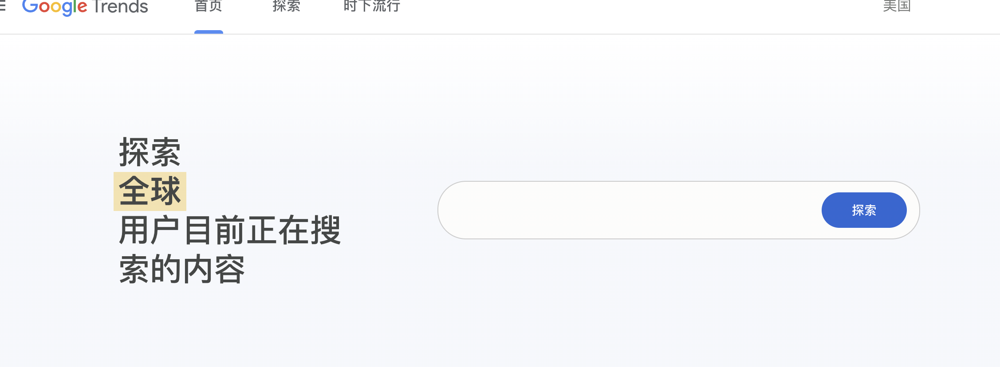

## 🎈优秀开源

**flutter_colorpicker**

https://github.com/mchome/flutter_colorpicker

Flutter颜色选择器

 

**FloatingX**

 https://github.com/Petterpx/FloatingX

 Android悬浮窗工具

 

## 📚好资源

**shadPS4**

https://github.com/shadps4-emu/shadPS4

**bga-chrome-plugin-note**

https://github.com/bingoogolapple/bga-chrome-plugin-note

Chrome插件开发学习笔记

## 🎮好玩的

**klifur**

https://torfi.itch.io/klifur

 

## 🔨好工具

**谷歌搜索热度趋势查询**

https://trends.google.com/trends/?geo=US&hl=zh-CN

 