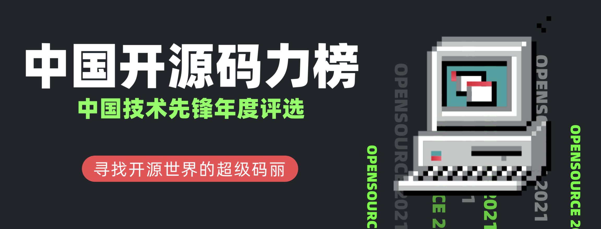

## 📖好文章 
* 📄[用 Swift 写 Android App ？来了解下 Skip 原生级跨平台框架](https://juejin.cn/post/7403991780511825947)

## 📚好资源

**中国开源码力榜**

https://opensource.win/

中国开源码力榜是由 SegmentFault 思否、开源社、X-lab 开放实验室共同发起的中国开源开发者榜单。

**Flutter_learn_demo**

https://github.com/shaoting0730/Flutter_learn_demo

Flutter学习demo，内容丰富，适合入门学习。

**《Flutter实战·第二版》**

https://book.flutterchina.club/

wendux出品优秀Flutter学习参考资料，深入浅出必有所收获。

**TypeScript 手册**

https://ts.nodejs.cn/docs/handbook/intro.html

