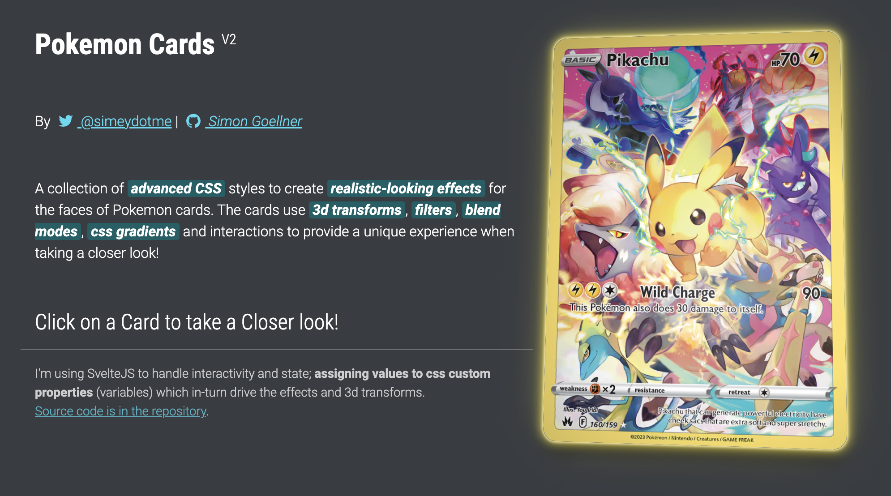
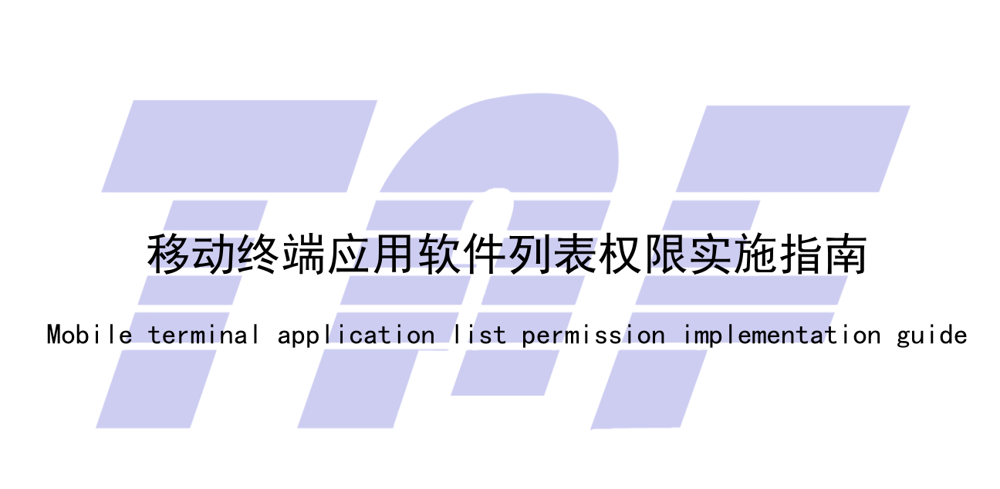

 
## 🎮好玩的

**Pokemon Cards**

用高级CSS实现的Pokemon卡牌动画特效，效果还是蛮炫酷的。

https://poke-holo.simey.me/

 
 ## 📝记录

 **移动终端应用软件列表权限实施指南**

 https://www.taf.org.cn/upload/AssociationStandard/TTAF%20108-2022%20%E7%A7%BB%E5%8A%A8%E7%BB%88%E7%AB%AF%E5%BA%94%E7%94%A8%E8%BD%AF%E4%BB%B6%E5%88%97%E8%A1%A8%E6%9D%83%E9%99%90%E5%AE%9E%E6%96%BD%E6%8C%87%E5%8D%97.pdf

  

  文章内容是为了规范化移动端使用`com.android.permission.GET_INSTALLED_APPS`权限而制定统一指导方案。判断`"oem_installed_apps_runtime_permission_enable"`返回值检查是否支持应用软件列表权限，但好像并不是所有厂商都做了这件事情。（标准统一化还是任重道远）

**安卓客户端权限**

最近做`Android`权限库有感，原生的危险权限以及特殊权限申请接口设计个人感觉不太好用，另外还存在碎片化严重问题其次还有国内产商特殊定制化等场景对于开发者也非常不友好。推荐比较好的权限兼容开源库:[XXPermisions](https://github.com/getActivity/XXPermissions)对各种系统版本权限申请以及不同机型做了适配处理。

此外感慨一下做`Android`开发得多看看开发文档，版本适配路漫漫：[AndroidVersion](https://developer.android.com/about/versions?hl=zh-cn)