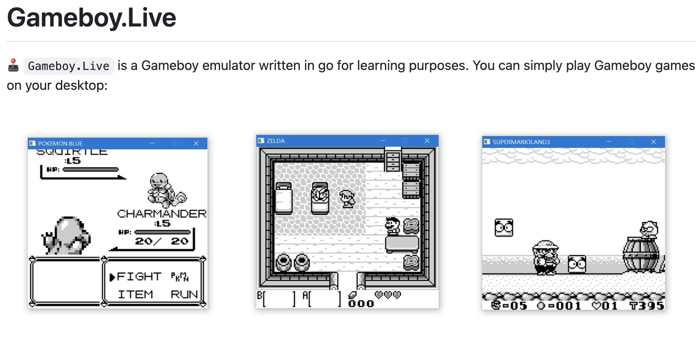
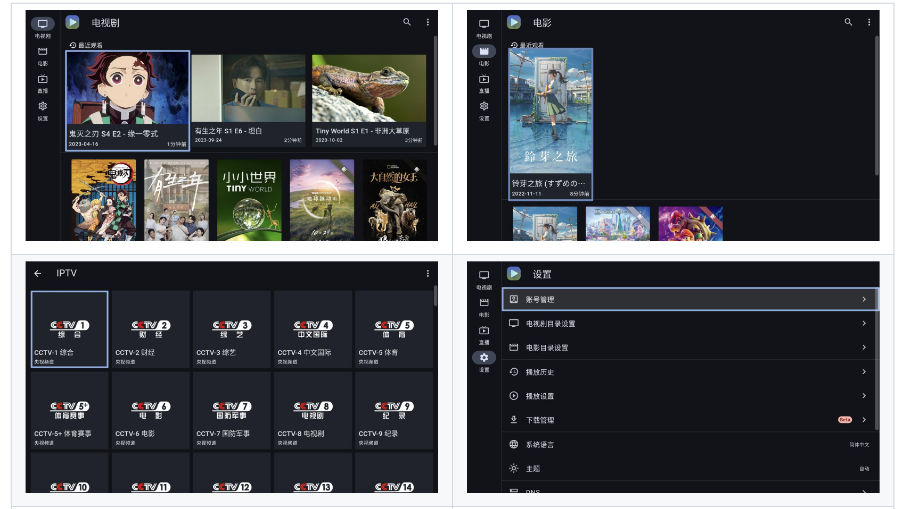

## 📖好文章 
* 📄[我的创业故事：两年内从零到每4.5万美元](https://juejin.cn/post/7300825244704849920)
* 📄[成为独立开发者有多难](https://juejin.cn/post/7304537109851144243)
* 📄[快讯，Flutter PC 多窗口新进展，已在 Ubuntu/Canonical 展示](https://juejin.cn/post/7431894641426202636)

## 🎮好玩的

**gameboy.live**

https://github.com/HFO4/gameboy.live

 

## 🔨好工具

**Ghosten-Player**

https://github.com/GhostenEditor/Ghosten-Player

一款同时适配Android TV和Android Phone的视频播放器，同时支持云播放(阿里云盘和Webdav)和本地播放，支持刮削影视的元信息，界面简洁纯净，操作简单

 