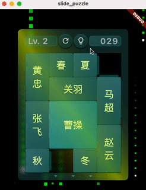
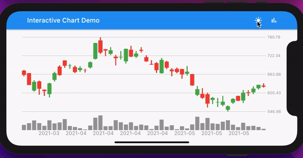
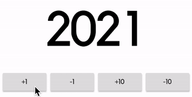
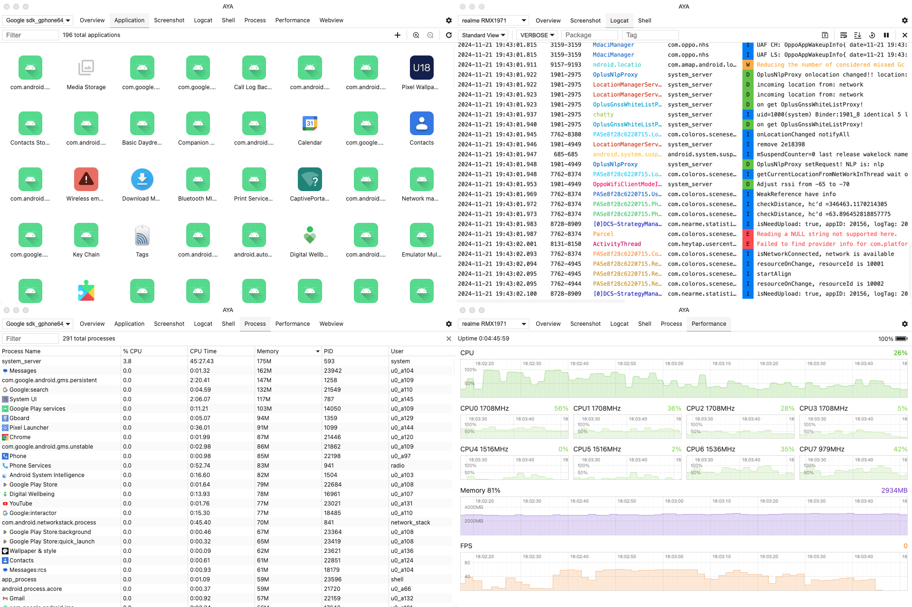
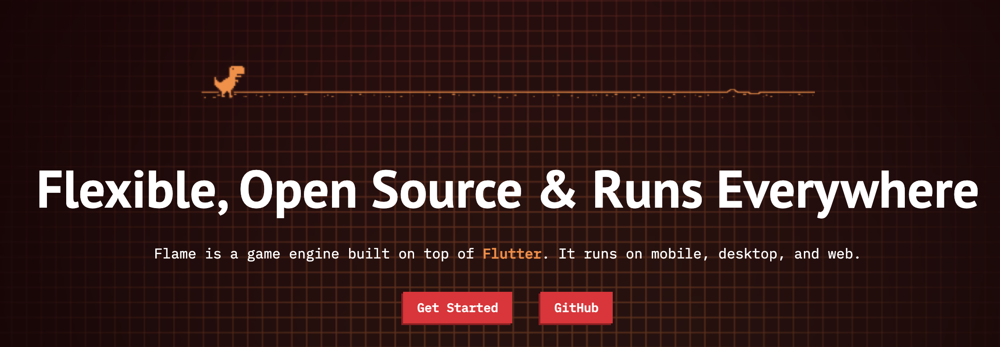
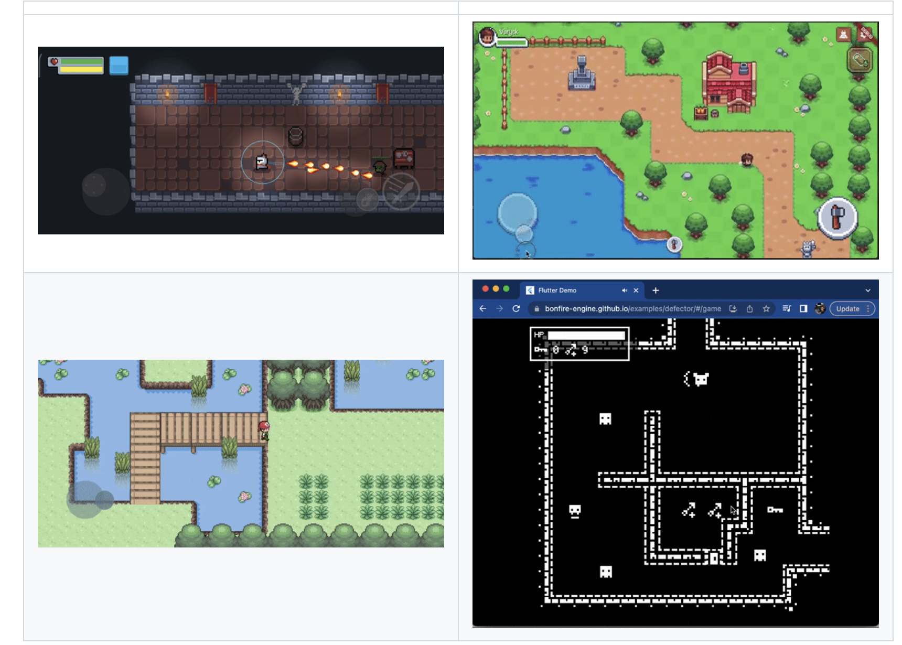

## 📖好文章 
* 📄 [几乎是当下最详细的 AOSP 编译与调试运行指南](https://juejin.cn/post/7457533674582835237)
* 📄 [Cocos2dx+lua合适还是Cocos2dx+js合适?](https://www.zhihu.com/question/21130385)
* 📄 [两天入门cocos开发飞机大作战](https://juejin.cn/post/7282605849708986403)
* 📄 [cocos实现消消乐小游戏](https://juejin.cn/post/7289718324857716793)

## 🎈优秀开源

**slide-puzzle-challenge**

https://github.com/h65wang/slide-puzzle-challenge

Flutter纯代码实现华容道挑战游戏。

**flutter-interactive-chart**

https://github.com/fluttercandies/flutter-interactive-chart

Flutter折线图表

**flutter-animated-counter**

https://github.com/h65wang/flutter-animated-counter

Flutter数字动画

## 🔨好工具

**aya**

https://github.com/liriliri/aya

基于 ADB 封装了一个桌面应用

**opencv-mobile**

https://github.com/nihui/opencv-mobile

## 📚好资源

**flame**

https://flame-engine.org/

Flutter平台的2D游戏引擎

**bonfire**

https://github.com/RafaelBarbosatec/bonfire

Build RPG games and similar with the power of FlameEngine!

**box2d**

https://box2d.org/

游戏2D物理引擎

**awesome-CocosCreator**

https://github.com/Leo501/awesome-CocosCreator

**基于Flutter开发的开源游戏集合**

https://github.com/flutter/pinball
https://github.com/lucasnlm/snaake-flutter
https://github.com/Float-like-a-dash-Sting-like-a-dart/GhostRigger
https://github.com/Yayo-Arellano/flutter_games_compilation/tree/main/new_super_jumper
https://github.com/RutvikPanchal246/FlappyDash
