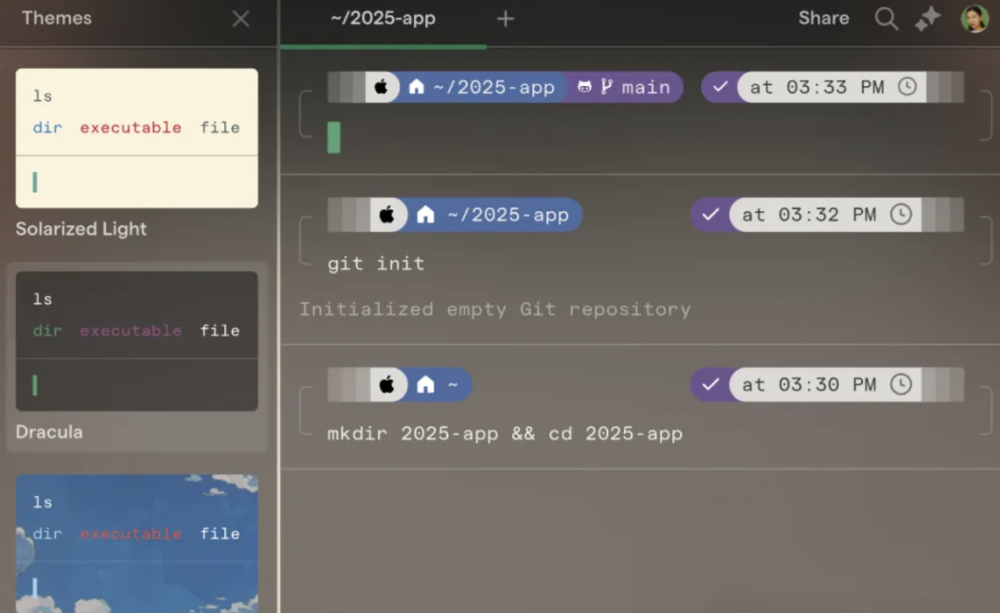

## 📖好文章 

* 📄[劝学：Android 14 Framework 引入了哪些“新”技术栈](https://juejin.cn/post/7231728952057249847)
* 📄[太库辣！Netflix Android 客户端开源库大公开](https://juejin.cn/post/7246453307735392316)
* 📄[没错，我给androidx修了一个bug！](https://juejin.cn/post/7416660926635212851)

## 🎈优秀开源

**gpt-engineer**

https://github.com/AntonOsika/gpt-engineer

CLI platform to experiment with codegen. 

**LHM**

https://github.com/aigc3d/LHM

**warp**

https://github.com/warpdotdev/warp

一款 GitHub 超火的开源终端工具——Warp。它不仅自带 AI 助手，还兼容 zsh、bash 等主流 Shell，完美适配各种操作系统。

