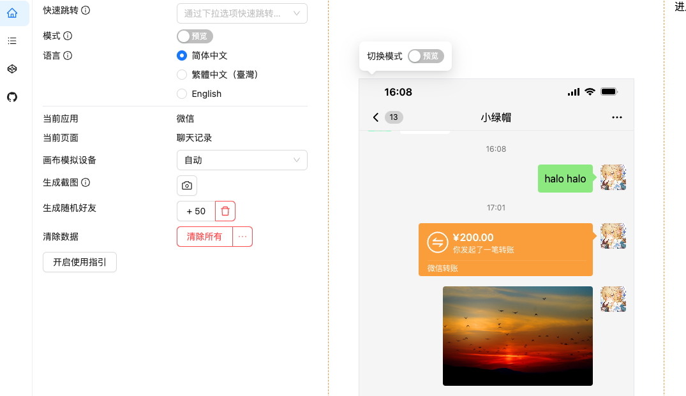
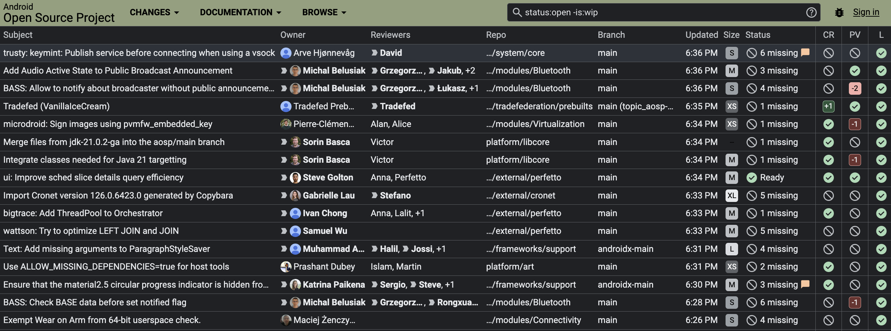

## 🎮好玩的

**killedbygoogle**

https://killedbygoogle.cn/

 

那些被谷歌关停的项目:总会有一些应用软件程序会成为历史。

**Fake-World**

https://fake-world.devdoll.icu/wechat/contacts

 

 
复刻了微信的多种界面、功能：通讯录、发送编辑朋友圈、发送各种类型的消息（文本、图片、转账、红包、消息间引用、语音）、钱包、交易记录等等

## 🔨好工具

**tinypng**

https://tinypng.com/

 

开发者们应该都熟悉的经典压缩工具，每个月有500次免费压缩数并支持api接入。

**android-review**

https://android-review.googlesource.com/q/status:open+-is:wip

 

 Android源码预览，在线追溯代码更新历史，跟着谷歌程序员学习写代码改Bug。

## 📚好资源

**周杰伦JAY**

https://github.com/sxcool1024/Jay

 ## 📝记录

 **相信第一直觉**

 这周排查一个问题直觉怀疑是官方组件自身bug导致，但不太自信把排查切入方向搞错。最终在官方更新日志中看到确实是官方组件存在问题，更新到最新版本后解决并耗时半天时间。有时候还是应该信任自己的直觉尝试第一时间去排查。