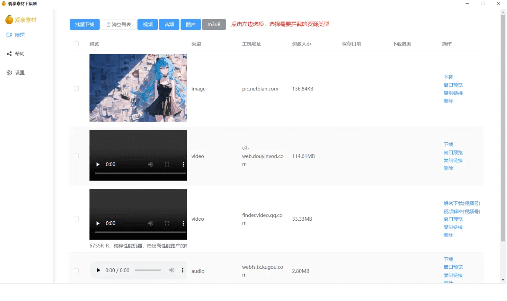
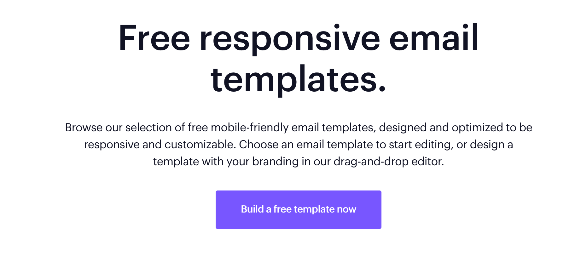
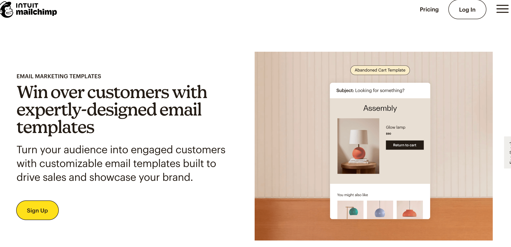

## 📖好文章
* 📄[客户端开发的我，准备认真学前端了](https://juejin.cn/post/7271248528999481384)
* 📄[2024年移动端技术探索](https://juejin.cn/post/7381388012276645907)
* 📄[一文看懂前端怎么写HTML邮件模版](https://juejin.cn/post/6903138530370715656)
* 📄[掘金自动签到 ➕ 定时执行 ➕邮箱推送 你还想要啥❓](https://juejin.cn/post/7053779525737398285)
* 📄[HTML Email 编写指南](https://www.ruanyifeng.com/blog/2013/06/html_email.html)

## 🔨好工具

**res-downloader**

https://github.com/putyy/res-downloader

爱享素材下载器

**campaignmonitor**

 https://www.campaignmonitor.com/email-templates/

**mailchimp**
https://mailchimp.com/features/email-templates/?currency=HKD

 
