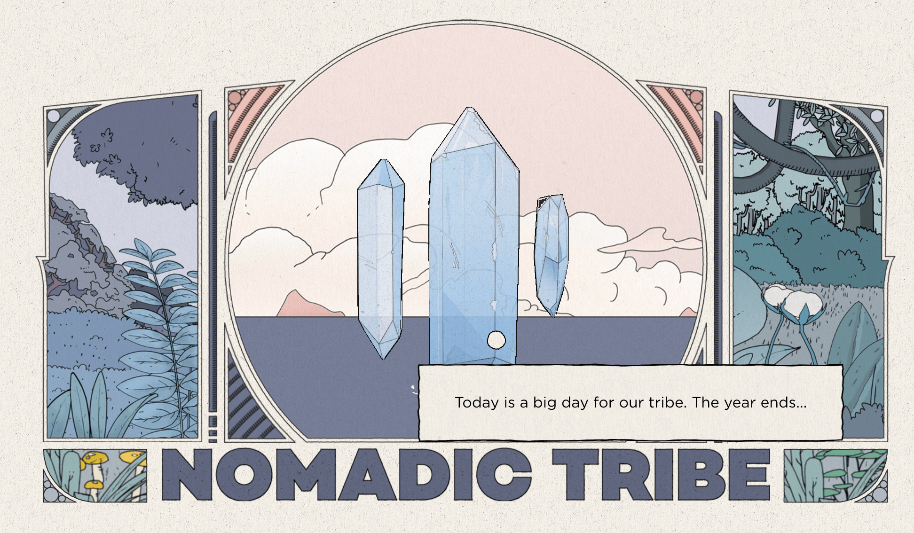

## 📖好文章 

* 📄 [Flutter 我就要五彩斑斓渐进的黑](https://juejin.cn/post/7411799494415728674)
* 📄 [领导被我的花式console.log吸引了！直接写入公司公共库！](https://juejin.cn/post/7371716384847364147)
* 📄 [Flutter 之 ftcon24usa 大会，创始人分享 Flutter 十年发展史，一闪而过的鸿蒙身影](https://juejin.cn/post/7418061055207178249)
* 📄 [Flutter 什么，微信现在才支持实况图！？](https://juejin.cn/post/7418391732162854927)

## 🎈优秀开源

**transcoder**

https://opensource.deepmedia.io/transcoder

 
Android多媒体合成开源库解决燃眉之急。

**Vant-UI**

https://vant-ui.github.io/vant/#/zh-CN

有赞Vue UI组件库（做小项目的UI工具利器）

**flutter_novel**

https://github.com/fluttercandies/flutter_novel

novel_flutter_app 《爱看》是一款开源的阅读APP。

 

## 🔨好工具

**Magpie**

https://github.com/Blinue/Magpie

Magpie 是一个轻量级的窗口缩放工具，内置了多种高效的缩放算法和滤镜。它主要用于提升游戏画质和让不支持全屏化的游戏也能全屏显示等。

## 🎮好玩的

**tetris-sql**

https://github.com/nuno-faria/tetris-sql

使用sql编写的俄罗斯方块游戏。

**Nomadic Tribe**

https://2019.makemepulse.com/

这个网址游戏交互动画非常赞：新颖的交互式故事与游玩体验;科技与艺术的完美结合；

 