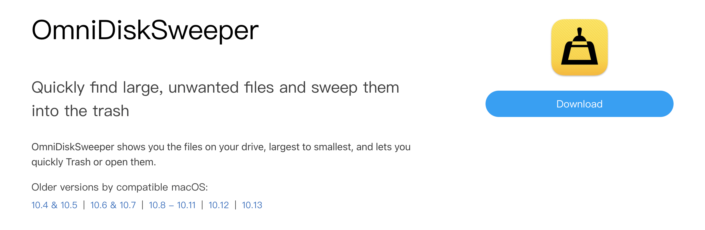

## 🔨好工具

**alist**

https://github.com/alist-org/alist

一个支持多存储的文件列表程序，使用 Gin 和 Solidjs。（准备用于群辉资源下载）

**juejin-helper**

https://github.com/iDerekLi/juejin-helper

掘金自动化工作流

**wechat-article-exporter**

https://github.com/jooooock/wechat-article-exporter

在线批量导出微信公众号文章，支持内嵌的音视频导出，无需搭建任何环境，可100%还原文章样式，支持私有部署。

**OmniDiskSweeper**

https://www.omnigroup.com/more/

 

Mac磁盘清理工具，免费好用。

## 🎈优秀开源

**LibChecker**

https://github.com/LibChecker/LibChecker

This app is used to view the third-party libraries used by applications in your device.Something like FlutterShark.

**crosscore-mod-manager**

https://github.com/laoxinH/crosscore-mod-manager

MOD实验室：一个游戏mod管理工具，支持管理大多数二游的MOD

## 📚好资源

**Mizuki-Ming**

https://github.com/MEE-Developers/Mizuki-Ming

致力于打造印刷体风格字形的项目。

**Metric3D**

https://jugghm.github.io/Metric3Dv2/

