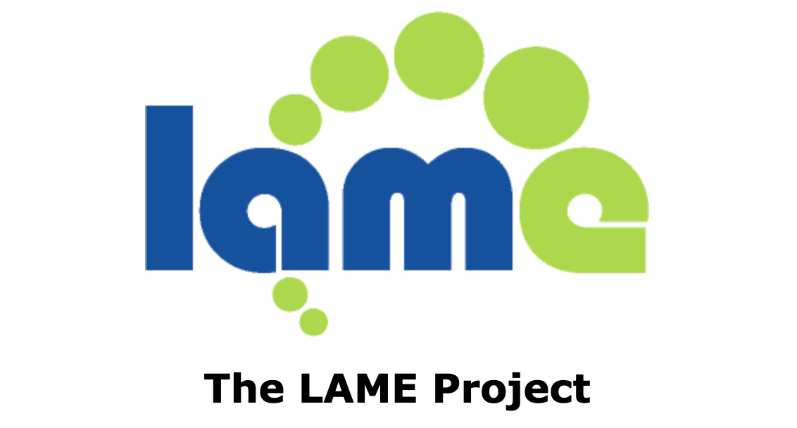

## 📖好文章 
* 📄[1 分钟，让你的网站充满吸引力！保姆级 Live2D 网页教程](https://juejin.cn/post/7439232445470359552)

* 📄[下载网站 favicon 图标的 3 种方法](https://juejin.cn/post/6987258296881119262)

* 📄[网页疯狂自动刷新，发生了什么？业务：我传了一张两亿像素的图片而已](https://juejin.cn/post/7453828227191422988)

* 📄[【鸿蒙突击队】鸿蒙突击队开发者课堂——Flutter Impeller 鸿蒙化实践](https://www.chaspark.com/#/hotspots/1076936441212223488)

## 🎈优秀开源

**activityGuard**

https://github.com/denglongfei/activityGuard

activityGuard 是一种针对四大组件进行混淆的解决方案，能够在打包时对apk和aab中的Activity、Service、Application和自定义的view进行名称混淆以提升应用的安全性。

**micro_dart**

https://github.com/lancexin/micro_dart

能够在Flutter上开发一种轻量级的dart代解释器，它能够动态执行dart代码，可以实现在Flutter上实现热更新（仍然在开发阶段）。

**lame**

https://lame.sourceforge.io/

LAME is a high quality MPEG Audio Layer III (MP3) encoder licensed under the LGPL.
附带Android环境编译使用链接：https://www.jianshu.com/p/fb531239cd79

## 🔨好工具

**TapClick**

https://github.com/LGH1996/TapClick

基于Android无障碍服务开发的应用:自动跳过广告

**Android音频录制工具及编码工具参考**

https://github.com/Arjun-sna/Android-AudioRecorder-App
https://github.com/kevinchen797/AudioRecorder
https://github.com/lassana/continuous-audiorecorder
https://github.com/Dimowner/AudioRecorder
https://github.com/naman14/TAndroidLame

Android录音功能实践案例参考，包含MediaRecorder以及AudioRecord不同API音频录音功能以及编码。
