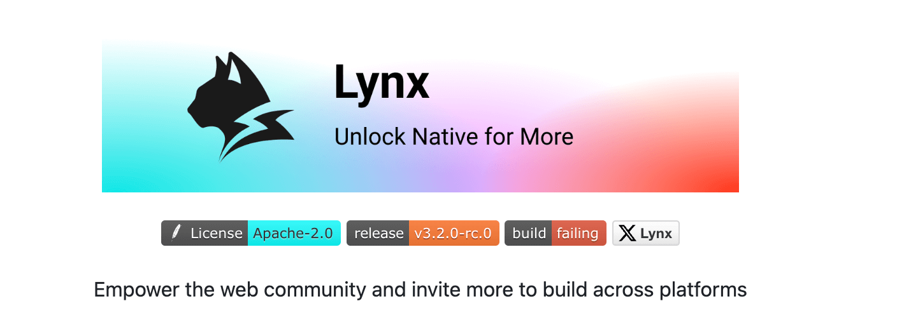
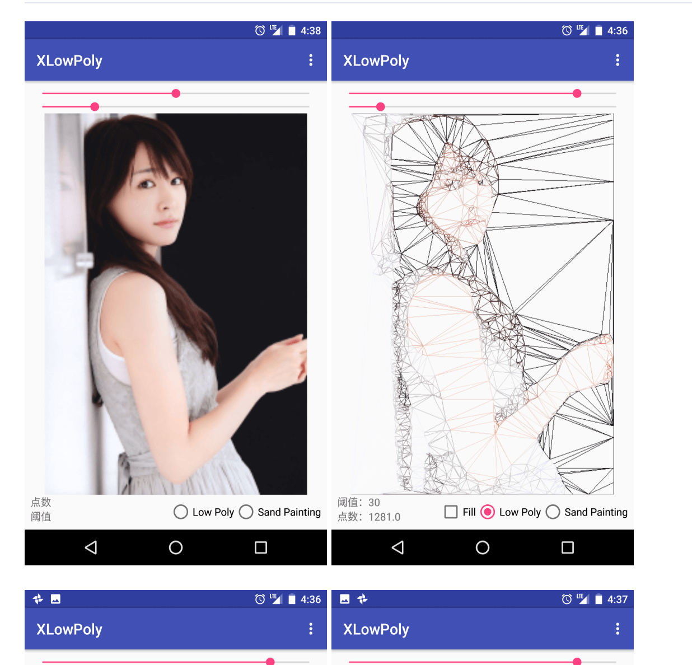
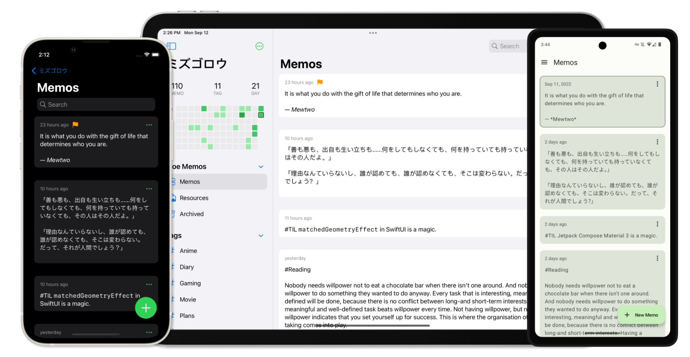
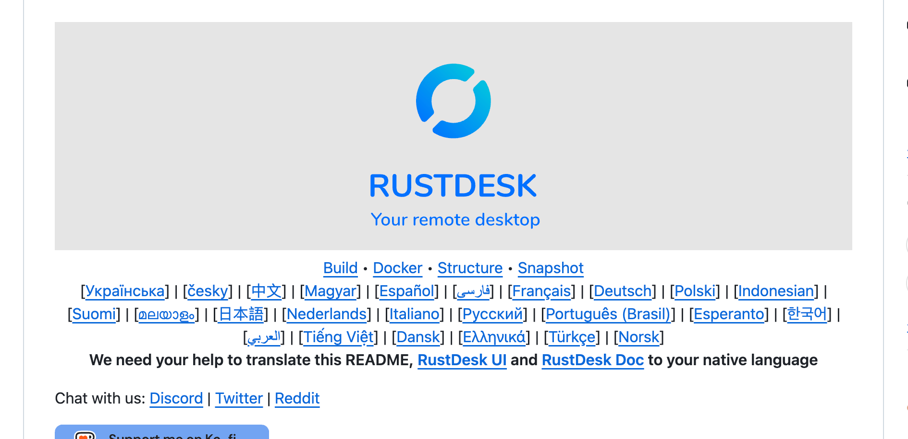
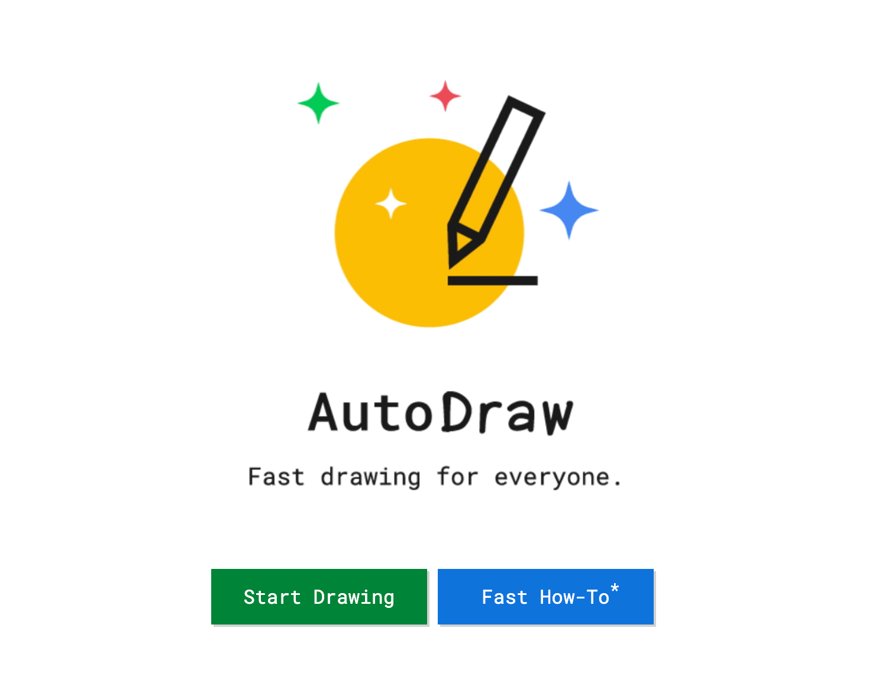
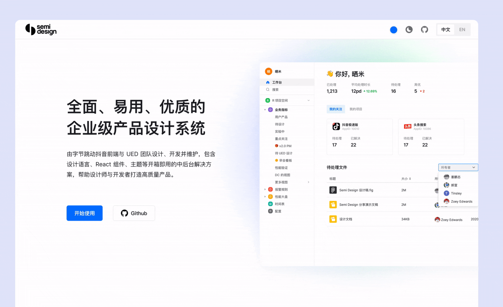
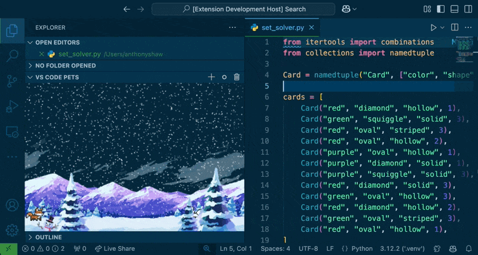

## 🎈优秀开源

**lynx**

https://github.com/lynx-family/lynx

Empower the web community and invite more to build across platforms.

**XLowPoly**

https://github.com/xyzxqs/XLowPoly

Low poly picture, Sandpainting for Android implemented by JNI, delaunay triangulation algorithm.

**MoeMemos**

https://github.com/mudkipme/MoeMemos

Moe Memos is an app to help you capture thoughts and ideas.

To use this app, you must have a self-hosted ✍️memos server set up and running.

**FileCodeBox**

https://github.com/vastsa/FileCodeBox

FileCodeBox 是一个基于 FastAPI + Vue3 开发的轻量级文件分享工具。它允许用户通过简单的方式分享文本和文件，接收者只需要一个提取码就可以取得文件，就像从快递柜取出快递一样简单。

## 📚好资源

**第19届D2终端技术大会「热·AI」**

https://github.com/d2forum/19th

**AndroidStorage**

https://github.com/BuleB/AndroidStorage

Android存储历史版本适配解答

## 🔨好工具

**rustdesk**

https://github.com/rustdesk/rustdesk

远程桌面软件，开箱即用，无需任何配置。您完全掌控数据，不用担心安全问题。您可以使用我们的注册/中继服务器， 或者自己设置， 亦或者开发您的版本。

**autodraw**

https://www.autodraw.com/

AutoDraw is a new kind of drawing tool. It pairs machine learning with drawings from talented artists to help everyone create anything visual, fast. There’s nothing to download. Nothing to pay for. And it works anywhere: smartphone, tablet, laptop, desktop, etc. 

**semi-design**

https://github.com/DouyinFE/semi-design

现代、全面、灵活的设计系统和 UI 库。 致力打通 DesignOps & DevOps ，快速搭建美观的 React 应用。

## 🎮好玩的

**vscode-pets**

https://github.com/tonybaloney/vscode-pets

Puts a small, bored cat, an enthusiastic dog, a feisty snake, a rubber duck, or Clippy 📎 in your code editor to boost 

