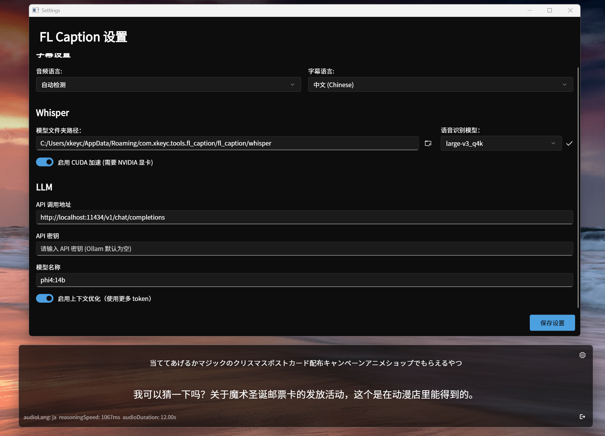
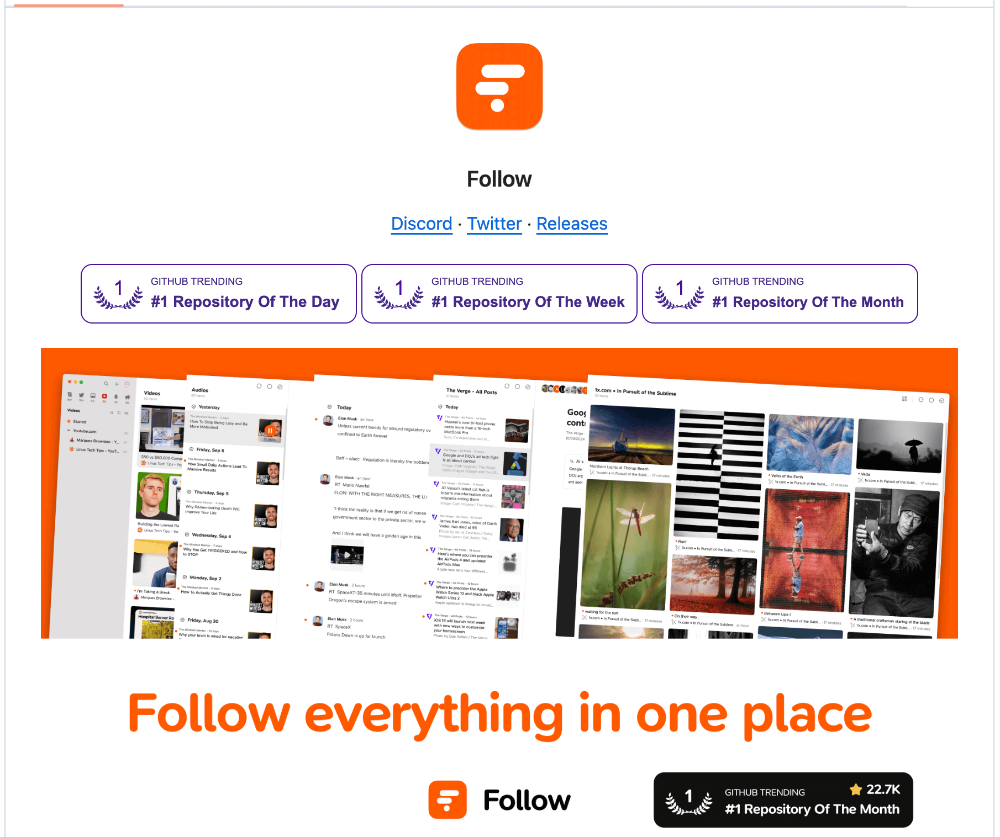
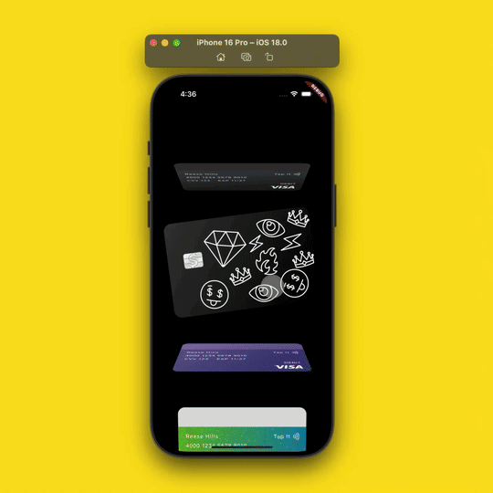
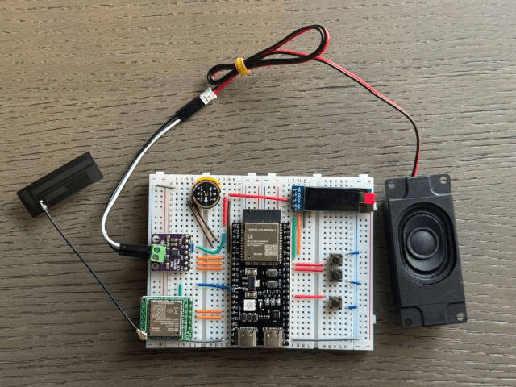

## 📖好文章
* 📄[一起设计一个Android倒计时组件](https://juejin.cn/post/6984725689257689101)
* 📄[为什么网络上一些表情包在反复传播之后会变绿？“电子包浆”到底是怎么形成的？](https://juejin.cn/post/7467099560520859663)

## 📚好资源

**RapidAI**

https://github.com/RapidAI

An open source organization for the development of AI based applications. We do not train a model but apply models.

**Font-Awesome**

https://github.com/FortAwesome/Font-Awesome

Font Awesome is the Internet's icon library and toolkit, used by millions of designers, developers, and content creators. 非常不错的免费图标库。

## 🎈优秀开源

**LiveTalking**

https://github.com/lipku/LiveTalking

实时交互流式数字人，实现音视频同步对话。基本可以达到商用效果

**fl_caption**

https://github.com/xkeyC/fl_caption

离线实时字幕软件，使用 Flutter 和 Rust 编写，由 LLM 和 基于 candle 推理框架的 Whisper 驱动。

**开源UI布局**

* [litho](https://github.com/facebook/litho)
* [yoga](https://github.com/facebook/yoga)

**Follow**

https://github.com/RSSNext/Follow

RSS订阅器

## 🎮好玩的

**flutter_design_cash_app**

https://github.com/Alvish0407/flutter_design_cash_app

Flutter列表卡片滑动酷炫效果。

**xiaozhi-esp32**

https://github.com/78/xiaozhi-esp32

我们希望通过这个项目，能够帮助更多人入门 AI 硬件开发，了解如何将当下飞速发展的大语言模型应用到实际的硬件设备中。无论你是对 AI 感兴趣的学生，还是想要探索新技术的开发者，都可以通过这个项目获得宝贵的学习经验。