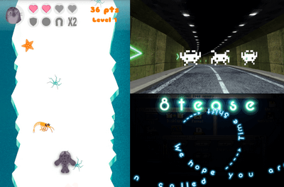
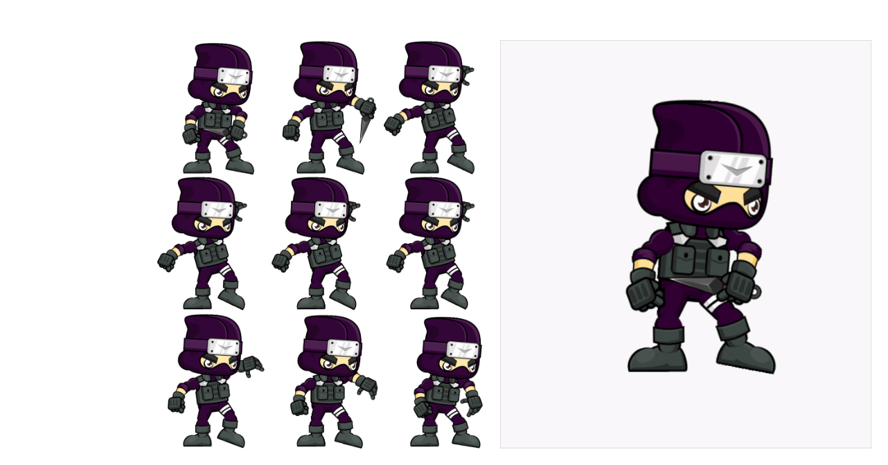
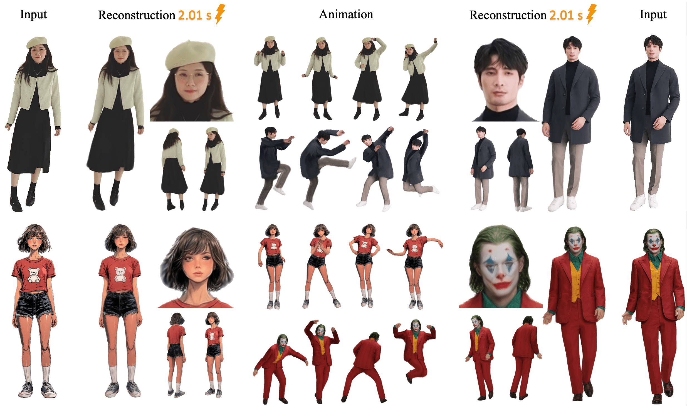
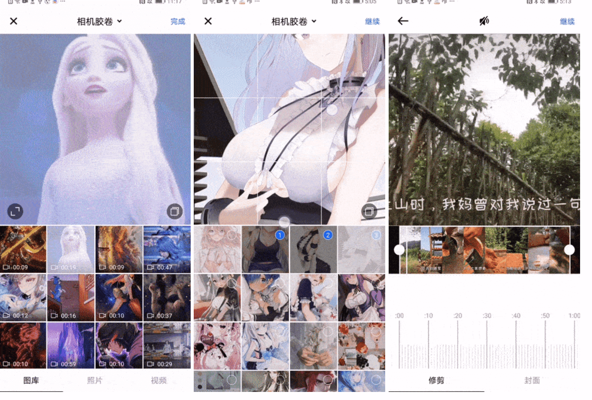
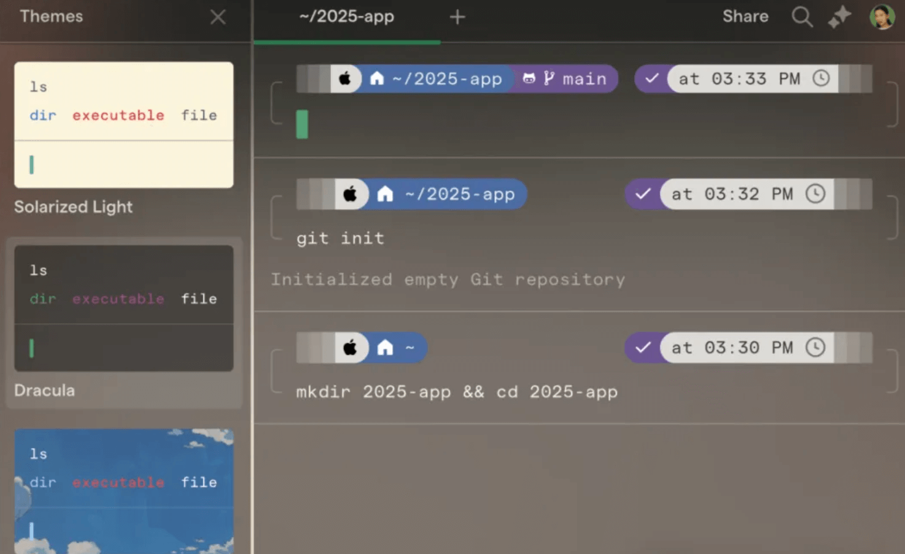
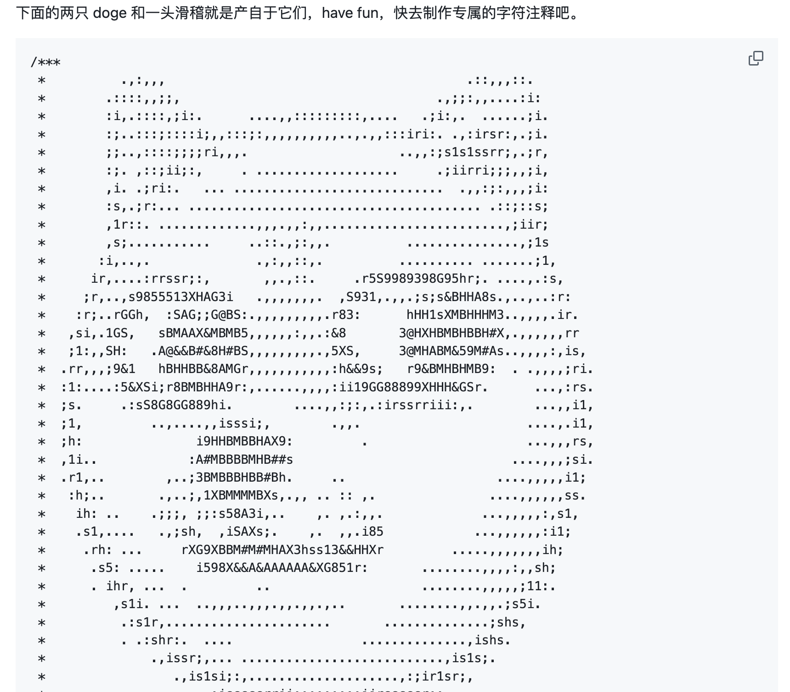

## 📖好文章 

* 📄[劝学：Android 14 Framework 引入了哪些“新”技术栈](https://juejin.cn/post/7231728952057249847)
* 📄[太库辣！Netflix Android 客户端开源库大公开](https://juejin.cn/post/7246453307735392316)
* 📄[没错，我给androidx修了一个bug！](https://juejin.cn/post/7416660926635212851)

## 📚好资源

https://thebookofshaders.com/

This is a gentle step-by-step guide through the abstract and complex universe of Fragment Shaders.

**ourtv**

https://github.com/andandroidor/ourtv

电视直播软件，安装即可使用，高清，超清，蓝光，完全免费，您再也不用费劲巴力的找各种不稳定的直播源了。

**AndroidOfferKiller**
https://github.com/Blankj/AndroidOfferKiller

安卓 offer 收割基

**resume**

https://github.com/Blankj/resume

我们只需要一份Markdown格式的简历便可轻轻松松管理所有格式的简历了

## 🎈优秀开源

**smartGL**

https://github.com/smart-fun/smartGL

SmartGL is a Graphic Engine for creating Android Games and Apps. It is based on OpenGL and handles 2D Sprites and 3D Textured Objects.

**SpriteView-KMP**

https://github.com/stevdza-san/SpriteView-KMP

支持跨平台的精灵图加载器

**gpt-engineer**

https://github.com/AntonOsika/gpt-engineer

CLI platform to experiment with codegen. 

**LHM**

https://github.com/aigc3d/LHM

阿里巴巴通义实验室出品。

**InsGallery**

https://github.com/JessYanCoding/InsGallery

 

 Instagram-like image picker for Android (一款 UI 炫酷高仿 Instagram 的图片、视频选择器)

**warp**

https://github.com/warpdotdev/warp

一款 GitHub 超火的开源终端工具——Warp。它不仅自带 AI 助手，还兼容 zsh、bash 等主流 Shell，完美适配各种操作系统。

## 🎮好玩的

**awesome-comment**

https://github.com/Blankj/awesome-comment

收录一些非常有趣高效的神注释，让你的代码更加优雅（不是）。

