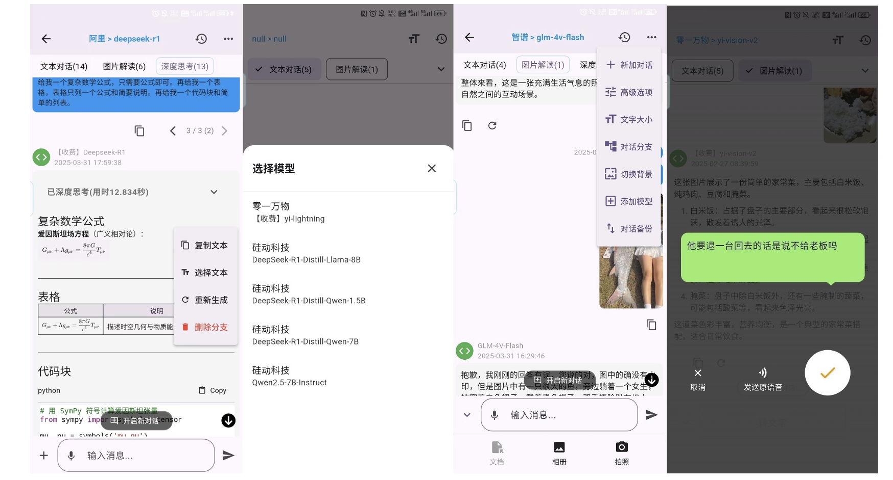
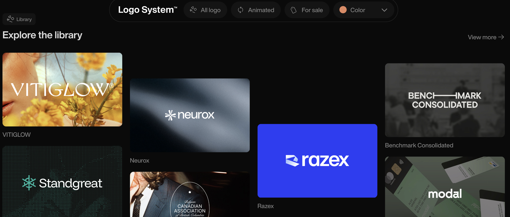
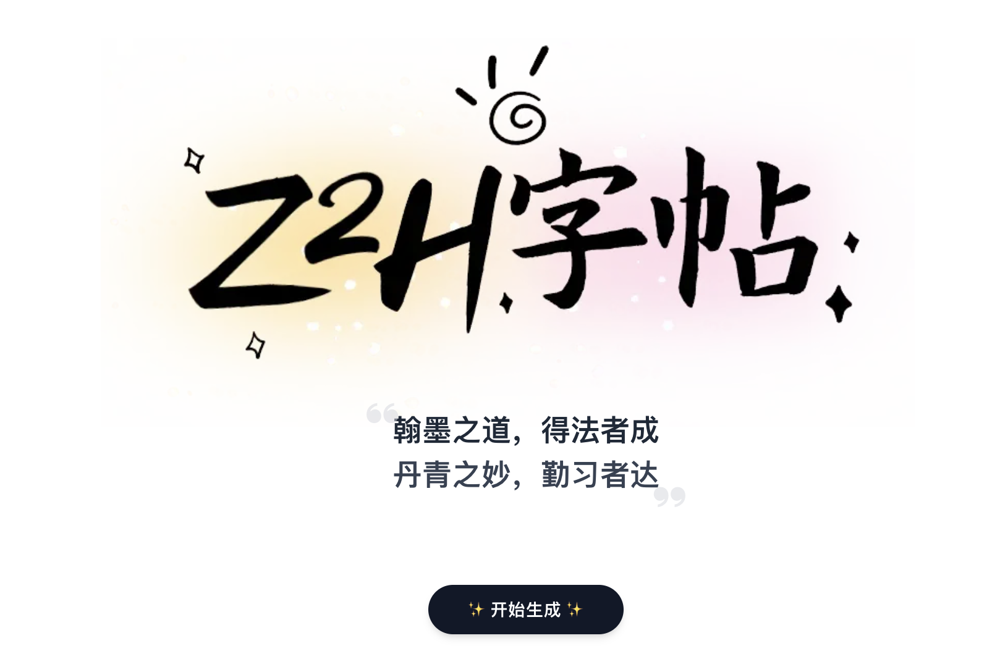
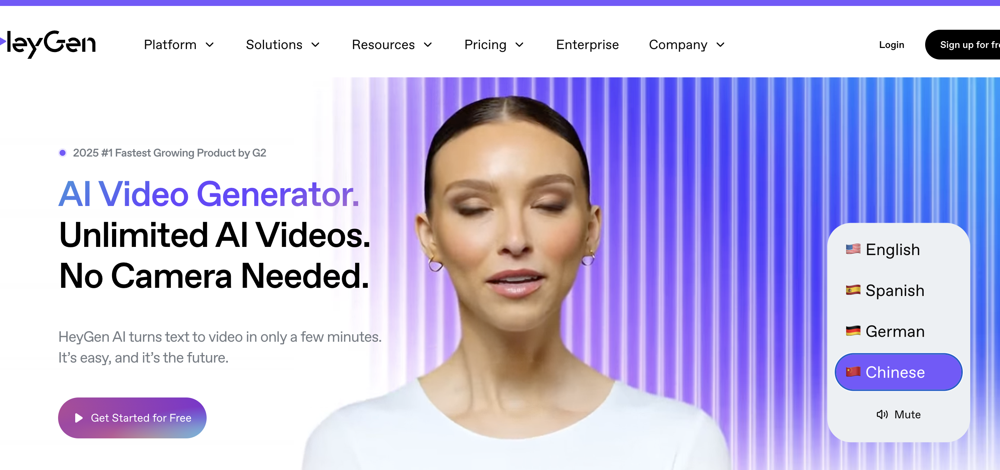
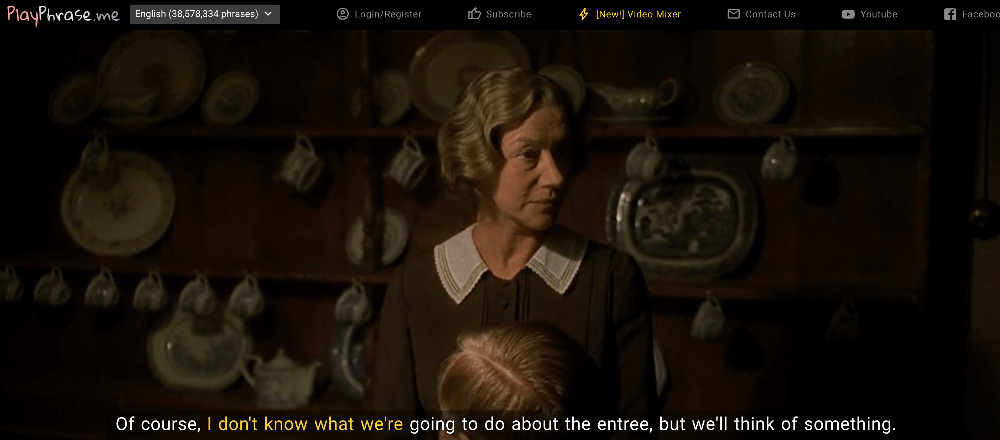
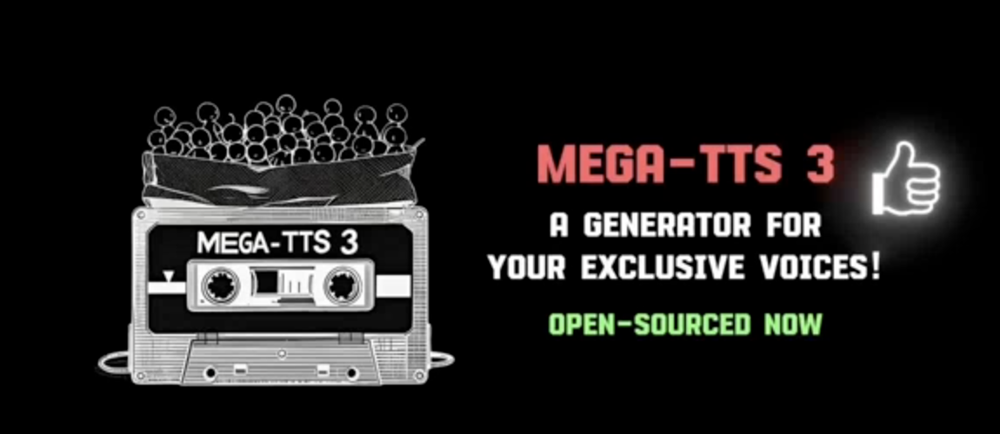
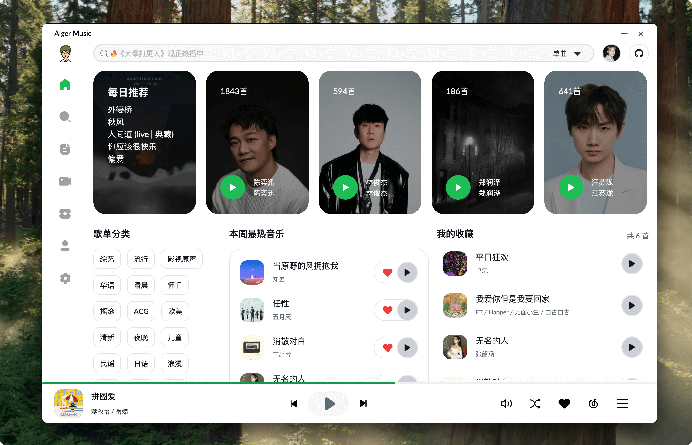
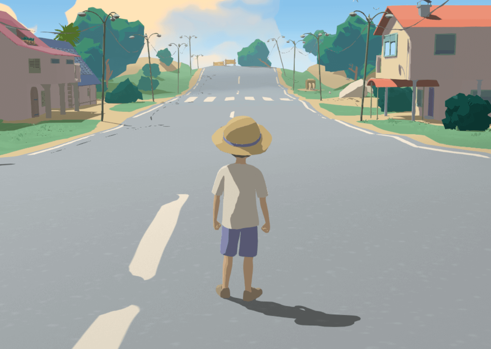

## 🎈优秀开源

**mediasoup**
https://mediasoup.org/
一个基于WebRTC的实时音视频通信框架。

**SWMate**
https://github.com/Sanotsu/swmate

使用 flutter 开发的一个“智能工作生活类助手”应用。

**HyperCeiler**

https://github.com/ReChronoRain/HyperCeiler

Android 14-15 的 HyperOS

## 📚好资源

**Logosystem**

https://logosystem.co/

Logo灵感网址

**z2H字帖**

https://paper.z2h.cn/

免费字帖网站，可下载打印字帖练习写字。

## 🔨好工具

**heygen**

https://www.heygen.com/

数字人生成工具。

**playphrase**

https://www.playphrase.me/

输入台词就能找到你想要的电影素材，可惜目前没有支持中文素材并不完全免费。

**firecrawl**
https://github.com/mendableai/firecrawl

Ai超强爬虫框架，爬虫界的天花板。

**MegaTTS3**

https://github.com/bytedance/MegaTTS3

一个基于pytorch的语音合成模型，支持中文和英文。

**AlgerMusicPlayer**

https://github.com/algerkong/AlgerMusicPlayer

一个基于 electron typescript vue3 的桌面音乐播放器 适配 web端 桌面端 web移动端

## 🎮好玩的

**Summer Afternoon**
https://summer-afternoon.vlucendo.com/

一个基于treejs实现的的3D游戏。

**Viggle AI**

https://viggle.ai/home

基于AI的视频转换平台，导入图片和视频将图片人物转换为AI人物。