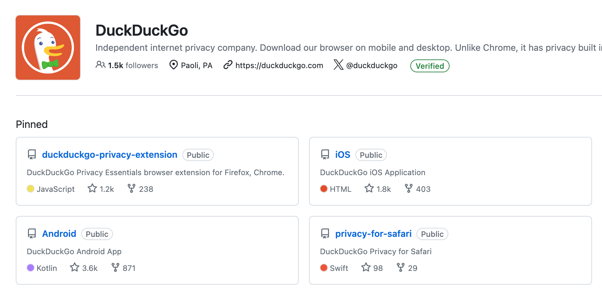

## 📖好文章
* 📄[微信公众号集成扣子免费实现智能助手](https://juejin.cn/post/7364004802856337458)

## 🎮好玩的

**扣子助手**

https://www.coze.cn/home

扣子是新一代 AI 应用开发平台，无论你是否有编程基础，都可以在扣子上快速搭建基于大模型的各类 Bot，并发布到各个社交平台、通讯软件，甚至部署到你自己的网站上。

 

 **腾讯应用宝电脑版**

 https://sj.qq.com/download

 PC手机跨端体验 | 键鼠操作 | 支持安卓和iOS账号登录

  

**ChatTTS**

https://github.com/2noise/ChatTTS

ChatTTS是专门为对话场景设计的文本转语音模型，例如LLM助手对话任务。它支持英文和中文两种语言。最大的模型使用了10万小时以上的中英文数据进行训练。在HuggingFace中开源的版本为4万小时训练且未SFT的版本.

## 📚好资源

**DuckDuckGo**

https://github.com/duckduckgo

一个以将隐私放在第一位的用户而闻名的搜索引擎。它的客户端代码是开源的，对于客户端开发者来说是一个非常不错学习项目。

 

**Android Code Search**

https://cs.android.com/android/platform/superproject/main?hl=zh-cn

Android源代码搜索工具，支持在线阅读框架源码，是安卓开发者撸源码利器。

