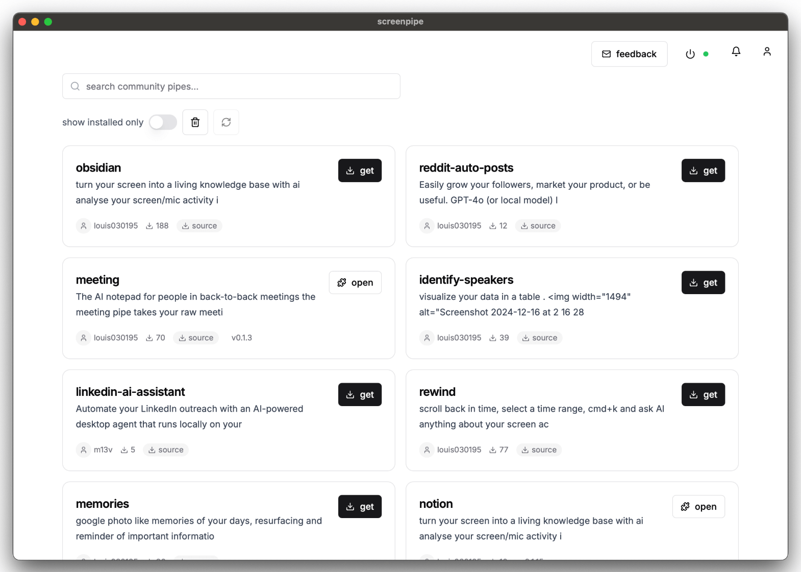
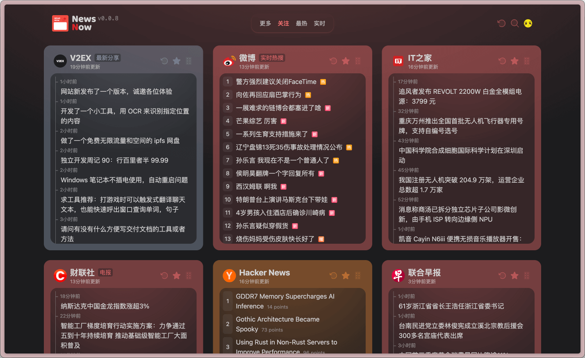
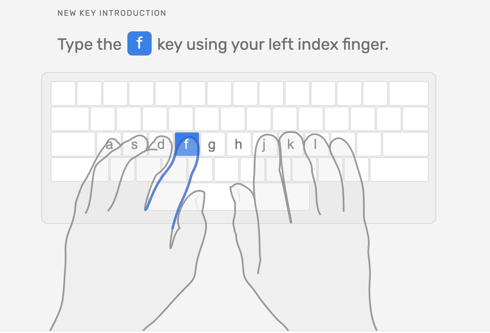
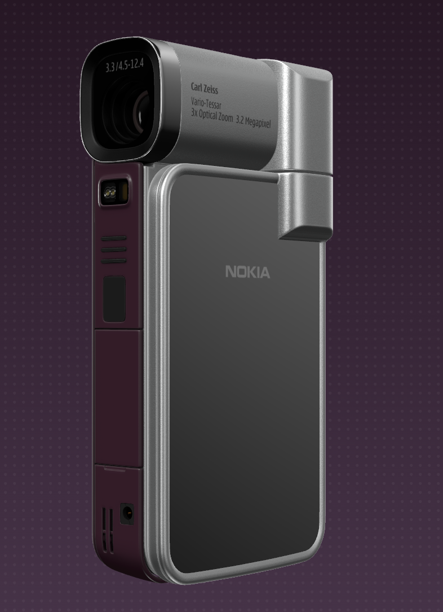
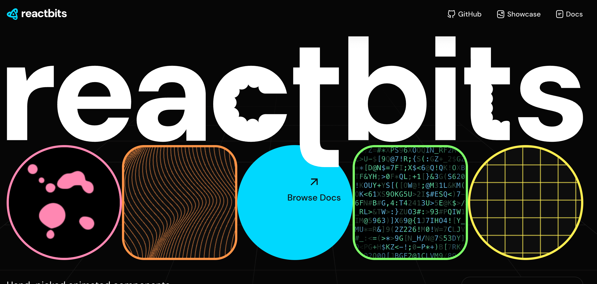

## 📖好文章 
* 📄[2025年，Android 16 都快来了，你知道各个版本 Android的特点吗？](https://juejin.cn/post/7478894814811045926)
* 📄[5分钟制作丝滑的AI视频-ComfyUI+AnimateDiff](https://juejin.cn/post/7293728293768232995)
* 📄[基于 MCP Http SSE模式的天气助手智能体开发实战（一文带你了解MCP两种开发模式）](https://juejin.cn/post/7490407437070483475)

## 🔨好工具

**pic-smaller**

https://github.com/joye61/pic-smaller

Pic Smaller 是一款超级易用的在线图像压缩工具。

**screenpipe**

https://github.com/mediar-ai/screenpipe

一个获取所有用户桌面数据的API（本地、跨平台、全天候、屏幕、语音、键盘、鼠标、摄像头录制）

**file.pizza**

https://file.pizza/

通过浏览器实现点对点文件传输的工具。

**newsnow**

https://github.com/ourongxing/newsnow

优雅地阅读实时热门新闻：信息聚合工具将所有你想看的内容汇聚到一起，让你随时了解最新动态。

**BiliTools**

https://github.com/btjawa/BiliTools

哔哩哔哩工具箱。不多解释用了就知道。

**typingclub**

https://www.typingclub.com/

一个打字练习网站，从入门到精通。作为程序员的你提升打字效率代码写得飞起。

## 📚好资源

**lucidrains**

https://github.com/lucidrains

Python大神

**build-your-own-x**

https://github.com/codecrafters-io/build-your-own-x

超全开发技术学习资料集合，总有一款开发语言会是你感兴趣的。

**USTC-Course**
https://github.com/USTC-Resource/USTC-Course

本仓库收录中国科学技术大学众多课程资源的笔记，总结，经验等学生原创内容。

**AI图像模型库**

https://civitai.com/
https://www.liblib.art/

## 🎮好玩的

https://chaz.fun/phone/n93i/

3D数字手办:诺基亚 N93i,来自作者“叉子周”

**reactbits**

https://www.reactbits.dev/

让你的React项目炫酷炸天的UI动画库：内容非常多包罗万象，值得收藏。

**inspira-ui**

https://inspira-ui.com/

又一款Vue&Nuxt前端的UI酷炫动画库:潮人前端必备。