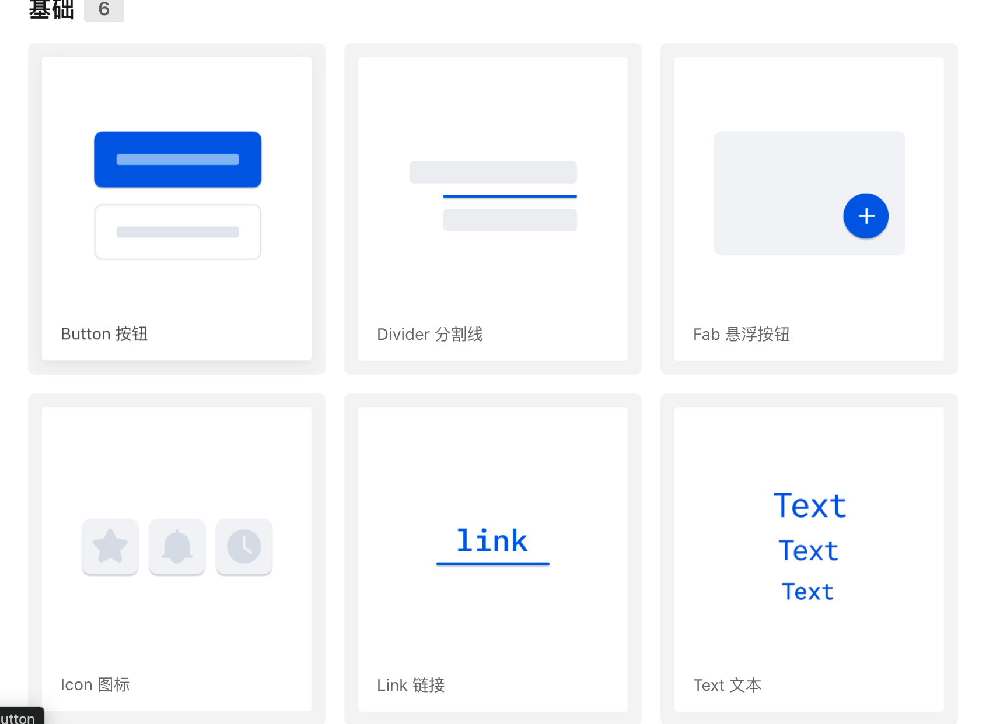
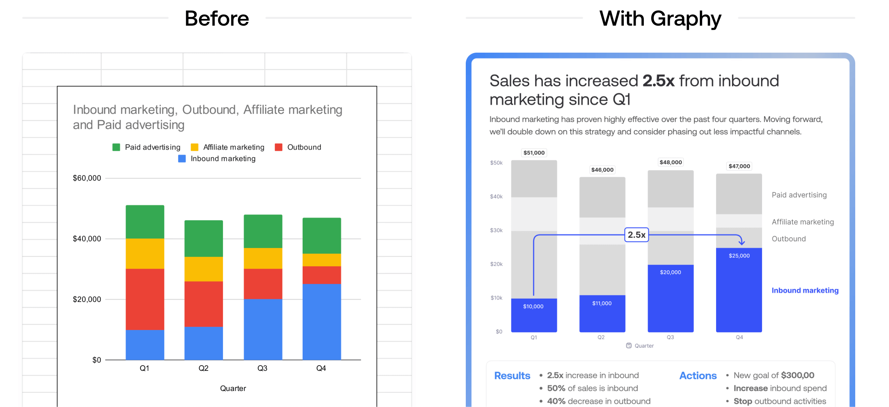
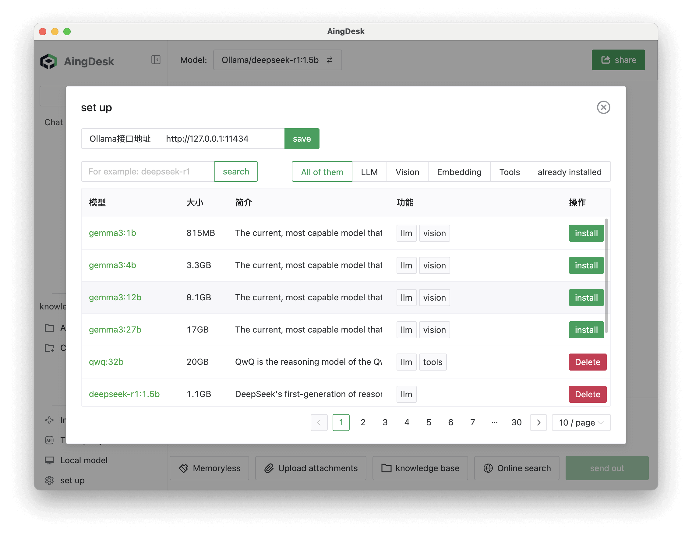
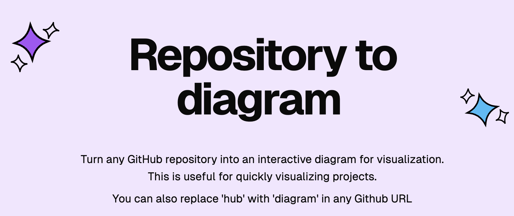
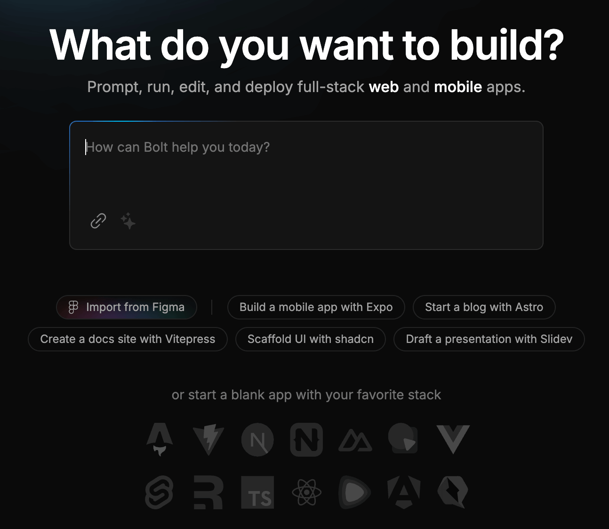
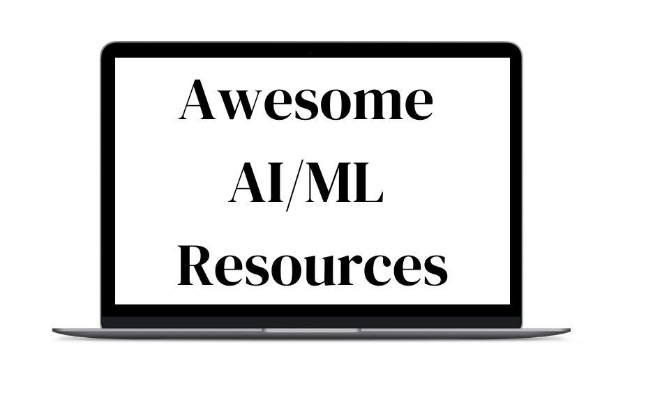
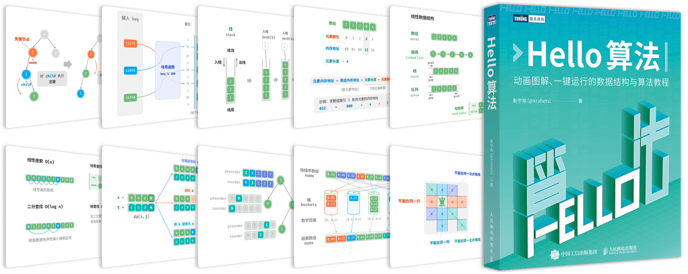
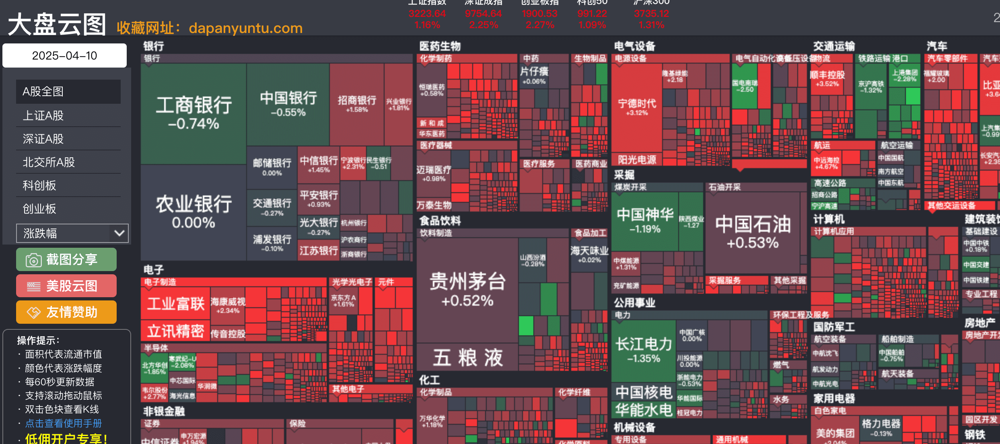
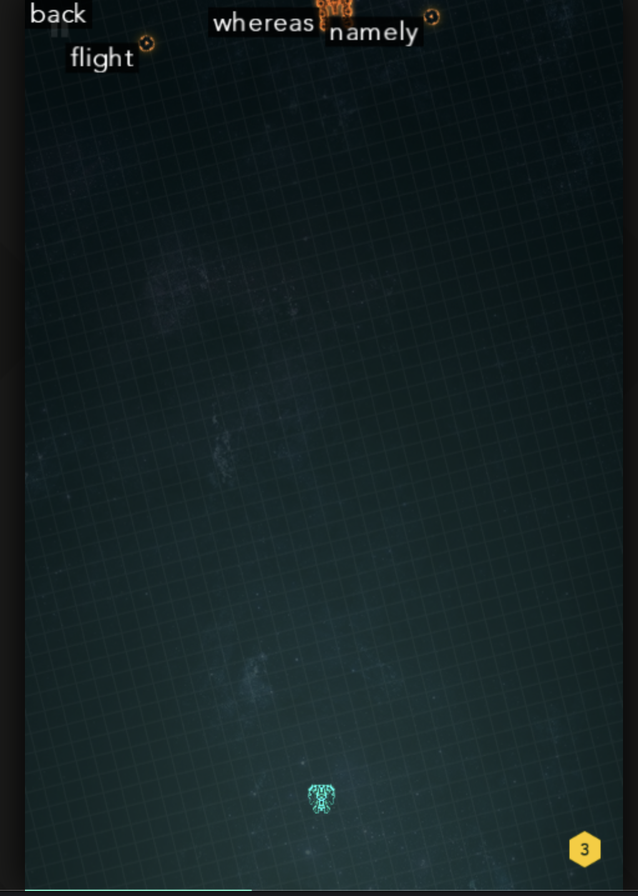

## 🎈优秀开源

**tdesign-flutter**

https://github.com/Tencent/tdesign-flutter

腾讯出品Flutter版的TDesign UI组件库。

**RSSHUB-MCP**

https://github.com/RechardLLee/RSSHUB-MCP

RSSHUB MCP 是一个用于获取和解析 RSS 源的 Python 工具，它支持多种 RSSHub 实例，并提供了自动故障转移功能。

## 🔨好工具

**Graphy**

https://graphy.app/

AI快捷将Excel表格可视化工具。

**AingDesk**

https://github.com/aingdesk/AingDesk

AingDesk是一款简单好用的AI助手，支持知识库、模型API、分享、联网搜索、智能体，它还在飞快成长中。

**GitDiagram**

https://gitdiagram.com/

将任何GitHub库变成可视化的交互式图。

**bolt**

https://bolt.new/

AI自动化帮助你生成全栈网页和App工具。

## 📚好资源

**awesome-ai-ml-resources**

https://github.com/armankhondker/awesome-ai-ml-resources

机器学习和人工智能免费学习资源。

**hello-algo**

https://github.com/krahets/hello-algo

拥有111k的star的动画图解、一键运行的数据结构与算法教程。

**free-for-dev**

https://github.com/ripienaar/free-for-dev

一个省钱小妙招免费开发资源获取列表。

## 🎮好玩的

**kalidoface-3d**

https://github.com/yeemachine/kalidoface-3d

Kalidoface 3D是一个支持Live2D Avatars的Kalidoface的序列，是一个网络应用程序，可为3D VTUBER AVATARS提供支持。采用最新的Mediapipe人姿势检测模型具有更动态的相机角度，甚至具有全身跟踪选项。

**大盘云图

https://dapanyuntu.com/

看A股票大田，非常直观可观。

**zty.pe**

https://zty.pe/

一款在线打字游戏。

