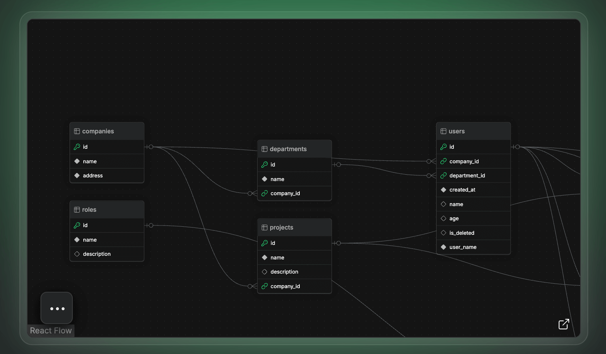

## 📖好文章 
* 📄[vue3.5+deepseek+arco+markdown搭建web版流式输出AI模板](https://juejin.cn/post/748636969673801732)
* 📄[拿到Offer，租房怎么办？看我用高德MCP+腾讯云MCP，帮你分分钟搞定](https://juejin.cn/post/7488599657125052416)

## 🎈优秀开源

**Folo**

https://github.com/RSSNext/Folo

一款开源免费的RSS订阅工具

**fishTV**

https://github.com/lhccong/fishTV

自己动手搭建属于私人的视频站。

**liambx**

https://liambx.com/

https://github.com/liam-hq/liam

Liam ERD自动生成美观且易于阅读的ER图表，让你轻松掌握数据库的复杂关系。

## 🔨好工具

**小红书自动发布工具**

* [XHS_Auto_Publish](https://github.com/hasuoshenyun/XHS_Auto_Publish)
* [xhs_ai_publisher](https://github.com/BetaStreetOmnis/xhs_ai_publisher)

**魔塔社区**

https://modelscope.cn/home

国内MCP中文社区。

**copyweb**

https://copyweb.ai/

网页克隆工具

## 📚好资源

**manualslib**

https://www.manualslib.com/

各式各样的产品说明书大全。

**odd-hyphen**

https://odd-hyphen.com/

韩国小众设计网站，还蛮有创作艺术的。

**abdul_bari**

https://www.youtube.com/@abdul_bari

印度老哥的算法课

**uiverse**

https://uiverse.io/

一个专门提供用作前端开发的各种酷炫 UI 组件的网站
网站提供 4000 多个优雅精致的前端 UI 元素/组件，拿来就可以用，全都免费开源，适用于前端各个框架。

**awesome-gpt4o-images**

https://github.com/jamez-bondos/awesome-gpt4o-images

这里收集了 OpenAI 最新多模态模型 GPT‑4o 生成的精彩案例，展示其强大的文本‑图像理解与创作能力。