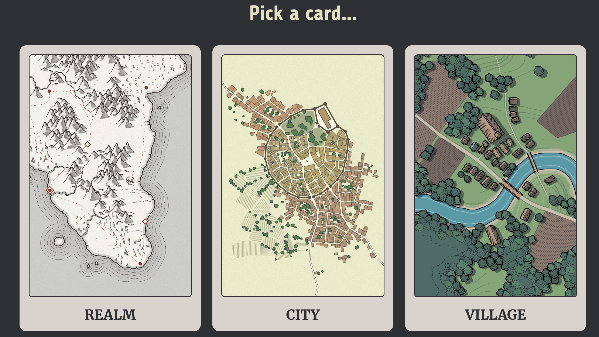
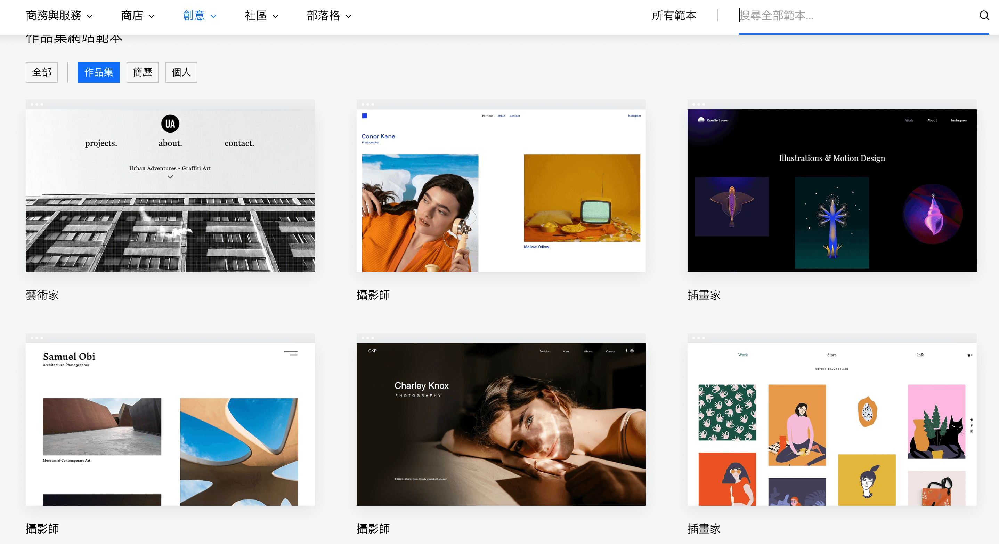
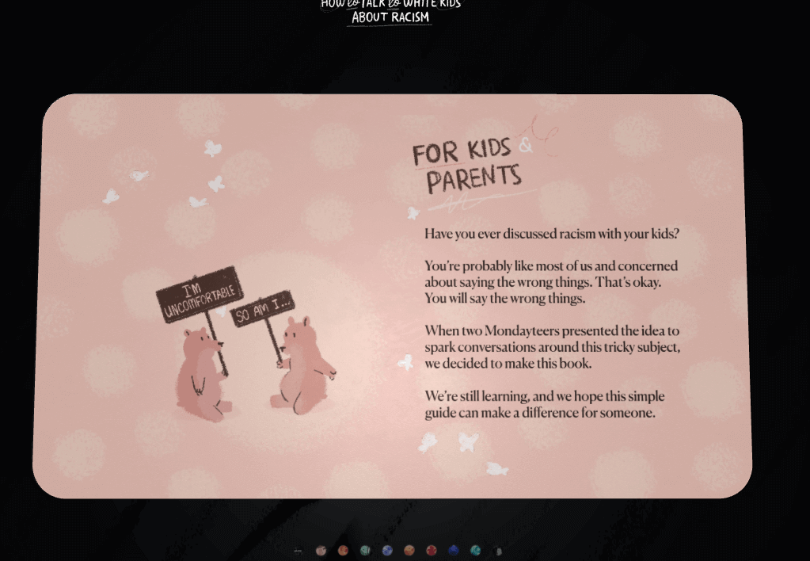
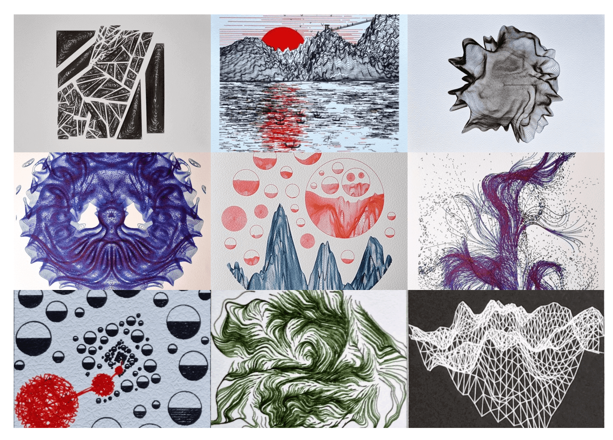
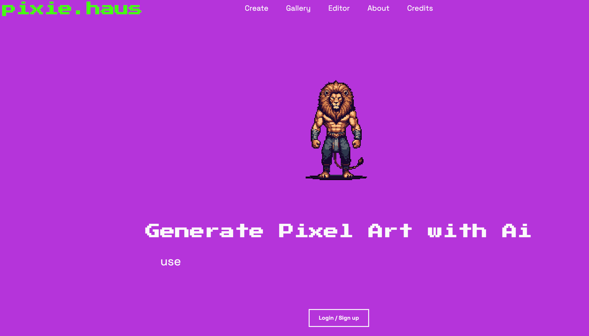

## 🎈优秀开源

**AndroidWebGL**

https://github.com/tanpuer/AndroidWebGL

Using v8 in Android to run WebGL Demo.

**ShaderToyAndroid**

https://github.com/tanpuer/ShaderToyAndroid

ShaderToy plugin for Android

## 🔨好工具

**watabou**

https://watabou.github.io/

地图生成工具

**md2card**

https://md2card.com/zh

Markdown转知识卡片

## 📚好资源

**Awesome-Android-NDK**

https://github.com/JsonChao/Awesome-Android-NDK

全面深入地掌握NDK技术，成为下一波5G时代的浪潮儿~

**codekk**

https://p.codekk.com/

Android开发老站点：KK 专注于开发效率提升、开源分享、技术内推、源码解析、框架设计、好文推荐

**diygod**

https://diygod.cc/about

一个前端大佬的博客

**wix**

https://zh.wix.com/website/templates/html/portfolio-cv/portfolios

網站範本参考

**OpenGLESDemo**

https://github.com/ouyangpeng/OpenGLESDemo

Android客户端OpenGLES学习资料

## 🎮好玩的

**HTWKR**

https://howtotalktowhitekidsaboutracism.com/

H5前端优秀案例，采用treejs实现的儿童翻页图书

**greweb-plots**

https://greweb.me/plots

一个外国博主使用代码来生成艺术（创意编码）

**pixie.haus**

 

https://pixie.haus/

像素风格一键生成工具