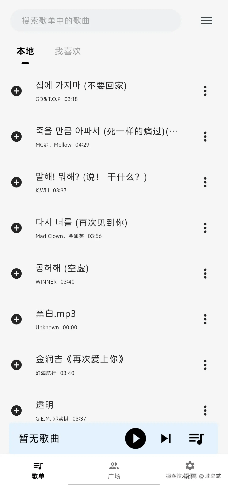
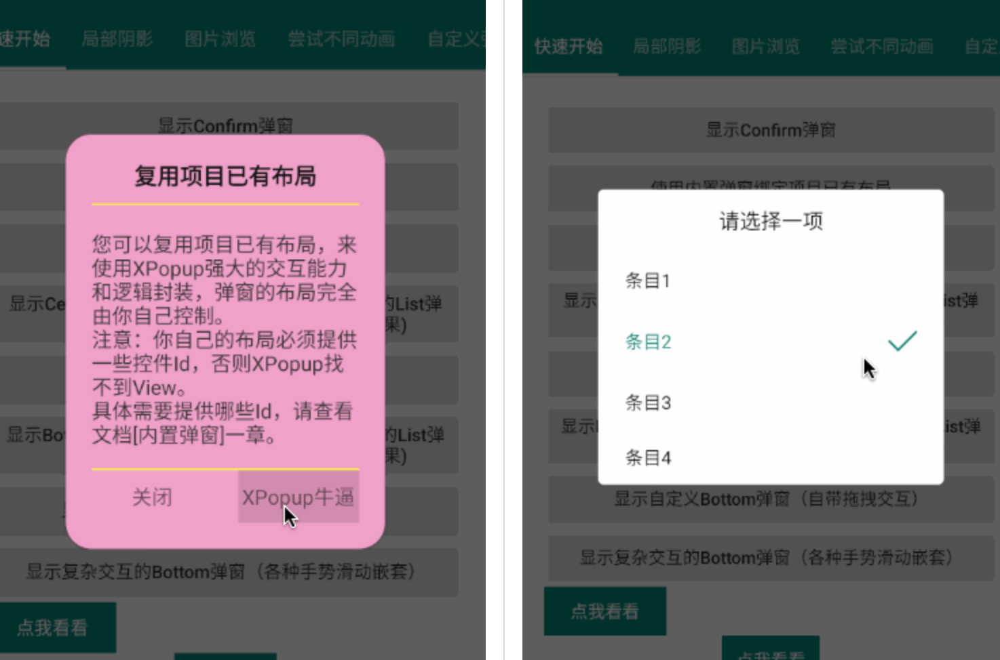
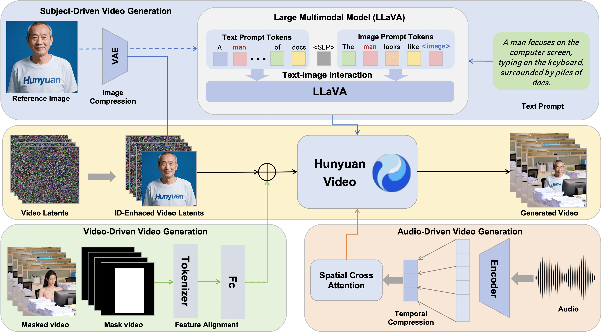
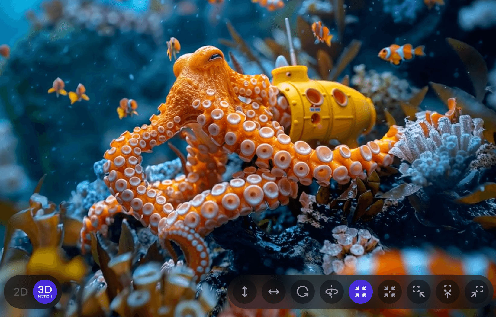

## 🎈优秀开源

**bobomusic**

https://github.com/Redstone-1/bobomusic

一款Flutter开发的开源免费音乐App

**MoneyPrinterTurbo**

https://github.com/harry0703/MoneyPrinterTurbo

只需提供一个视频 主题 或 关键词 ，就可以全自动生成视频文案、视频素材、视频字幕、视频背景音乐，然后合成一个高清的短视频。

**XPopup**

https://github.com/junixapp/XPopup

Android的弹窗组件

**HunyuanCustom**

https://github.com/Tencent/HunyuanCustom

腾讯混元大模型工具

**deer-flow**

https://github.com/bytedance/deer-flow

DeerFlow（Deep Exploration and Efficient Research Flow）是一个社区驱动的深度研究框架，它建立在开源社区的杰出工作基础之上。我们的目标是将语言模型与专业工具（如网络搜索、爬虫和 Python 代码执行）相结合，同时回馈使这一切成为可能的社区。

**inject-hooks-android-rs**

https://github.com/strazzere/inject-hooks-android-rs

AndroidHook库

## 📚好资源

**OpenGLES**

https://registry.khronos.org/OpenGL-Refpages/es3/

OpenGLES官方文档

## 🔨好工具

**droidrun**

https://github.com/droidrun/droidrun

DroidRun是通过LLM代理控制Android设备的强大框架。它允许您使用天然语言命令自动化Android设备交互。

**public-apis**

https://github.com/public-apis/public-apis

许多域中的大量公共API列表包含了许多领域的接口，可以将其用于自己的产品中。

## 🎮好玩的

**buildcores**

https://buildcores.com/

3D装机PC模拟器

**Immersity AI**

https://www.immersity.ai/

2D转3D媒体转换的AI工具

**vantajs**

https://www.vantajs.com/

前端背景酷炫动画参考
