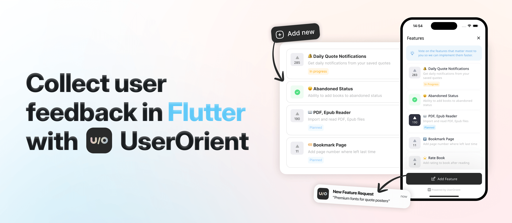
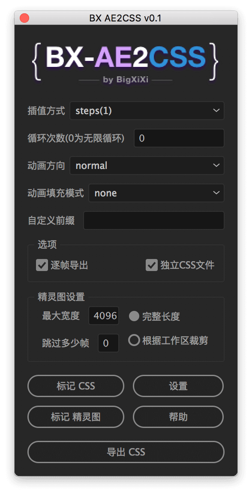
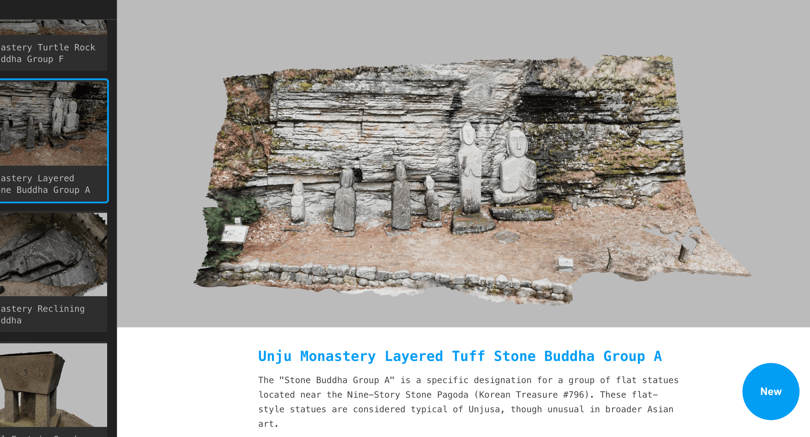

## 📖好文章 
* 📄[得物App弱网诊断探索之路](https://juejin.cn/post/7395080141129842697)
* 📄[Flutter - 支持观察NestedScrollView，兼容性更强 😈](https://juejin.cn/post/7388444606456840211)
* 📄[35岁大龄码农，用cursor独立做副业经历分享](https://juejin.cn/post/7491926630035390514)

## 🎈优秀开源

**logarte**

https://github.com/kamranbekirovyz/logarte

Flutter应用内的调试台日志工具

**mem0**

https://github.com/mem0ai/mem0

Mem0 ("mem-zero") enhances AI assistants and agents with an intelligent memory layer, enabling personalized AI interactions. It remembers user preferences, adapts to individual needs, and continuously learns over time—ideal for customer support chatbots, AI assistants, and autonomous systems.

**codiumai-jetbrains-release**

https://github.com/Codium-ai/codiumai-jetbrains-release

Qodo Gen is your AI-powered coding assistant and mentor. Qodo Gen helps you understand your code, test it and review it with your team.

## 📚好资源

**webgl2-fundamentals**

https://github.com/gfxfundamentals/webgl2-fundamentals

This is a series of lessons or tutorials about WebGL2.

## 🔨好工具

**FlClash**

https://github.com/chen08209/FlClash

基于ClashMeta的多平台代理客户端，简单易用，开源无广告。

**ae2css**

https://github.com/bigxixi/ae2css

将 AE 制作的动画导出为 CSS 代码。

## 🎮好玩的

**funes.world**

https://funes.world/

3D体验世界各地建筑

