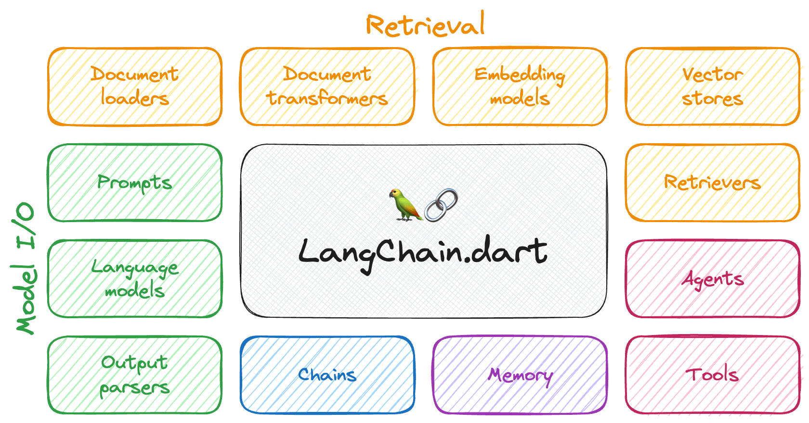
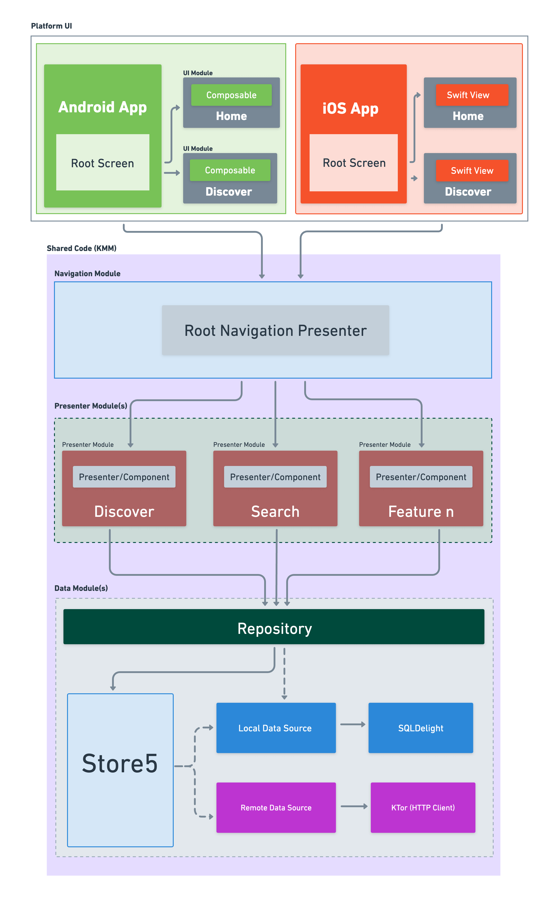
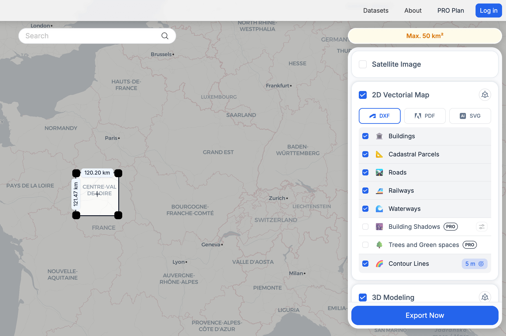

## 📖好文章 
* 📄[glance：Flutter移动端(Android/iOS)线上卡顿检测库](https://juejin.cn/post/7434899217804902427)
* 📄[如何避免别人的SDK悄悄破坏你App的混淆规则，记一次APK体积优化](https://juejin.cn/post/7453809061906645011)
* 📄[https://juejin.cn/post/7377200392059617295](https://juejin.cn/post/7377200392059617295)

## 🎈优秀开源

**dimina**

https://github.com/didi/dimina

星河小程序（以下简称 Dimina）是滴滴自研的一套轻量级跨端小程序框架，致力于为开发者提供高性能、跨平台、低门槛的开发体验。

**langchain_dart**

https://github.com/davidmigloz/langchain_dart

Build LLM-powered Dart/Flutter applications.

**tv-maniac**

https://github.com/thomaskioko/tv-maniac

TvManiac is a personalized entertainment tracking and recommendation Multiplatform app. By utilizing TMDB, we can view shows, create a watchlist get statistics, and much more. This project aims to demonstrate KMP development capabilities.

**airi**

https://github.com/moeru-ai/airi

与其他 AI 和 LLM 驱动的 VTuber 开源项目不同，アイリ VTuber 从开始开发的第一天开始就支持多种 Web 技术，涵盖诸如 WebGPU、WebAudio、Web Workers、WebAssembly、WebSocket 等已经广泛应用或仍在大量实验的 API。

## 🔨好工具

**ts-ast-viewer**

https://github.com/dsherret/ts-ast-viewer

TypeScript AST Viewer

## 🎮好玩的

一键获取全球任意地点地图模型

https://topoexport.com/

