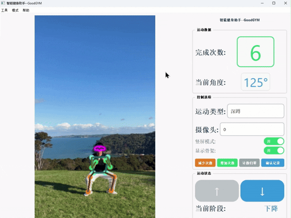
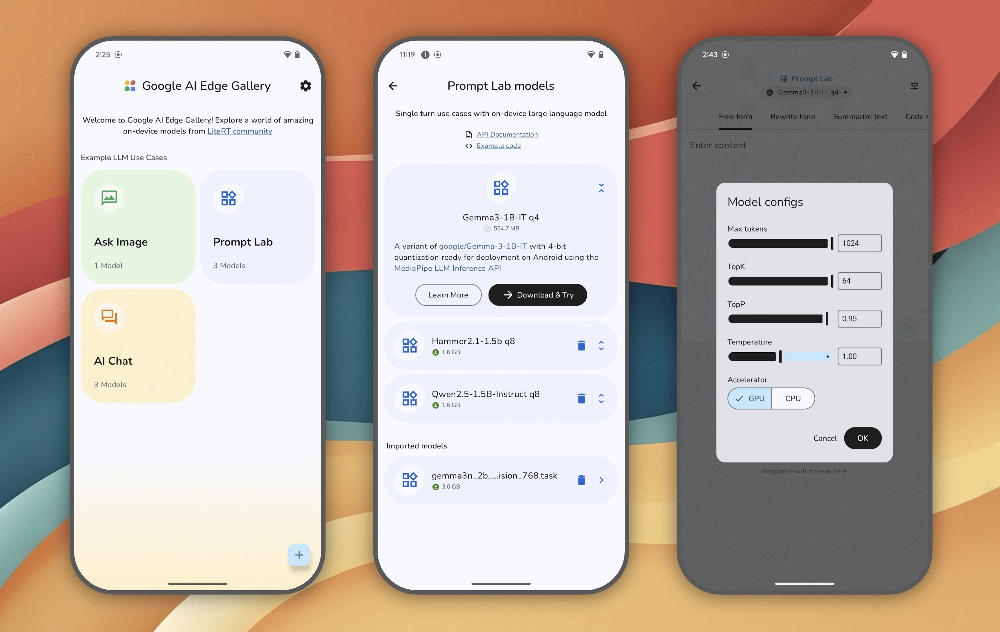
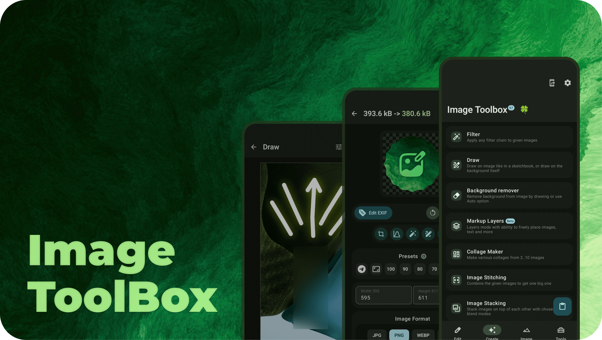
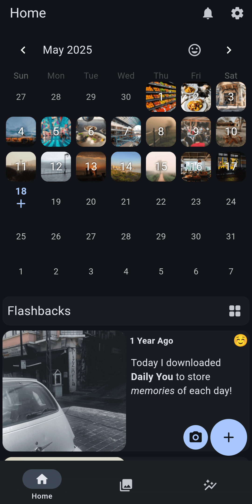
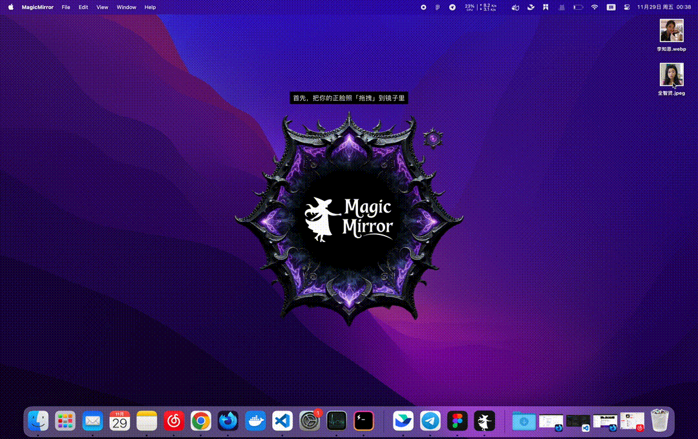
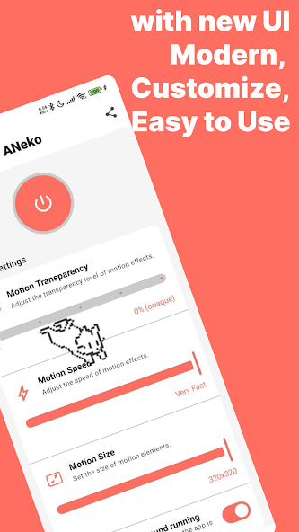

## 📖好文章 
* 📄[Android热修](https://juejin.cn/post/7426988056635015206)

## 🎈优秀开源

**Good-GYM**

https://github.com/yo-WASSUP/Good-GYM

基于RTMPose姿态检测的AI健身助手

**fading_edge_scrollview**

https://github.com/mponkin/fading_edge_scrollview

Package providing FadingEdgeScrollView which allows you to build scrollable views with fading edges

**ovCompose-sample**

https://github.com/Tencent-TDS/ovCompose-sample

ovCompose（online-video-compose）是腾讯大前端领域Oteam中，腾讯视频团队基于 Compose Multiplatform 生态推出的跨平台开发框架，旨在弥补Jetbrains Compose Multiplatform不支持鸿蒙平台的遗憾与解决iOS平台混排受限的问题，便于业务构建全跨端App。

**gallery**

https://github.com/google-ai-edge/gallery

The Google AI Edge Gallery is an experimental app that puts the power of cutting-edge Generative AI models directly into your hands, running entirely on your Android (available now) and iOS (coming soon) devices. Dive into a world of creative and practical AI use cases, all running locally, without needing an internet connection once the model is loaded. Experiment with different models, chat, ask questions with images, explore prompts, and more!

## 🔨好工具

**ImageToolbox**

 

https://github.com/T8RIN/ImageToolbox
https://play.google.com/store/apps/details?id=ru.tech.imageresizershrinker

ImageToolbox is a versatile image editing tool designed for efficient photo manipulation. It allows users to crop, apply filters, edit EXIF data, erase backgrounds, and even convert images to PDFs. Ideal for both photographers and developers, the tool offers a simple interface with powerful capabilities.

**MusicFree**

https://github.com/maotoumao/MusicFree

一个插件化、定制化、无广告的免费音乐播放器，目前只支持 Android 和 Harmony OS。

**Daily_You**

https://github.com/Demizo/Daily_You

Capture the moments that matter. Daily You helps you log your thoughts, track your mood, and keep a diary of meaningful moments, every day. Whether you're journaling, reflecting, or just noting what made you smile, Daily You gives you a private space that's truly yours.

## 🎮好玩的

**MagicMirror**

https://github.com/idootop/MagicMirror

Instant AI Face Swap — One click to a brand new you!

**ANeko Reborn**

https://play.google.com/store/apps/details?id=org.nqmgaming.aneko

在 Android 屏幕上带来经典的桌面猫宠物，体验 ANeko Reborn —— 这款现代化重制的原始 Neko 软件及其 Android 版本 ANeko 和 ANeko Plus。
