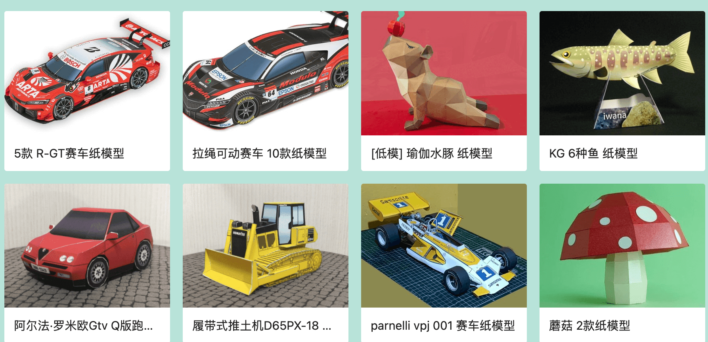
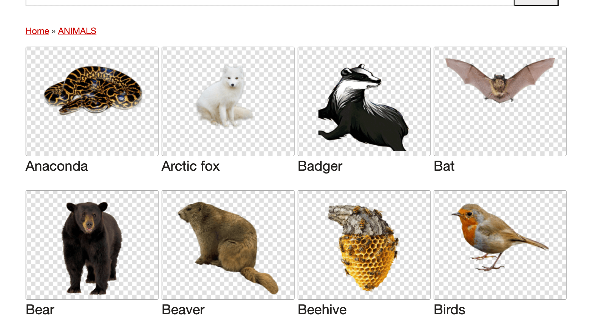
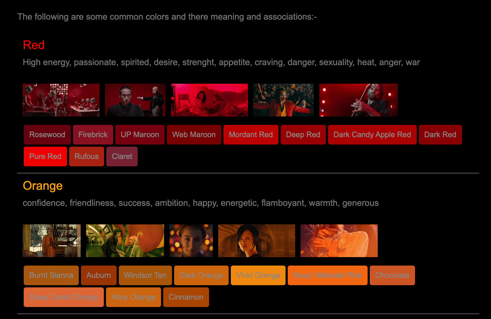
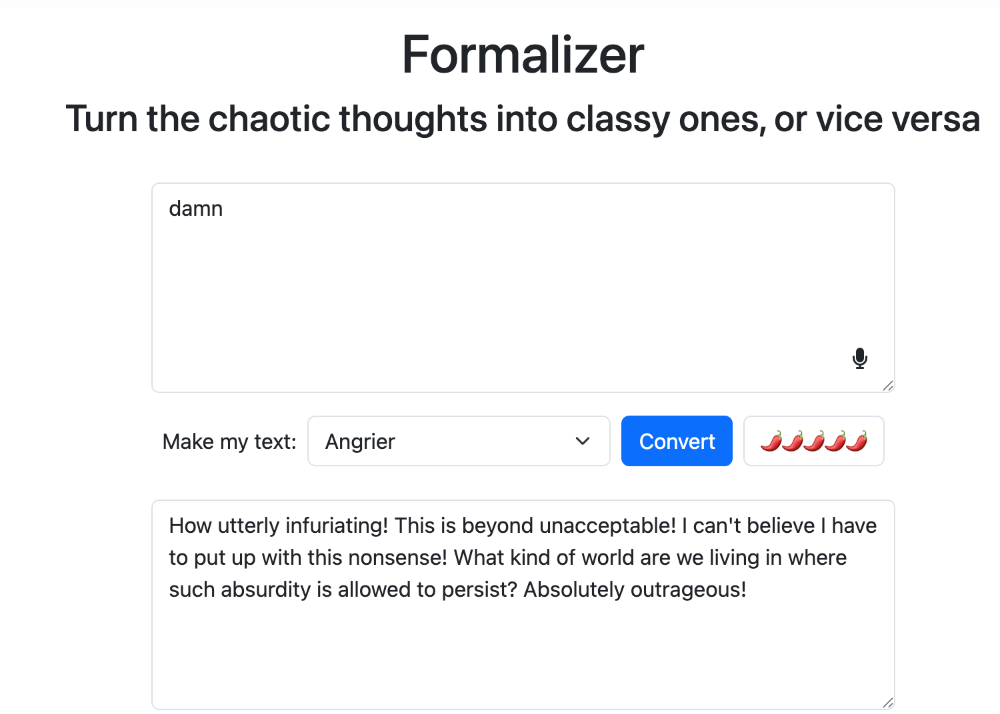

## 📖好文章 
* 📄[为什么跨平台框架可以适配鸿蒙，它们的技术原理是什么？](https://juejin.cn/post/7513136826073677850)
* 📄[Flutter+Android/ios 桌面小组件](https://juejin.cn/post/7397683995192442907)
* 📄[别人开源项目都自动化发包了，你还在本地打包？](https://juejin.cn/post/7413541435331395647)
* 📄[基于Kotlin Multiplatform的鸿蒙跨平台开发实践](https://juejin.cn/post/7404858270513152000?share_token=b772ccc6-bacf-413d-9b9d-a6f0b23f131b)

## 📚好资源

**纸工场**

https://paper.tv/

纸模资源网址

**darebee**

https://darebee.com/

专业健身资源库，收集了大量健身动作。

**seeing-theory**

https://seeing-theory.brown.edu/basic-probability/index.html

在线学习数学统计学的网址

**pngimg**

https://pngimg.com/

已抠图的透明素材资源库网址

**screenmusings**

https://screenmusings.org/

收录海量电影截图的网站，还支持根据色值分类匹配。

## 🎈优秀开源

**RobustVideoMatting**

https://github.com/PeterL1n/RobustVideoMatting

论文 Robust High-Resolution Video Matting with Temporal Guidance 的官方 GitHub 库。RVM 专为稳定人物视频抠像设计。不同于现有神经网络将每一帧作为单独图片处理，RVM 使用循环神经网络，在处理视频流时有时间记忆。RVM 可在任意视频上做实时高清抠像。在 Nvidia GTX 1080Ti 上实现 4K 76FPS 和 HD 104FPS。此研究项目来自字节跳动。

**TRELLIS**

https://github.com/microsoft/TRELLIS

TRELLIS is a large 3D asset generation model. It takes in text or image prompts and generates high-quality 3D assets in various formats, such as Radiance Fields, 3D Gaussians, and meshes. The cornerstone of TRELLIS is a unified Structured LATent (SLAT) representation that allows decoding to different output formats and Rectified Flow Transformers tailored for SLAT as the powerful backbones. We provide large-scale pre-trained models with up to 2 billion parameters on a large 3D asset dataset of 500K diverse objects. TRELLIS significantly surpasses existing methods, including recent ones at similar scales, and showcases flexible output format selection and local 3D editing capabilities which were not offered by previous models.

## 🎮好玩的

**oldmapsonline**

https://www.oldmapsonline.org/zh

通过 OldMapsOnline 探索历史,浏览历史名胜,搜索带有时间轴的老地图。

**formalizer**

https://goblin.tools/formalizer

Turn the chaotic thoughts into classy ones, or vice versa。
