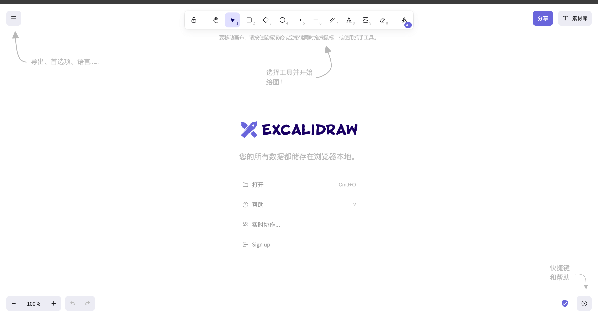

## 📖好文章
* 📄[使用 MediaExtractor + MediaMuxer 多个视频合成MP4](https://www.jianshu.com/p/97b79842b47a)

## 🔨好工具

**cobalt**

https://cobalt.tools/

支持从社交媒体平台下载视频的工具。尝试可以下载B站视频，不过小红书无法识别下载。

**agilestudio**

https://33.agilestudio.cn/

 

通过这个工具，你可以轻松找到相关台词出现的影片和时间点，另外工具还支持支持客户端下载。

**Excalidraw**

https://excalidraw.com/

 

Excalidraw是一款开源软件，不需要安装、不需要注册就可以免费使用，能简单地画出美观漂亮的流程图、示意图和开发架构图等常用图片。

## 📚好资源

**程序员做饭指南**

https://github.com/Anduin2017/HowToCook

一个程序员分享自己做菜经验制定出来的"程序员菜谱",清晰描述了每道菜所需材料、工具以及步骤。