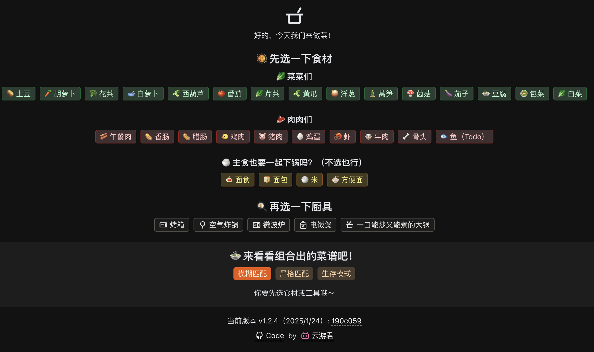
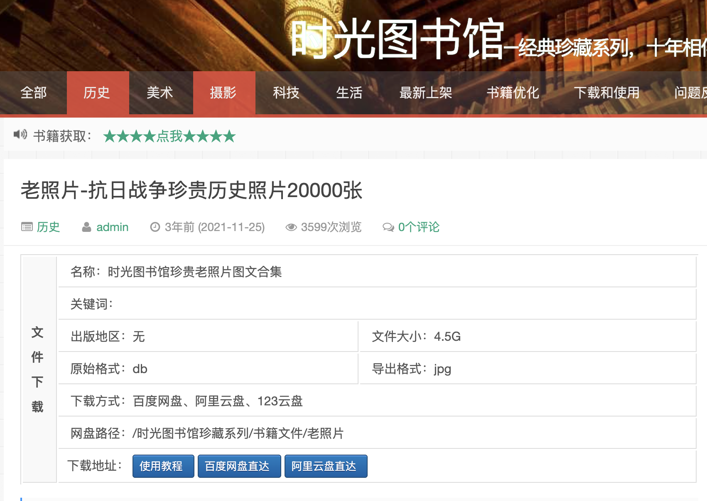
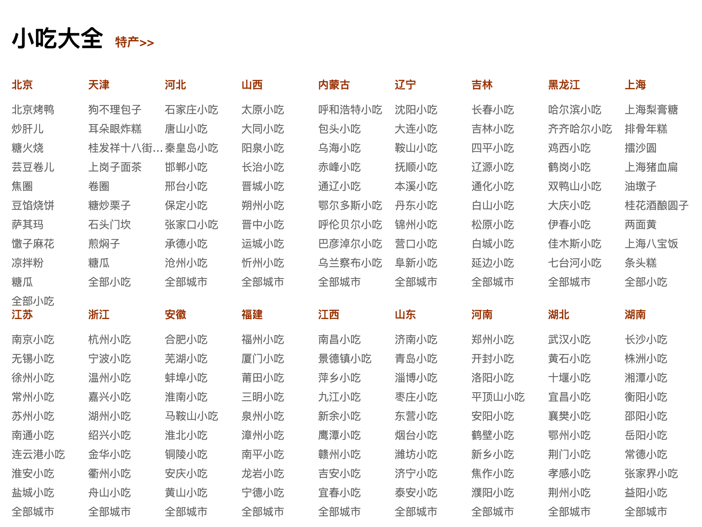
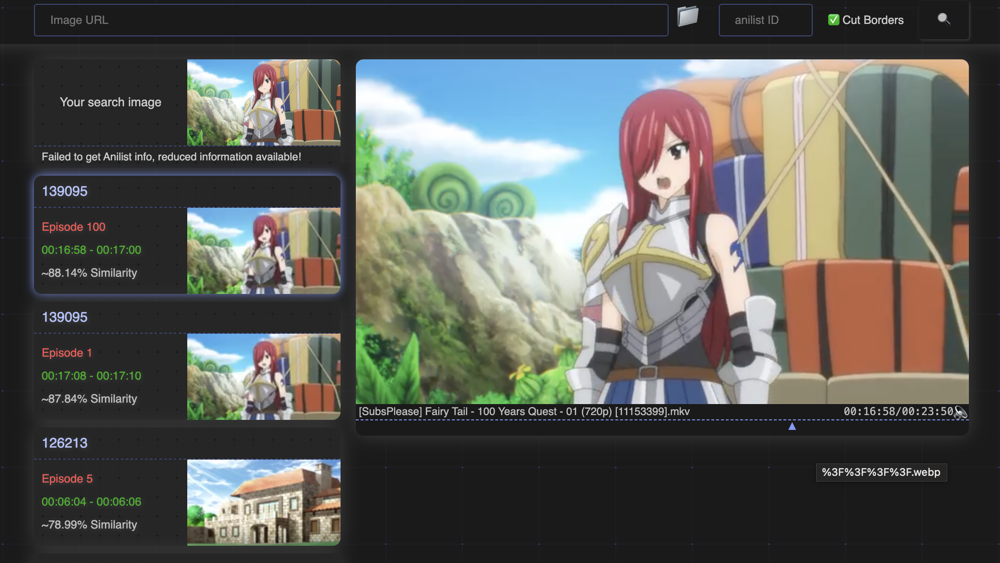
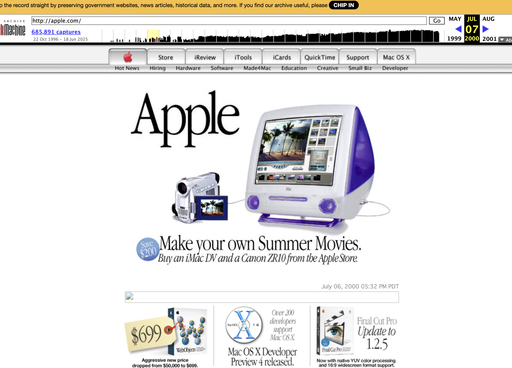
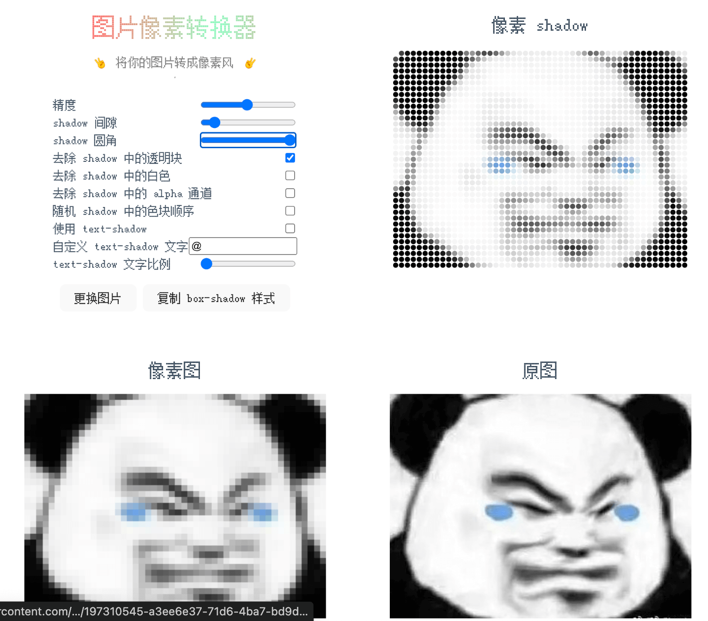
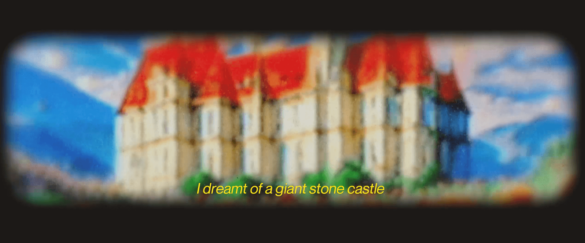

## 📖好文章 
* 📄[每个移动开发者都应该知道的 flutter 高级技巧](https://juejin.cn/post/7312724111399239743)
* 📄[都快 2024 年了还不会 vscode 插件开发？ ---- vscode 任务栏插件](https://juejin.cn/post/7312724111399239743)

## 🎈优秀开源

**liquido**

https://github.com/renancaraujo/liquido

Create beautiful liquid glass effects in your Flutter applications.

**json_to_dart_library**

https://github.com/fluttercandies/json_to_dart_library

The library to convert json to dart code

## 📚好资源

**食用手册大全**

https://cook.yunyoujun.cn/

根据现有食材寻找到合适的菜谱。

**时光图书馆**

https://atimebook.com/

一个收藏老照片、老杂志、老书籍、老漫画的资源网站。

**ebook-treasure-chest**

https://github.com/jbiaojerry/ebook-treasure-chest

欢迎来到电子书下载宝库，一个汇聚了各类电子书下载链接的地方。

**小吃大全**

https://www.xiangha.com/xiaochi/

全国各地的小吃大全

## 🔨好工具

**trace.moe**

https://trace.moe/

一张图就能找到对应动漫，还能查到这帧画面在第几分钟（试了下动漫内截图识别比较准）

**纸由我**

https://paperme.toolooz.com/

一个让你公司打印机遭殃的网站，里面有20多种纸张类型可以打印，比如方格纸、横线纸、书法纸、点阵纸、草图纸、乐谱纸等等

**audiotrimmer**

https://audiotrimmer.com/

在线音频剪辑工具网站

## 🎮好玩的

**Internet Archive**

https://archive.org/

Internet Archive is a non-profit library of millions of free texts, movies, software, music, websites, and more.

网页博物馆，可以追溯网页历史样貌。

**pixel-converter**

https://github.com/ZxBing0066/pixel-converter

将你的图片转换为像素风格。

**dreamrecorder**

https://dreamrecorder.ai/
https://github.com/modem-works/dream-recorder

Dream Recorder is a portal to your subconscious. The magical bedside device catches your nightly visions and plays them back as vivid, cinematic reels.
