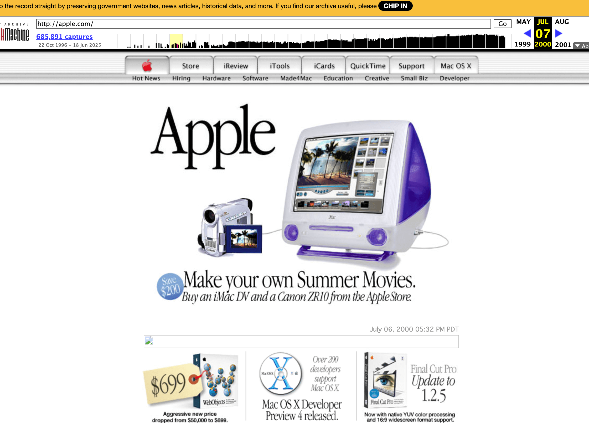

## 📖好文章 
* 📄[每个移动开发者都应该知道的 flutter 高级技巧](https://juejin.cn/post/7312724111399239743)
* 📄[都快 2024 年了还不会 vscode 插件开发？ ---- vscode 任务栏插件](https://juejin.cn/post/7312724111399239743)

## 📚好资源

**食用手册大全**

https://cook.yunyoujun.cn/

根据现有食材寻找到合适的菜谱。

**时光图书馆**

https://atimebook.com/

一个收藏老照片、老杂志、老书籍、老漫画的资源网站。

## 🔨好工具

**trace.moe**

https://trace.moe/

一张图就能找到对应动漫，还能查到这帧画面在第几分钟（试了下动漫内截图识别比较准）

**纸由我**

https://paperme.toolooz.com/

一个让你公司打印机遭殃的网站，里面有20多种纸张类型可以打印，比如方格纸、横线纸、书法纸、点阵纸、草图纸、乐谱纸等等

## 🎮好玩的

**Internet Archive**

https://archive.org/

Internet Archive is a non-profit library of millions of free texts, movies, software, music, websites, and more.

网页博物馆，可以追溯网页历史样貌。