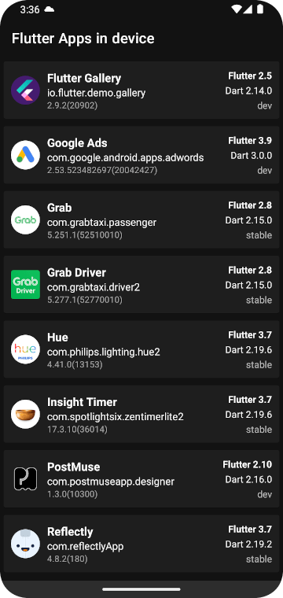
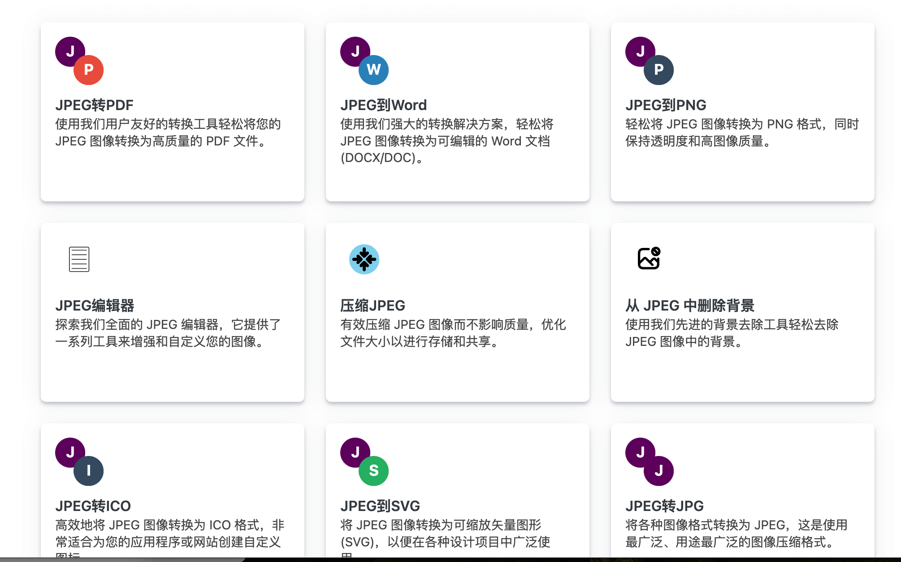

## 📖好文章 
* 📄[ListView流畅度翻倍！！Flutter卡顿分析和通用优化方](https://juejin.cn/post/6940134891606507534)
* 📄[Flutter 复杂列表开发与性能优化全攻略（现在看为时不晚！）](https://juejin.cn/post/7362562720708509708)
* 📄[看完你就懂了-移动端蓝牙开发](https://juejin.cn/post/7427340152819040294)
* 📄[Flutter 高性能、多功能的全场景滚动容器，一定要看！](https://juejin.cn/post/6917484706585903118)

## 🎈优秀开源

**azlistview**

https://github.com/flutterchina/azlistview

Flutter 城市列表、联系人列表，索引&悬停。基于scrollable_positioned_list.

**flutter_scrollview_observer**

 

https://github.com/fluttercandies/flutter_scrollview_observer

这是一个可用于监听滚动视图中正在显示的子部件的组件库。

## 🔨好工具

**fluttershark**

 

https://fluttershark.hashnode.dev/how-to-know-if-a-mobile-app-is-made-with-flutter

FlutterShark can help you determine if an Android app is made with Flutter.

**jpeg.to**

 

https://www.jpeg.to/

免费 JPEG 转换工具发现无限的可能性。可以将JPEG转化为其他格式。

**svg-to-flutter-path**

https://www.flutterclutter.dev/tools/svg-to-flutter-path-converter/

svg转Path的工具

## 🎮好玩的

**桌游游戏合集** 

https://game.hullqin.cn/

桌游合集包括五子棋、UNO、象棋等。

**yuruyurau**

https://x.com/yuruyurau

Pygame可复刻的函数生命体
a=(x,y,d=mag(k=(4+sin(y*2-t)*3)*cos(x/29),e=y/8-13))=>point((q=3*sin(k*2)+.3/k+sin(y/25)*k*(9+4*sin(e*9-d*3+t*2)))+30*cos(c=d-t)+200,q*sin(c)+d*39-220)
t=0,draw=$=>{t||createCanvas(w=400,w);background(9).stroke(w,96);for(t+=PI/240,i=1e4;i--;)a(i,i/235)}//#つぶやきProcessing