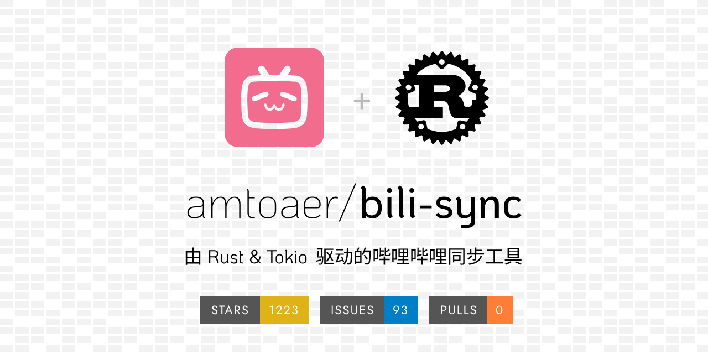
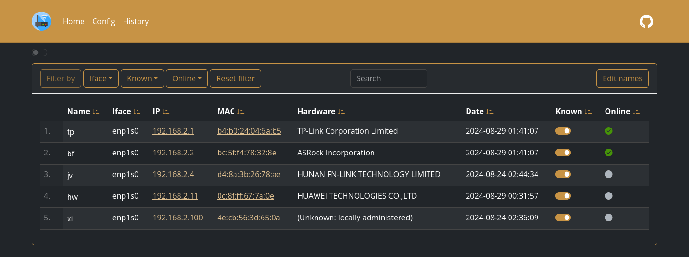

## 📖好文章 
* 📄[程序员焦虑症之「没用过」和「不知道」，码农的「拧螺丝」之道](https://juejin.cn/post/7451964967165231104)
* 📄[5分钟手把手教你开发一个MCP服务](https://juejin.cn/post/7489302960175185974)
* 📄[基于Flutter的开源壁纸软件](https://juejin.cn/post/7478870801157324852)

## 🔨好工具

**bili-sync**

https://github.com/amtoaer/bili-sync

bili-sync 是一款专为 NAS 用户编写的哔哩哔哩同步工具，由 Rust & Tokio 驱动。

**aya**

https://github.com/liriliri/aya

Android ADB desktop app.

**frida**

https://github.com/frida/frida

Dynamic instrumentation toolkit for developers, reverse-engineers, and security researchers. Learn more at frida.re.(逆向工程工具)

**WatchYourLAN**

https://github.com/aceberg/WatchYourLAN

Lightweight network IP scanner with web GUI.

**mult**

https://mult.dev/

一键生成旅游轨迹动画工具。

**ActivityTracker**

https://github.com/fashare2015/ActivityTracker

Android客户端，查看当前的Activity工具。

**Telegram-X**

https://github.com/TGX-Android/Telegram-X

This is the complete source code and the build instructions for the official alternative Android client for the Telegram messenger, based on the Telegram API and the MTProto secure protocol via TDLib.

Full-featured reader
Discover and read manga, webtoons, comics, and more – easier than ever on your Android device.

## 📚好资源

**从零开始的大语言模型原理与实践教程**

https://github.com/datawhalechina/happy-llm

本项目是一个系统性的 LLM 学习教程，将从 NLP 的基本研究方法出发，根据 LLM 的思路及原理逐层深入，依次为读者剖析 LLM 的架构基础和训练过程。同时，我们会结合目前 LLM 领域最主流的代码框架，演练如何亲手搭建、训练一个 LLM，期以实现授之以鱼，更授之以渔。希望大家能从这本书开始走入 LLM 的浩瀚世界，探索 LLM 的无尽可能。

**AndroidVersionAdapter**

https://github.com/getActivity/AndroidVersionAdapter

Android 版本适配全套指南

## 🎮好玩的

**raindrop-fx**

https://github.com/SardineFish/raindrop-fx

Optimised raindrop effect on glass with WebGL2

