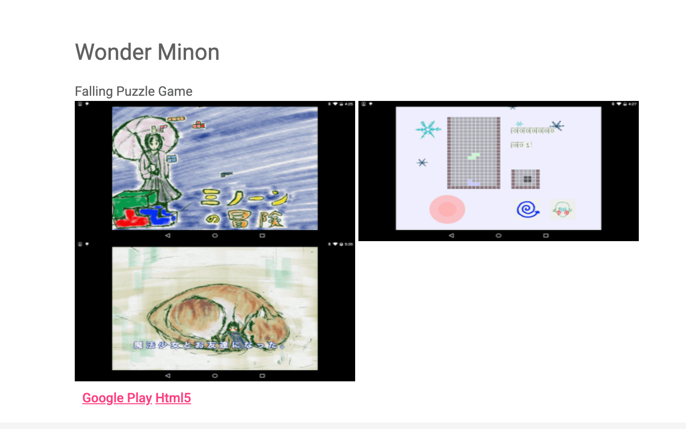
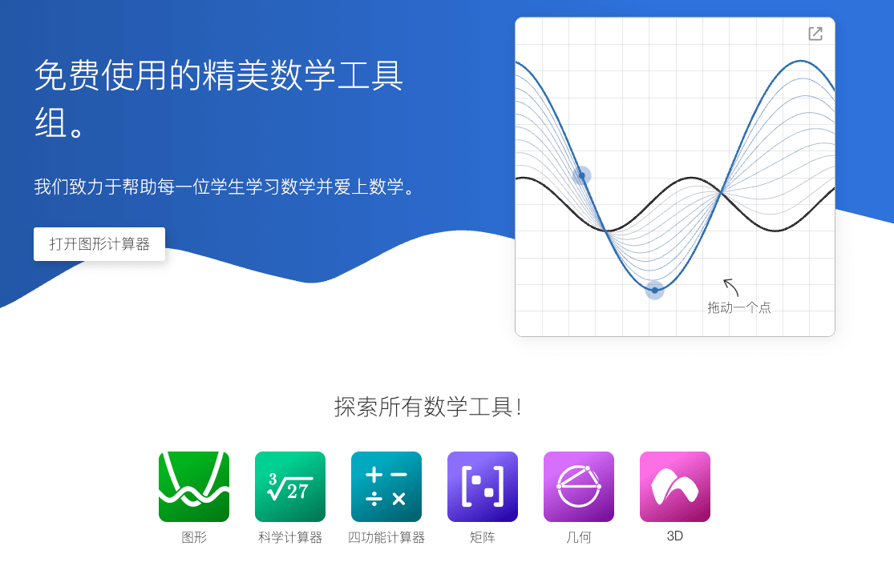

## 📖好文章 
* 📄[为什么我不建议你用Flutter实现液态玻璃效果？](https://juejin.cn/post/7520048068626038822)
* 📄[字节跳动技术副总裁洪定坤：TRAE 想做 AI Development](https://juejin.cn/post/7514956702346952713)
* 📄[闲谈 React 渲染机制](https://juejin.cn/post/7513183180091736099)
* 📄[玩转Flutter手势机制](https://juejin.cn/post/7524161016768577546)
* 📄[基于Spine的2D形象换装换动作实现](https://segmentfault.com/a/1190000040116516?sort=newest)

## 🎈优秀开源

**BreezeApp**

https://github.com/mtkresearch/BreezeApp

**xiaomusic**

https://github.com/hanxi/xiaomusic

使用小爱音箱播放音乐。

**hello_skyengine**

https://github.com/kyorohiro/hello_skyengine

UmiUni2D is tiny 2dgame library for Dart that is executable WebGL and Flutter.（一个日本老哥的Flutter修炼手册。

## 🔨好工具

**desmos**

https://www.desmos.com/

免费使用的精美数学工具组。

**ai-goofish-monitor**

https://github.com/dingyufei615/ai-goofish-monitor

一个基于 Playwright 和AI过滤分析的[XY]xiaoyu多任务实时监控与智能分析工具，配备了功能完善的 Web 管理界面。

## 📚好资源

**kisssub**

https://github.com/iota9star/kisssub

动漫资源组

**introduce_c-cpp_manual**

https://github.com/0voice/introduce_c-cpp_manual

全网搜集C/C++入门练手项目实战，包含100+经典项目，大厂面经，学习视频，推荐书籍，面试题/算法题

