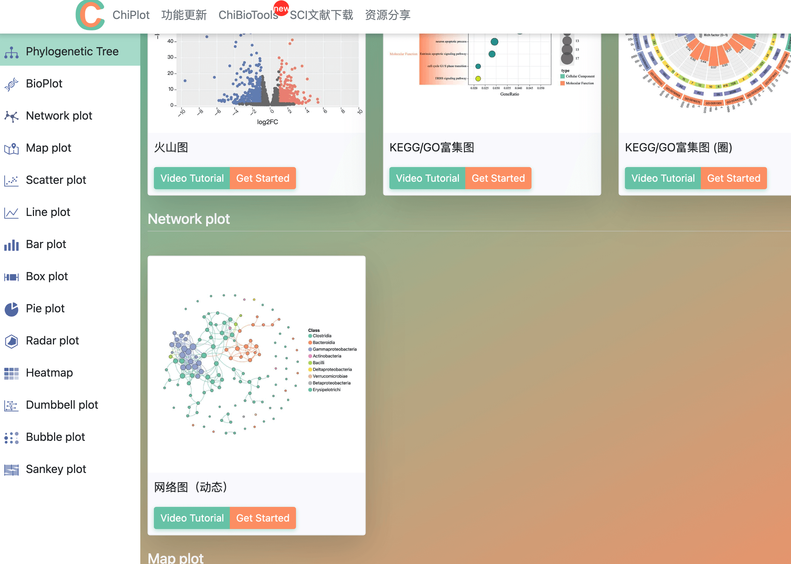
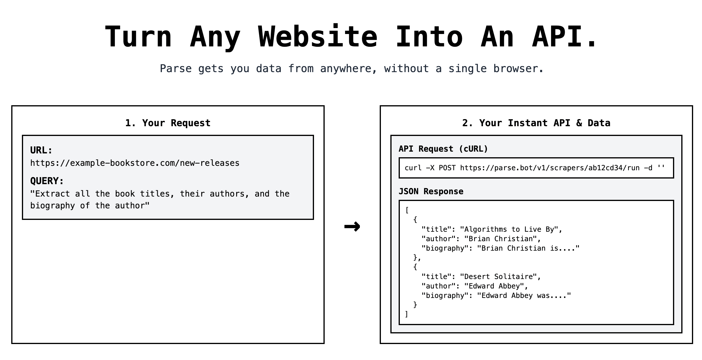
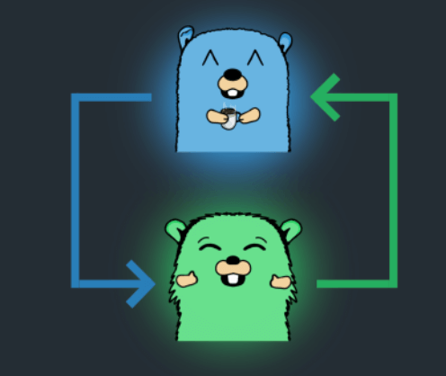
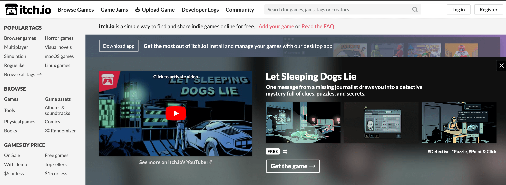
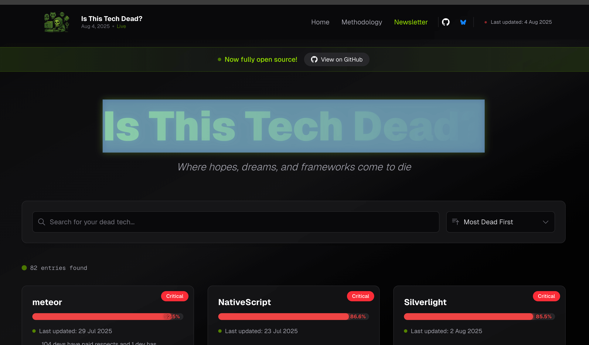
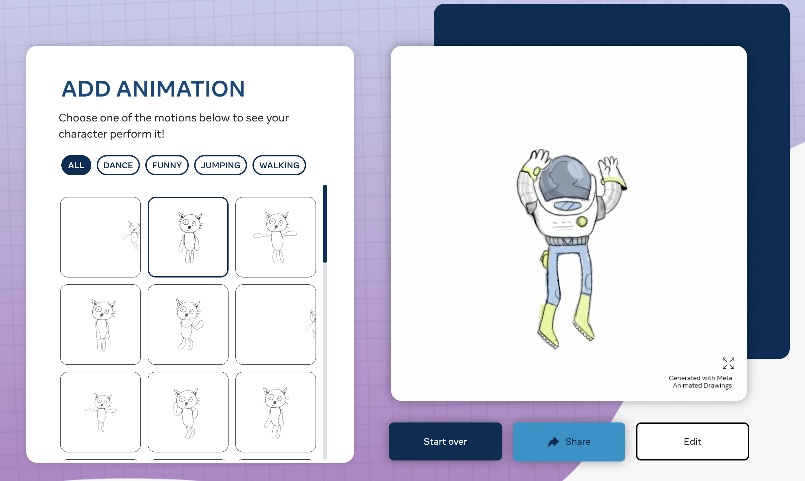
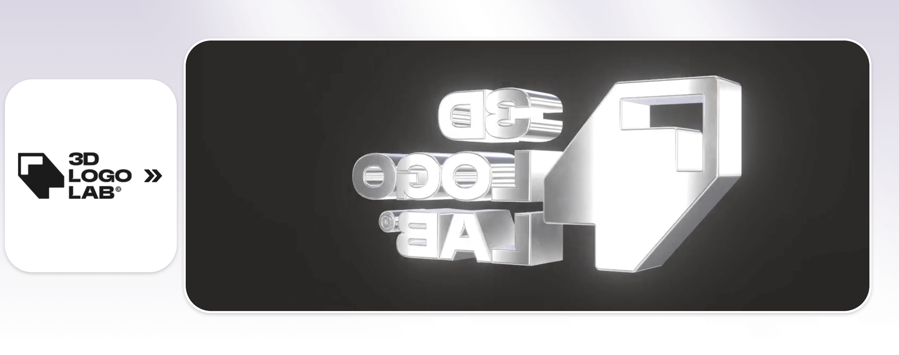

## 📖好文章 

* 📄[字节小哥带你揭秘Dart VM魔术盒](https://juejin.cn/post/6960932663095984136)
* 📄[你为什么需要了解 Dart AST？一个简单的 bug 带你快速认识下 Dart Kernel AST](https://juejin.cn/post/7490777239878795305)
* 📄[自研 DSL 神器：万字拆解 ANTLR 4 核心原理与高级应用](https://juejin.cn/post/7533521571567779882)
* 📄[C端增长业务中的动效探索](https://juejin.cn/post/7433061599248597018)
* 📄[Vue实现一个“液态玻璃”效果登录卡片](https://juejin.cn/post/7516306850715910182)

## 🔨好工具

**chiplot**

https://www.chiplot.online/

图标工具库

**parse.bot**
 

https://www.parse.bot/

Turn Any Website Into An API.

**screego**

https://screego.net/#/

It allows you to share your screen with good quality and low latency. Screego is an addition to existing software and only helps to share your screen. 一款开源屏幕共享软件使用了GO语言开发。

## 📚好资源

**itch**

https://itch.io/

itch.io是个销售和提供下载独立电子游戏的网站

## 🎮好玩的

**isthistechdead**

https://www.isthistechdead.com/

Is This Tech Dead?

**Animated Drawings**

https://sketch.metademolab.com/

Transform static sketches into fun animations.来自Meta公司的AI工具，让你的静态图片动起来。

**3dlogolab**

https://www.3dlogolab.io/

Bring your logos to life — animate, export, or embed in seconds!