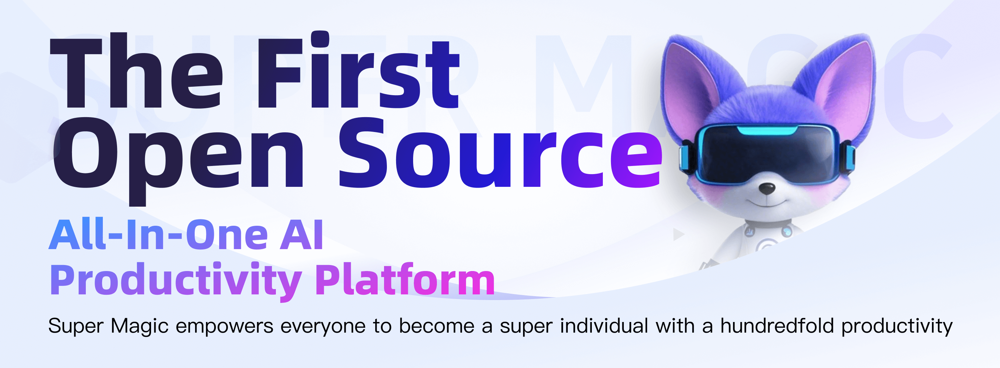
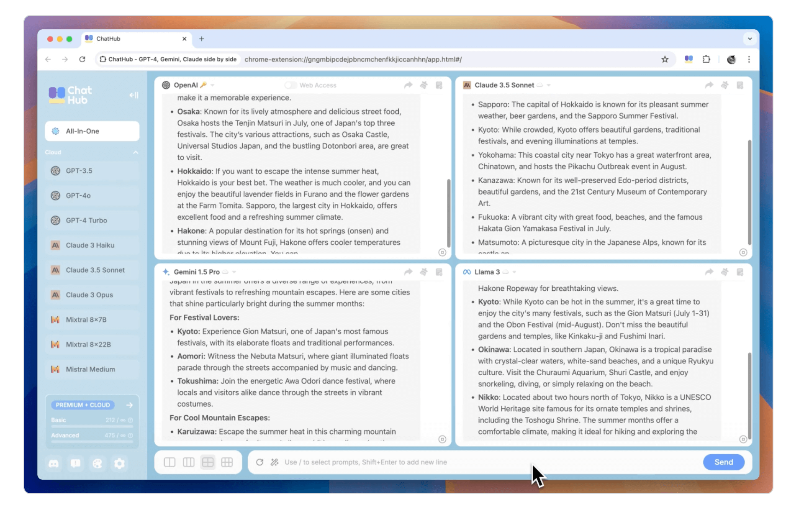
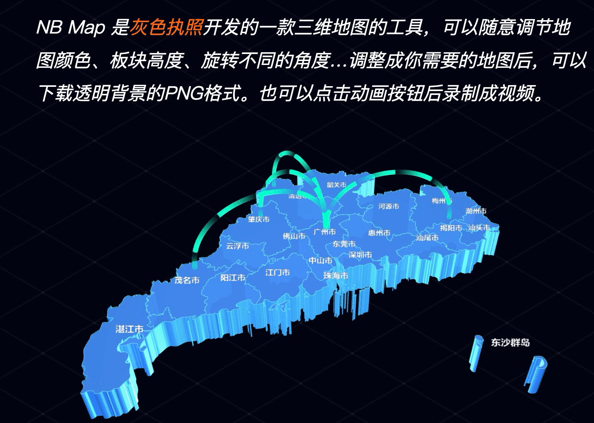
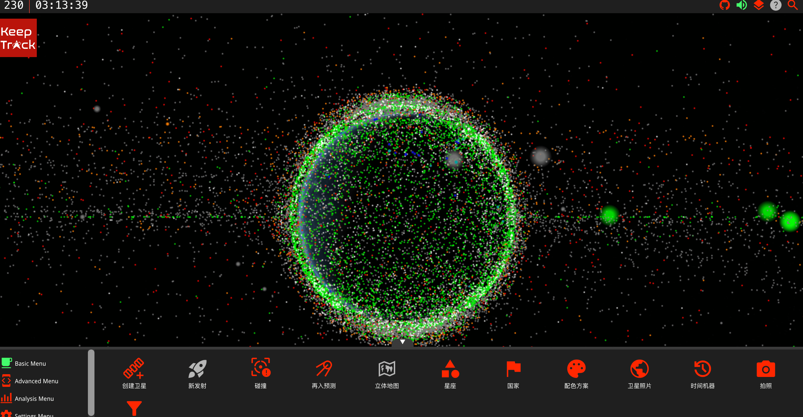

## 📖好文章 

* 📄[重温 fitsSystemWindows](https://www.sunmoonblog.com/2019/06/06/fits-system-windows/)

* 📄[Flutter 知识集锦 | 获取函数调用栈](https://juejin.cn/post/7485633146315751461)

* 📄[具透｜「胡萝卜手指」选字难：Flyme 的 Aicy 识屏是怎么做的？](https://sspai.com/post/101567)

* 📄[1 分钟，教你做出火爆全网的动物奥运会视频！附 AI 提示词](https://juejin.cn/post/7521658544577544244)

## 🎈优秀开源

**cough_detect**

https://github.com/voiddog/cough_detect

一个咳嗽检测程序，本人最近一直在咳嗽，记录下数据

*doodle**

https://nacular.github.io/doodle/

Write your app once, entirely in Kotlin and forget about the underlying platform.

**magic**

https://github.com/dtyq/magic

魔术 - 第一个开源全合理的AI生产力平台

**docker-android**

https://github.com/budtmo/docker-android

Docker-Android is a docker image built to be used for everything related to Android. It can be used for Application development and testing (native, web and hybrid-app).

## 🔨好工具

**chathub**

 

https://chathub.gg/zh-CN

AI工具：ChatGPT、Claude、Gemini 等众多AI聊天机器人，同时使用

**convertio**

https://convertio.co/zh/

文件转换器将您的文件转换成任意格式

**linkmind.chat**

https://linkmind.chat/#/home

提供爆款视频采集、对标账号监控、AI拆解分析和生成的一站式AI生产力平台

**NB Map**

https://www.nbcharts.com/map/map.php

自动生成三维地图工具

## 🎮好玩的

**animagraffs**

https://animagraffs.com/

一个通过3D模型告诉你各种物件内部结构和工作原理的网站。

**keeptrack**

https://app.keeptrack.space/

3D Visualization of satellite data and the sensors that track them.

**uchinoko-maker**

https://uchinoko-maker.jp/?lang=zh-CN

You can easily create a Uchinoko illustration just by selecting the parts!

**sz-games**

https://sz-games.online/

游戏集锦网址