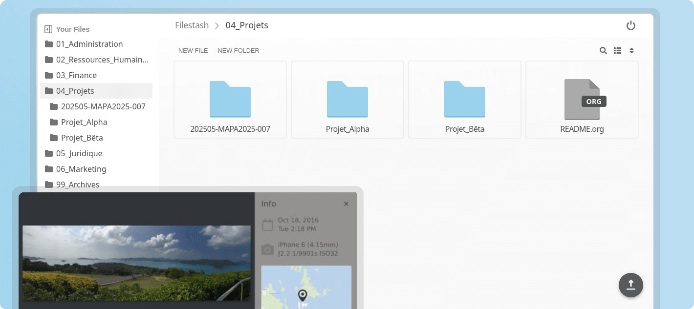

## 📖好文章 

* 📄[CVE-2024-49721 InputMethodSubtypeArray 反序列化漏洞分析](https://blog.canyie.top/2025/02/04/CVE-2024-49721/)
* 📄[「 深蓝洞察 」2022 年度最“不可赦”漏洞](https://mp.weixin.qq.com/s/P_EYQxOEupqdU0BJMRqWsw)
* 📄[一种虚位密码比对方法、系统及智能锁](https://patents.google.com/patent/CN111125456A/zh)
* 📄[Flutter 真 3D 游戏引擎来了，flame_3d 了解一下](https://juejin.cn/post/7545699564176719914)

## 🎈优秀开源

**pine**

https://github.com/canyie/pine

Pine 是一个在虚拟机层面、以Java方法为粒度的运行时动态 hook 框架，它可以拦截本进程内几乎所有的 java 方法调用。

目前它支持Android 4.4（只支持 ART）~ 15 Beta 4 且使用 thumb-2/arm64 指令集的设备。

**SwissArmyKnife**

https://github.com/android-notes/SwissArmyKnife

SwissArmyKnife 是一款方便调试android UI的工具。可以直接在android设备屏幕上显示控件的相关信息。3.x版本对根View没有任何要求，可以是任意类型的view。 3.x需要弹窗权限。由于时间有限，暂未兼容Android5.0以下设备

**DeviceCompat**

https://github.com/getActivity/DeviceCompat

Android获取国产设备信息的兼容框架

**LeakValue**

https://github.com/michalbednarski/LeakValue

关于利用CVE-2022-20452，通过使用lazyvalue在Android上升级到系统应用程序（或其他应用程序）。

这老哥专门研究Android系统漏洞:

https://github.com/michalbednarski

## 🔨好工具

**filestash**

https://github.com/mickael-kerjean/filestash

A Dropbox-like file manager that let you manage your data anywhere it is located

**file-transfer-go**

https://github.com/MatrixSeven/file-transfer-go

文件快传 - 文件传输工具(安全、快速、简单的点对点文件传输解决方案 - 无需注册，即传即用)

**[S]Spider_XHS**

https://github.com/cv-cat/Spider_XHS

XHS工具

## 🎮好玩的

**kumospace**

https://www.kumospace.com/

Kumospace makes managing teams like being in the same room. Complex projects with tight deadlines? Communicate seamlessly with chat or video, and make your team their most productive selves.

