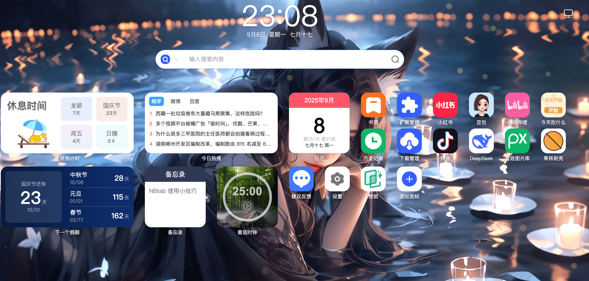
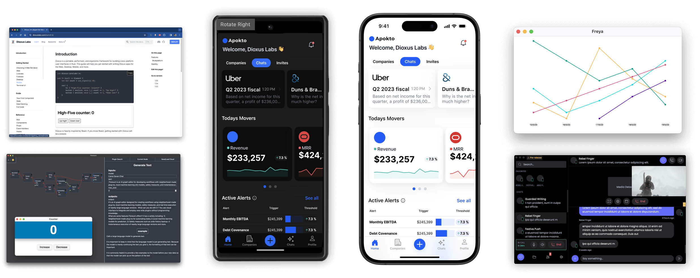
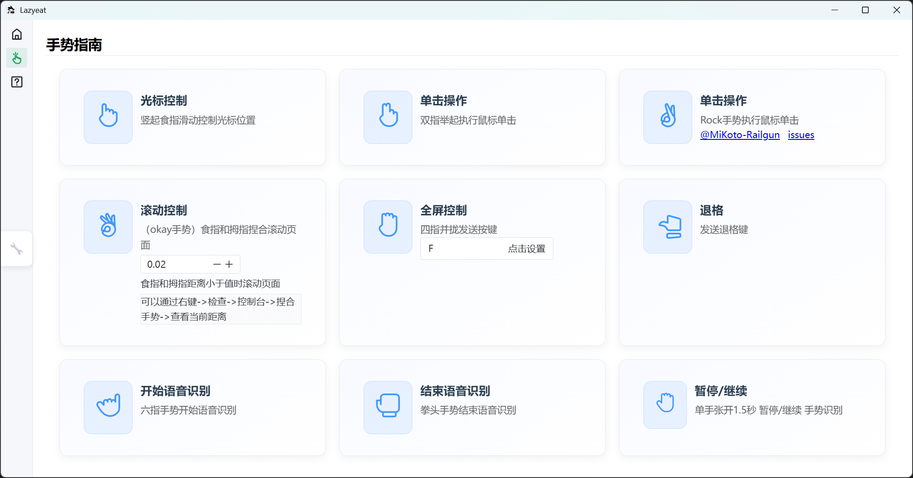
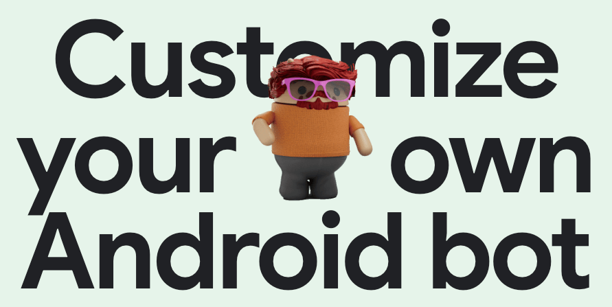

## 📖好文章 

* 📄[Meta 宣布加入 Kotlin 基金会，将为 Kotlin 和 Android 生态提供全新支持](https://juejin.cn/post/7521642915278487606)
* 📄[布局与测量：让Compose从"嵌套地狱"到"扁平化管理"](https://juejin.cn/post/7542821271174004736)
* 📄[Flutter 里的像素对齐问题，深入理解为什么界面有时候会出现诡异的细线？](https://juejin.cn/post/7518607166904991807)
* 📄[AI三大核心概念通俗指南：AIGC、Agent、MCP](https://juejin.cn/post/7525579161038225443)
* 📄[Kotlin Multiplatform 与 Compose Multiplatform 后续计划 | 官方博客](https://mp.weixin.qq.com/s/BIyyoCPuvFR27u8KXQ9Idw)
* 📄[我写了个App，上架 Google Play 一年，下载不到 10 次，于是决定把它开源了](https://juejin.cn/post/7471630643534512164)

## 📚好资源

**chinese-independent-developer**

https://github.com/1c7/chinese-independent-developer

聚合所有中国独立开发者的项目

## 🔨好工具

**GPT-SoVITS**

https://github.com/RVC-Boss/GPT-SoVITS

强大的少样本语音转换与语音合成Web用户界面。

**nbtab**

https://nbtab.com/

nbtab扩展迷网站，制作精良。

## 🎈优秀开源

**dioxus**

https://github.com/DioxusLabs/dioxus

30K的又一个跨平台框架：使用单一代码库构建 Web、桌面端、移动端以及更多平台的应用。

**Shadow**

https://github.com/Tencent/Shadow

Shadow是一个腾讯自主研发的Android插件框架，经过线上亿级用户量检验。 Shadow不仅开源分享了插件技术的关键代码，还完整的分享了上线部署所需要的所有设计。

**pixel_prompt**

https://github.com/primequantuM4/pixel_prompt

PixelPrompt is a Terminal UI (TUI) framework for Dart, inspired by Flutter’s widget-driven architecture.

Dart终端UI组件库

**scatter**

https://github.com/HungryProton/scatter

Place anything you want in your scenes, in a procedural, non-destructive way.
Godot engine addon to randomly fill an area with props or other scenes

**VibeVoice**

https://github.com/microsoft/VibeVoice
https://microsoft.github.io/VibeVoice/

该模型采用 next-token diffusion 机制，实现了长达90分钟、支持最多4人自然对话的高质量语音生成。更重要的是，VibeVoice 生成的语音中，还能听到说话人自然的呼吸、恰到好处的停顿，甚至偶尔的唇齿音，仿佛真的有人在你耳边交谈。

**TradingAgents**

https://github.com/TauricResearch/TradingAgents

TradingAgents: Multi-Agents LLM Financial Trading Framework

## 🎮好玩的

**radio.garden**

https://radio.garden/

Explore live radio by rotating the globe.

**lazyeat**

https://github.com/lanxiuyun/lazyeat

Lazyeat 是一款基于手势识别的非接触式控制工具。它支持摄像头手势操作和语音输入，使用户在进食时可以方便地使用设备而不弄脏手。

**androidify**

https://androidify.com/

Customize your own Android bot

Androidify: Building AI first Android Experiences with Gemini using Jetpack Compose and Firebase
