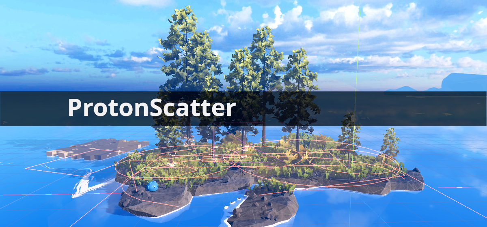
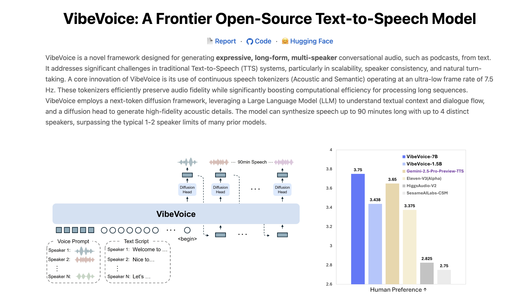
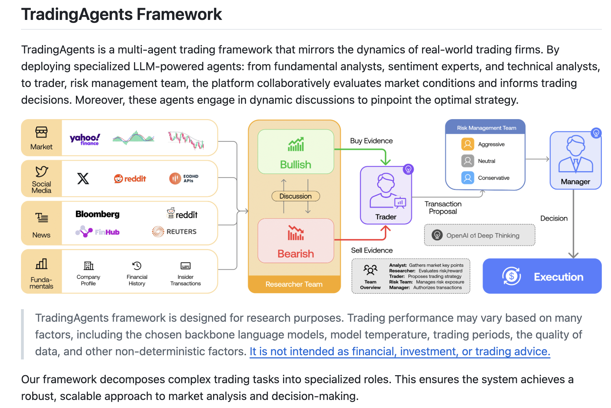
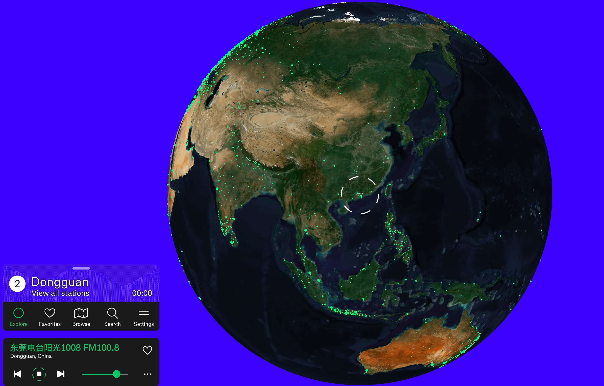

## 📚好资源

**chinese-independent-developer**

https://github.com/1c7/chinese-independent-developer

聚合所有中国独立开发者的项目

## 🎈优秀开源

**scatter**

https://github.com/HungryProton/scatter

Place anything you want in your scenes, in a procedural, non-destructive way.
Godot engine addon to randomly fill an area with props or other scenes

**VibeVoice**

https://github.com/microsoft/VibeVoice
https://microsoft.github.io/VibeVoice/

该模型采用 next-token diffusion 机制，实现了长达90分钟、支持最多4人自然对话的高质量语音生成。更重要的是，VibeVoice 生成的语音中，还能听到说话人自然的呼吸、恰到好处的停顿，甚至偶尔的唇齿音，仿佛真的有人在你耳边交谈。

**TradingAgents**

https://github.com/TauricResearch/TradingAgents

TradingAgents: Multi-Agents LLM Financial Trading Framework

## 🎮好玩的

**radio.garden**

https://radio.garden/

Explore live radio by rotating the globe.

