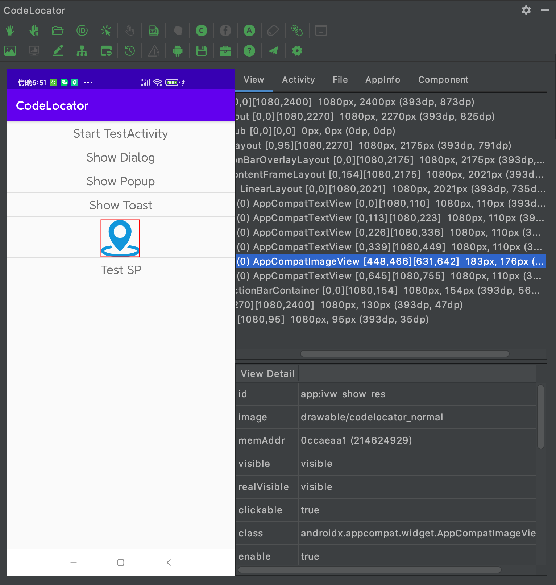
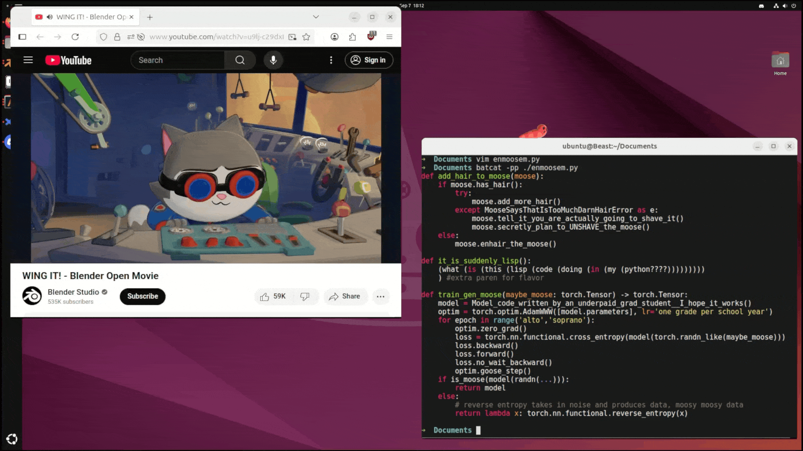

## 📖好文章 

* 📄[Measuring the Impact of Early-2025 AI on Experienced Open-Source Developer Productivity](https://metr.org/blog/2025-07-10-early-2025-ai-experienced-os-dev-study/)

* 📄[Android ASM 字节码插桩：实现双击防抖](https://juejin.cn/post/7042328862872567838)
* 📄[Android性能优化 - plt hook 与native线程监控](https://juejin.cn/post/7143945091366223903)

* 📄[C++ 获取 CPU 信息与绑核](https://liuzhe.vip/2025/04/08/C-%E8%8E%B7%E5%8F%96-CPU-%E4%BF%A1%E6%81%AF/)

* 📄[Nano Banana Images API 对接说明](https://zhuanlan.zhihu.com/p/1947856434252473117)

* 📄[Android Hook - 隐藏API拦截机制](https://juejin.cn/post/7440716088898060339)
* 📄[Android Hook - 隐藏API绕过实践](https://juejin.cn/post/7440700915140001843)

## 🎈优秀开源

**Track**

https://github.com/leavesCZY/Track

Track 是一个适用于 Android 的字节码插桩库

**booster**

https://github.com/didi/booster

Booster 是一款专门为移动应用设计的易用、轻量级且可扩展的质量优化框架，其目标主要是为了解决随着 APP 复杂度的提升而带来的性能、稳定性、包体积等一系列质量问题。

**index-tts**

https://github.com/index-tts/index-tts

IndexTTS2：情感表达与时长可控的自回归零样本语音合成突破

## 📚好资源

**Decoupling Design in Flutter**

https://github.com/flutter/flutter/issues/101479

https://docs.google.com/document/d/189AbzVGpxhQczTcdfJd13o_EL36t-M5jOEt1hgBIh7w/edit?tab=t.0

Evolving Flutter’s Design Systems for a More Modular Future

## 🔨好工具

**weiboSpider**

https://github.com/dataabc/weiboSpider

wb爬爬爬工具

**deepwiki**

https://deepwiki.com/

Which repo would you like to understand?

**CodeLocator**

https://github.com/bytedance/CodeLocator

CodeLocator是一个包含Android SDK 与 Android Studio插件的Android工具集(目前仅支持Mac, Windows)

**Pixel-Travel-Map**

https://github.com/Reborn14/Pixel-Travel-Map

一个 AI 驱动的互动式「旅游打卡地图」

## 🎮好玩的

**term.everything**

https://github.com/mmulet/term.everything

term.everything❗ is a Linux CLI program to run GUI windows in your terminal. Specifically, term.everything❗ is a built-from-scratch Wayland compositor that outputs to a terminal rather than your monitor.

