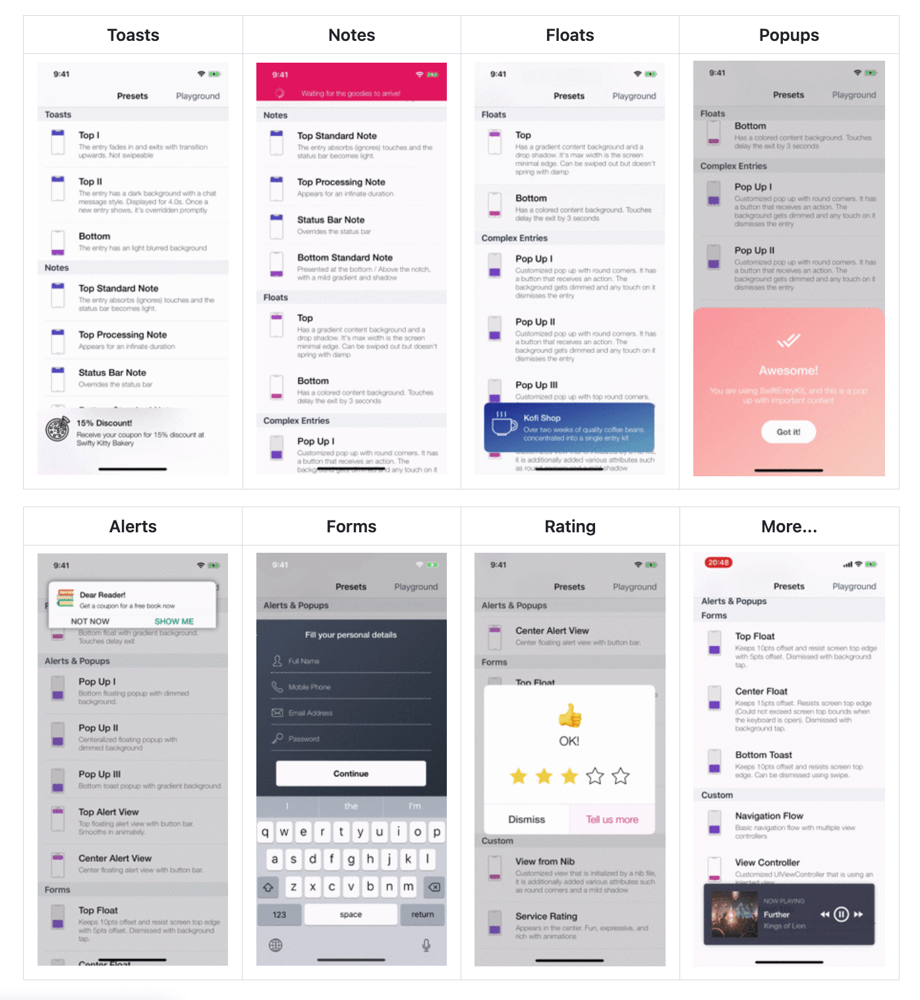
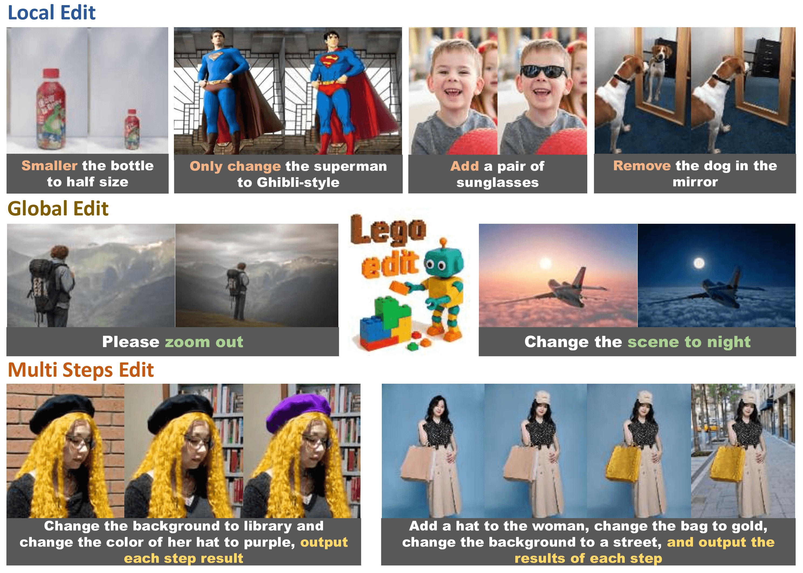
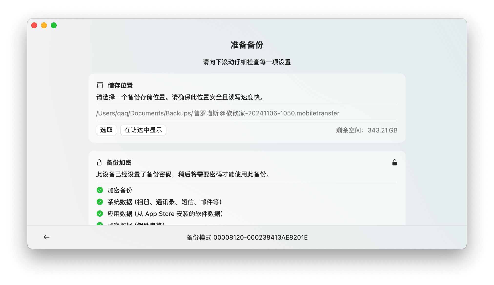
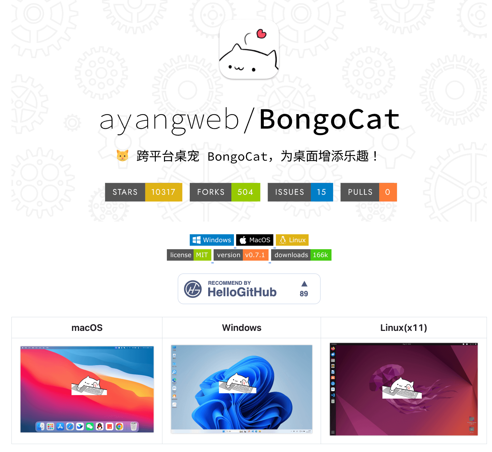

## 📖好文章 

* 📄[在Dart泛型中应该优先使用dynamic还是Object？](https://juejin.cn/post/7497435737052446730)
* 📄[2025 年真正有效的 App Store 优化（ASO）](https://juejin.cn/post/7545894189385777178)

## 📚好资源

**now-in-kotlin**

https://github.com/RicardoJiang/now-in-kotlin

Now in Kotlin 是一个基于 ovCompose 技术构建的跨平台项目。本项目旨在帮助开发者了解 Kotlin 最新技术动态，同时演示如何利用 ovCompose 在 Android、iOS 和 鸿蒙三个平台上实现代码共享与高效开发。

**SwiftEntryKit**

 

https://github.com/huri000/SwiftEntryKit

SwiftEntryKit's APIs use the Swift language exclusive syntax (enums, associated values, and more). Therefore, SwiftEntryKit cannot be referenced directly from an Objective-C file (.m, .h or .mm).

**analysis_claude_code**

https://github.com/shareAI-lab/analysis_claude_code

本仓库是对 Claude Code v1.0.33 进行深度逆向工程分析的完整研究资料库。通过对混淆源代码的系统性分析，我们揭示了这个现代AI编程助手的核心架构设计、实现机制和运行逻辑。

**pinduoduo_backdoor_x**

https://github.com/davinci01010/pinduoduo_backdoor_x

0day漏洞分析

## 🔨好工具

**timber**

https://github.com/JakeWharton/timber

This is a logger with a small, extensible API which provides utility on top of Android's normal Log class.

**brush**

https://github.com/ArthurBrussee/brush

Brush is a 3D reconstruction engine using Gaussian splatting. It works on a wide range of systems: macOS/windows/linux, AMD/Nvidia/Intel cards, Android, and in a browser. To achieve this, it uses WebGPU compatible tech and the Burn machine learning framework.

**mosaic**

https://github.com/JakeWharton/mosaic

An experimental tool for building console UI in Kotlin using the Jetpack Compose compiler/runtime.

## 🎈优秀开源

**lego-edit**

https://github.com/xiaomi-research/lego-edit

Lego-Edit: A General Image Editing Framework with Model-Level Bricks and MLLM Builder

**MobileTransfer**

 

https://github.com/Lakr233/MobileTransfer

MobileTransfer 是一款基于 MobileBackup (idevicebackup2) 运行的应用程序，为 iOS 设备提供数据备份和恢复解决方案。

**hls.js**

https://github.com/video-dev/hls.js

HLS.js is a JavaScript library that implements an HTTP Live Streaming client. It relies on HTML5 video and MediaSource Extensions for playback.

**penumbra**

https://github.com/shomykohai/penumbra

Penumbra is a Rust crate and tool for interacting with Mediatek devices.

## 🎮好玩的

**BongoCat**

https://github.com/ayangweb/BongoCat

本项目的灵感来源于 MMmmmoko 大佬开发的 Bongo-Cat-Mver。它以独特的猫咪互动功能深受用户喜爱，但仅支持 Windows 平台。作为一名深度 macOS 用户，我特别希望在自己的设备上也能使用这款可爱的猫咪，于是我决定开发一个适配 macOS 的版本。

**gallerix**

https://gallerix.asia/

RuNet最大和最受欢迎的关于绘画的专题网站。超过4万名艺术家，从我们同时代的人到已经熟知的老主人。 来自私人收藏和世界上最好的博物馆的50多万幅画作。

这个网址收藏了许多电子版世界过去著名画作其中还有钱币博物馆的内容可了解查看各国货币样式。