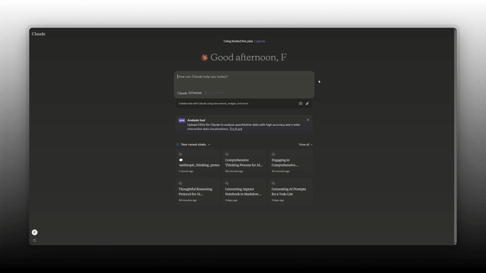
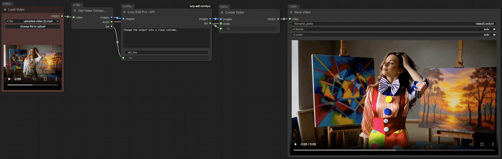
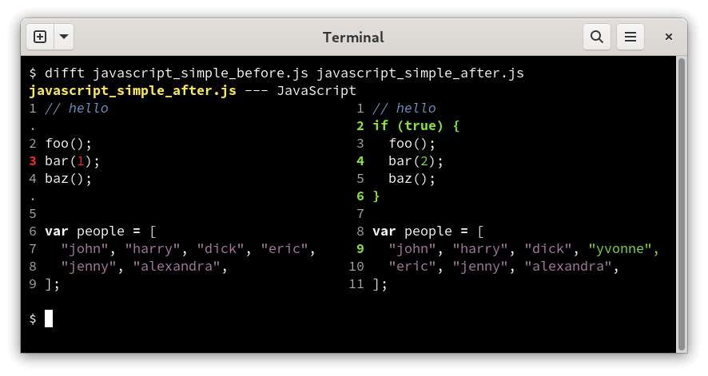
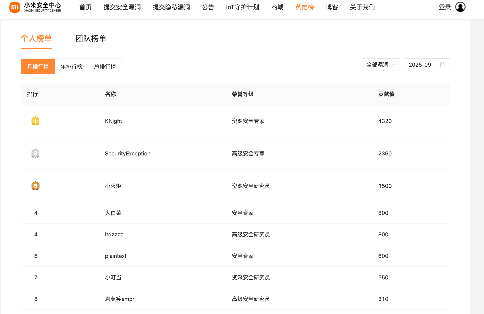

## 📖好文章 

* 📄[Android hide api反射方案合集](https://juejin.cn/post/7385832570183548966)
* 📄[理解Android P内部API的限制调用机制](http://gityuan.com/2019/01/26/hidden_api/)
* 📄[使用Android Studio 聊微信](https://juejin.cn/post/7525281845670346787)
* 📄[Android动态加载与反射机制的静态污点分析研究](https://crad.ict.ac.cn/fileJSJYJYFZ/journal/article/jsjyjyfz/HTML/2017-2-313.shtml)
* 📄[Liquid Glass in the Browser: Refraction with CSS and SVG](https://kube.io/blog/liquid-glass-css-svg/)

## 📚好资源

**Android-Daily-Interview**

https://github.com/Moosphan/Android-Daily-Interview

每工作日更新一道 Android 面试题，小聚成河，大聚成江，坚持下来的都是时代的铸就者。

**Thinking-Claude**

https://github.com/richards199999/Thinking-Claude

Let Claude think comprehensively before responding!

**libsuperuser**

https://github.com/Chainfire/libsuperuser

Even though its outdated with regards to usage of this library, if you're unfamiliar with writing code for root usage, it is not a bad idea to read it.

## 🔨好工具

**Lucy-Edit-ComfyUI**

https://github.com/DecartAI/Lucy-Edit-ComfyUI

Lucy Edit is a video editing model that performs instruction-guided edits on videos using free-text prompts — it supports a variety of edits, such as clothing & accessory changes, character changes, object insertions, and scene replacements while preserving the motion and composition perfectly.

**everyone-can-use-english**

https://github.com/ZuodaoTech/everyone-can-use-english

AI 是当今世界上最好的外语老师，Enjoy 做 AI 最好的助教。

**difftastic**

https://github.com/Wilfred/difftastic

Difftastic is a structural diff tool that compares files based on their syntax.

**APKEditor**

https://github.com/REAndroid/APKEditor

Powerful android apk resources editor

**小米安全中心-英雄榜**

https://sec.xiaomi.com/#/hero