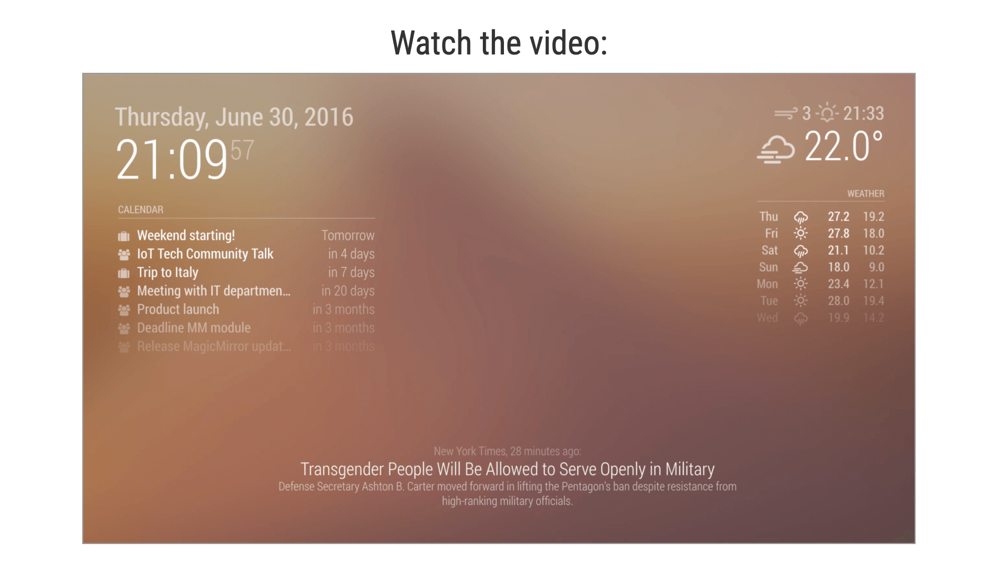
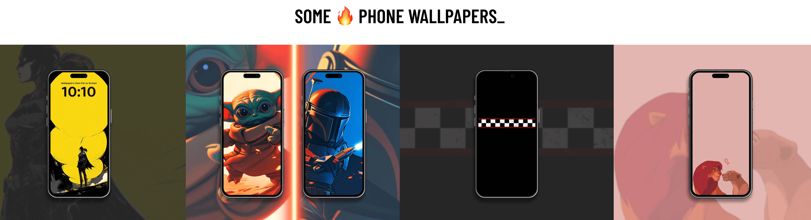
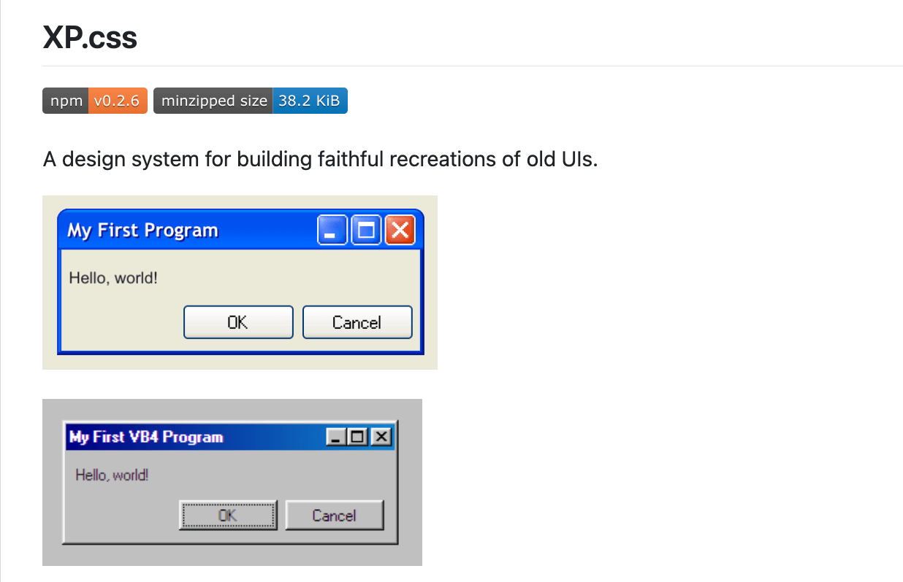
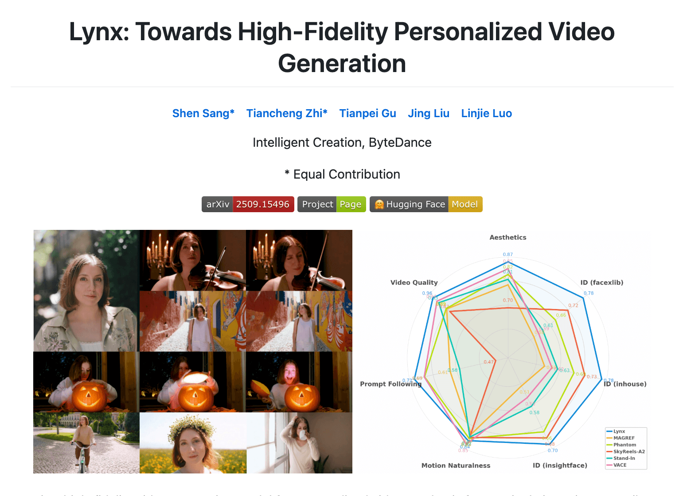
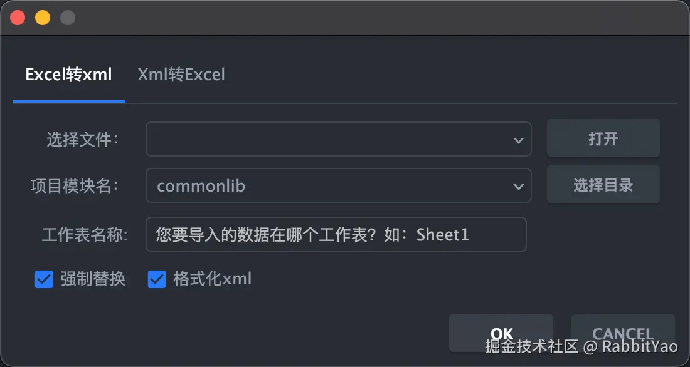
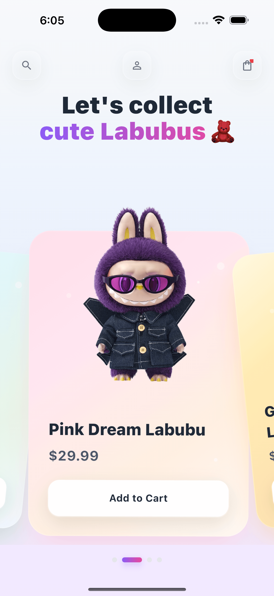

## 🎈优秀开源

**base-ui**

https://github.com/mui/base-ui

From the creators of Radix, Floating UI, and Material UI, Base UI is an unstyled UI component library for building accessible user interfaces.

**MagicMirror**

https://github.com/MagicMirrorOrg/MagicMirror

MagicMirror² is an open source modular smart mirror platform. With a growing list of installable modules, the MagicMirror² allows you to convert your hallway or bathroom mirror into your personal assistant. MagicMirror² is built by the creator of the original MagicMirror with the incredible help of a growing community of contributors.

## 📚好资源

**wallpapers-clan**

 

https://wallpapers-clan.com/

Cool Phone Wallpapers 🛼 Aesthetic App Icons

**XP.css**

https://github.com/botoxparty/XP.css

XP.css is an extension of 98.css. A CSS file that takes semantic HTML and makes it look pretty. It does not ship with any JavaScript, so it is compatible with your frontend framework of choice.

**muzero**

https://github.com/kaesve/muzero

MuZero Vs. AlphaZero in Tensorflow

**deep-learning-from-scratch-4**

https://github.com/oreilly-japan/deep-learning-from-scratch-4

从头开始的深度学习❹强化学习版

**Lynx: Towards High-Fidelity Personalized Video Generation**

https://github.com/bytedance/lynx

Lynx is a high-fidelity video generation model for personalized video synthesis from a single input image. Built on a Diffusion Transformer (DiT) foundation model with lightweight ID-adapters and Ref-adapters for identity preservation and spatial detail enhancement.

## 🔨好工具

**tbox**

https://www.tbox.cn/

百宝箱 Tbox 是面向 AI 开发者的一站式智能体应用开发平台。在平台上，无论您是否拥有编程基础，都可以通过自然语言，基于各种大模型搭建属于您自己的智能体应用，并将其发布到支付宝小程序、web 服务、浏览器插件等生态渠道。

**androidstringstool**

https://plugins.jetbrains.com/plugin/14444-androidstringstool

通过 AndroidStringsTool 更新多语言词条

**XiaoMusic**

https://xdocs.hanxi.cc/
https://juejin.cn/post/7517998609946886178

使用小爱音箱播放音乐

## 🎮好玩的

**flutter_labubu_shop_ui**

https://github.com/Mehrozsheikh/flutter_labubu_shop_ui

A Flutter e-commerce app for Labubu collectibles and merchandise.

