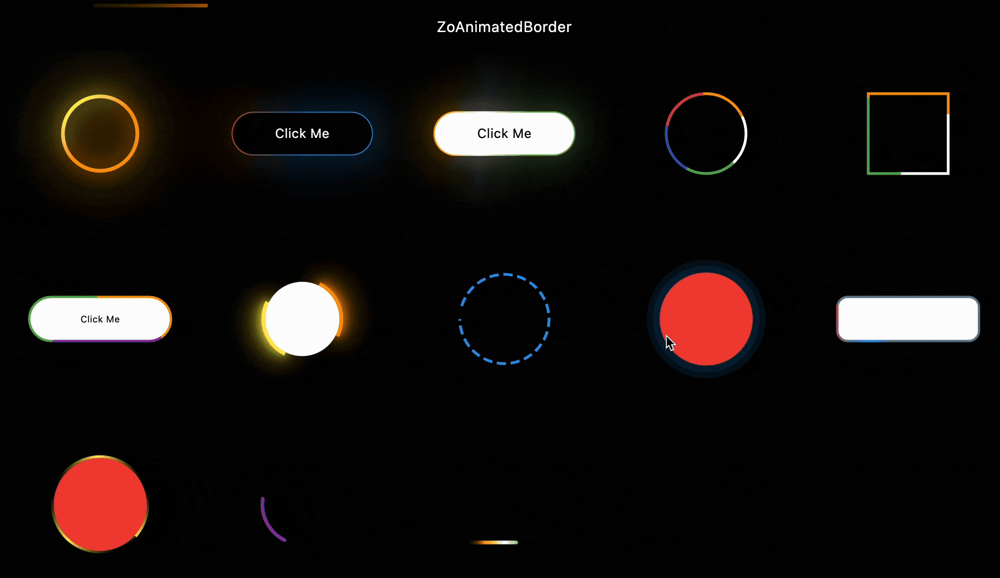
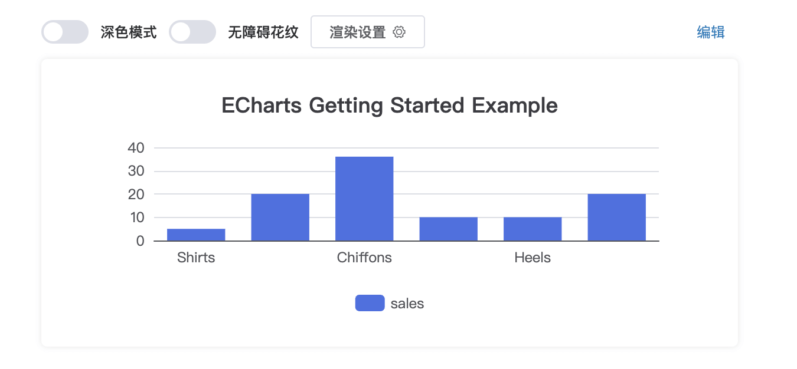
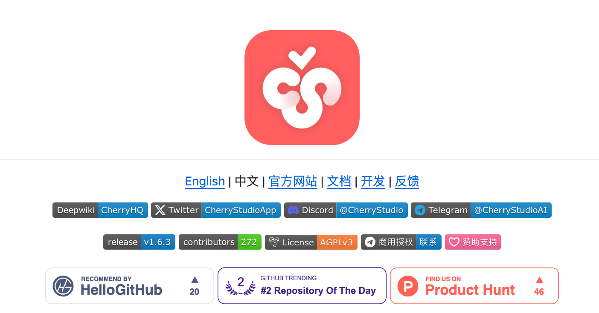
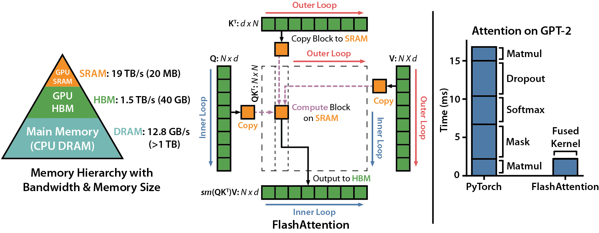
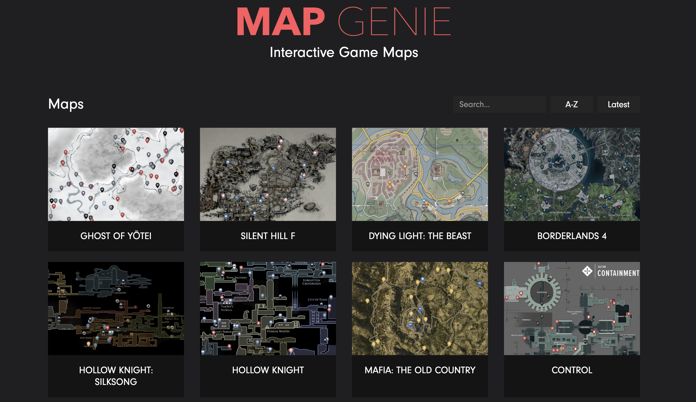
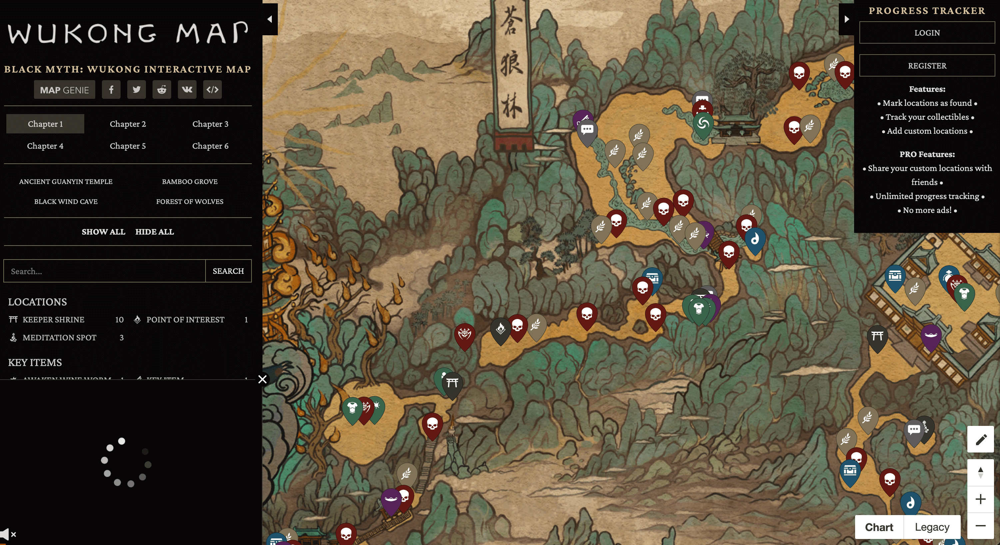
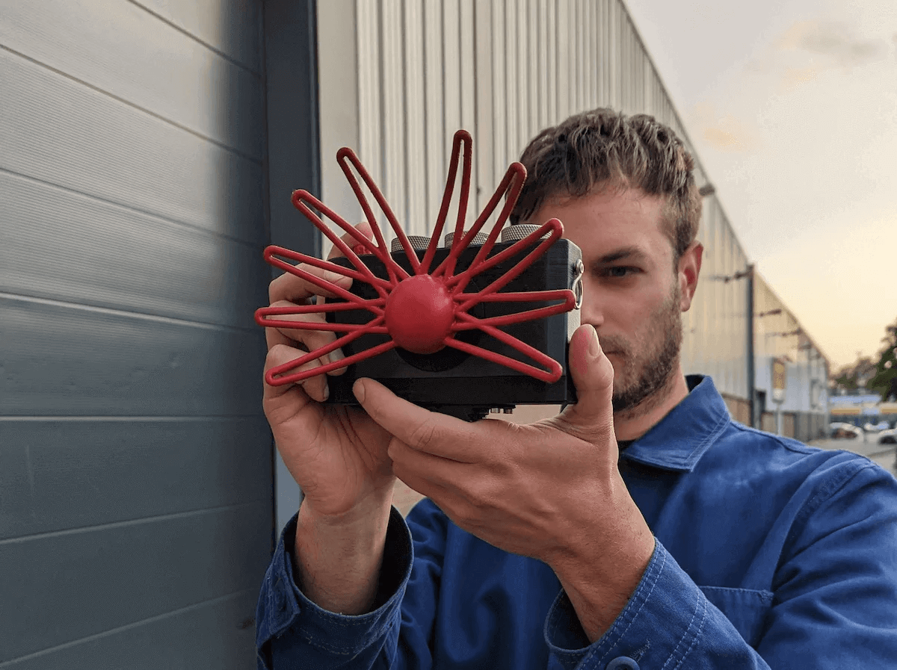
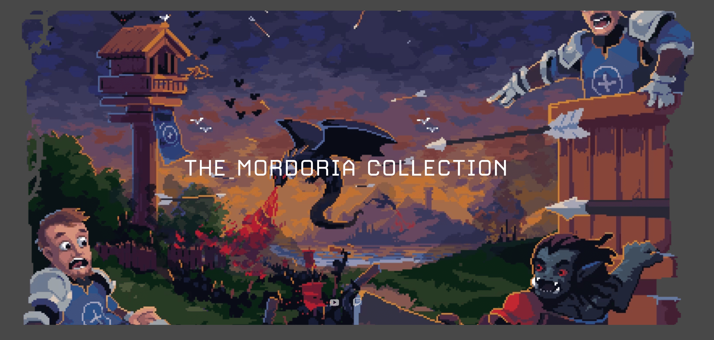

## 📖好文章
* 📄[分享并记录日常开发中的一些CSS布局和样式技巧（持续更新）](https://juejin.cn/post/7559073802824581161)
* 📄[New and Successful Experiment of webOS with Flutter for Better Performance and Playful Experience](https://webostv.developer.lge.com/news/2024-07-15-new-and-successful-experiment-of-webos-with-flutter?utm_source=chatgpt.com)
* 📄[Claude Code + Holopix AI | 轻松复刻 "虚假广告"-🧟‍♀️射击小游戏](https://juejin.cn/post/7554117742929166355)

## 🎈优秀开源

**fingerprintjs**

https://github.com/fingerprintjs/fingerprintjs

FingerprintJS is a source-available, client-side, browser fingerprinting library that queries browser attributes and computes a hashed visitor identifier from them. Unlike cookies and local storage, a fingerprint stays the same in incognito/private mode and even when browser data is purged.

**zo_animated_border**

https://pub.dev/packages/zo_animated_border

Zo Animated Border is a powerful Flutter package that brings modern UI to life with beautifully animated borders. Whether you're building a login screen, a button, or a decorative container, this package lets you wrap any widget with stylish, animated border effects.

## 🔨好工具

**echarts**

https://echarts.apache.org/zh/tutorial.html#5%20%E5%88%86%E9%92%9F%E4%B8%8A%E6%89%8B%20ECharts

前端图表库ECharts

**cherry-studio**

https://github.com/CherryHQ/cherry-studio

Cherry Studio 是一款支持多个大语言模型（LLM）服务商的桌面客户端，兼容 Windows、Mac 和 Linux 系统。

**mogua**

https://mogua.co/

摸瓜自动化APK线索分析平台

## 📚好资源

**flash-attention**

https://github.com/Dao-AILab/flash-attention

This repository provides the official implementation of FlashAttention and FlashAttention-2 from the following papers.

**quant-wiki**

https://github.com/LLMQuant/quant-wiki

Quant Wiki 致力于打造一个免费开放、持续更新的 量化金融（quantitative finance） 知识分享平台。

## 🎮好玩的

**mapgenie**

https://mapgenie.io/

收录了各种游戏地图,像是黑神话悟空的地图也是有的。

**paragraphica**

https://bjoernkarmann.dk/project/paragraphica

Paragraphica is a context-to-image camera that uses location data and artificial intelligence to visualize a "photo" of a specific place and moment. The camera exists both as a physical prototype and a virtual camera that you can try. 

**unnamed_game_1_v2**

https://github.com/Mordoria/unnamed_game_1_v2

https://theprimeagen-shop.fourthwall.com/

This is the state of the game (after one small bug fix) at the end of the 24x7 tower stream. 

一款开源塔防游戏，作者目前还在开发中孵化中。