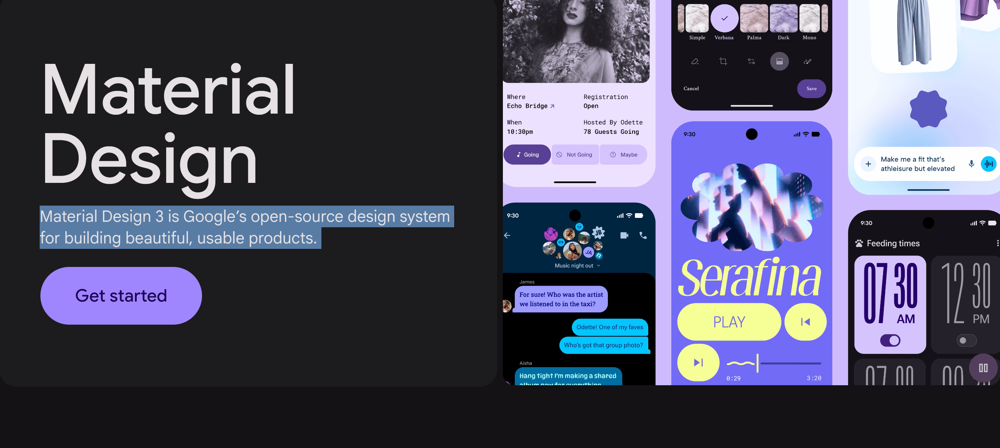
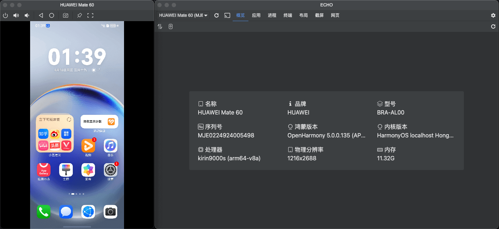
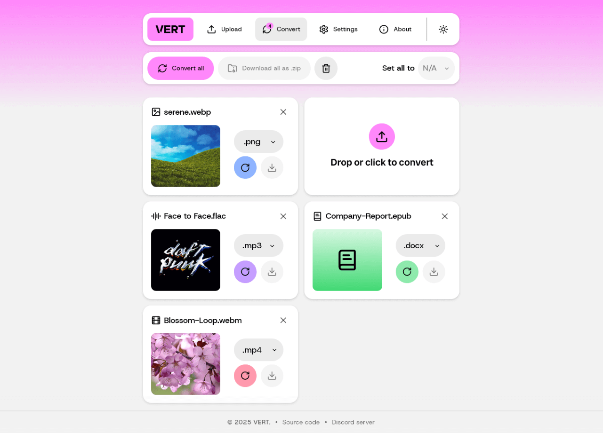
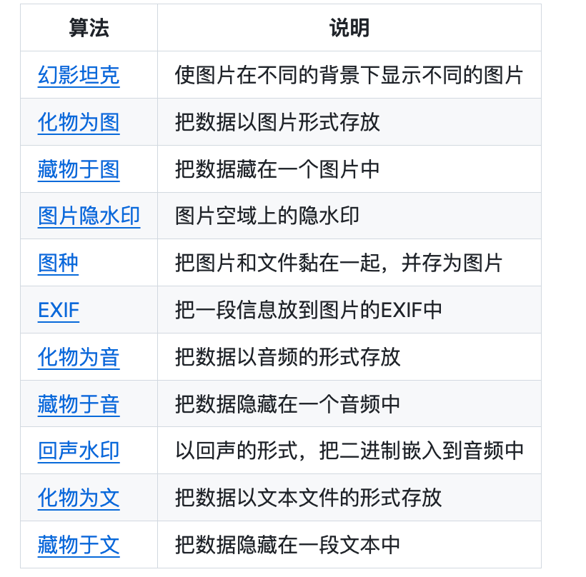

## 📖好文章

* 📄[glance：Flutter移动端(Android/iOS)线上卡顿检测库](https://juejin.cn/post/7434899217804902427)
* 📄[豆包编程能力升级，新增参考图、画板等多元化输入](https://juejin.cn/post/7563466036382810150)
* 📄[Android爬坑之旅：软键盘挡住输入框问题的终极解决方案](https://juejin.cn/post/6844903519082774535)

## 📚好资源

**开源大模型食用指南**

https://github.com/datawhalechina/self-llm

本项目是一个围绕开源大模型、针对国内初学者、基于 Linux 平台的中国宝宝专属大模型教程，针对各类开源大模型提供包括环境配置、本地部署、高效微调等技能在内的全流程指导，简化开源大模型的部署、使用和应用流程，让更多的普通学生、研究者更好地使用开源大模型，帮助开源、自由的大模型更快融入到普通学习者的生活中。

**skills**

https://github.com/anthropics/skills

Skills are folders of instructions, scripts, and resources that Claude loads dynamically to improve performance on specialized tasks. Skills teach Claude how to complete specific tasks in a repeatable way, whether that's creating documents with your company's brand guidelines, analyzing data using your organization's specific workflows, or automating personal tasks.

**javaguide**

https://javaguide.cn/

JavaGuide 已经持续维护 6 年多了，累计提交了接近 6000 commit ，共有 570+ 多位贡献者共同参与维护和完善。真心希望能够把这个项目做好，真正能够帮助到有需要的朋友！

**m3.material**

https://m3.material.io/

Material Design 3 is Google’s open-source design system for building beautiful, usable products.

## 🔨好工具

**mihon**

https://github.com/mihonapp/mihon

**echo**

https://github.com/liriliri/echo

鸿蒙 HDC 桌面应用。

**VERT**

https://github.com/VERT-sh/VERT

VERT is a file conversion utility that uses WebAssembly to convert files on your device instead of a cloud. Check out the live instance at vert.sh.

**blind_watermark**

https://github.com/guofei9987/blind_watermark

基于频域的数字盲水印

**HideInfo**

https://github.com/guofei9987/HideInfo

一些小而美的信息隐藏方法

