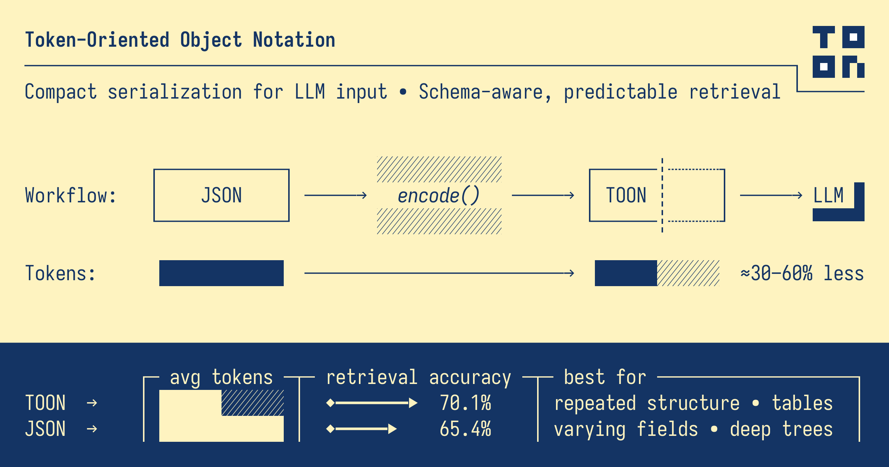
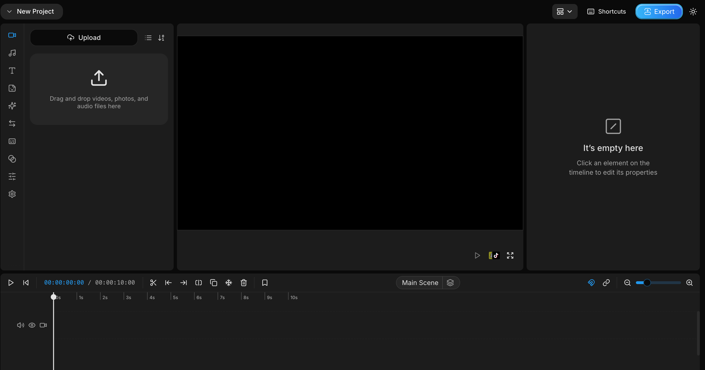
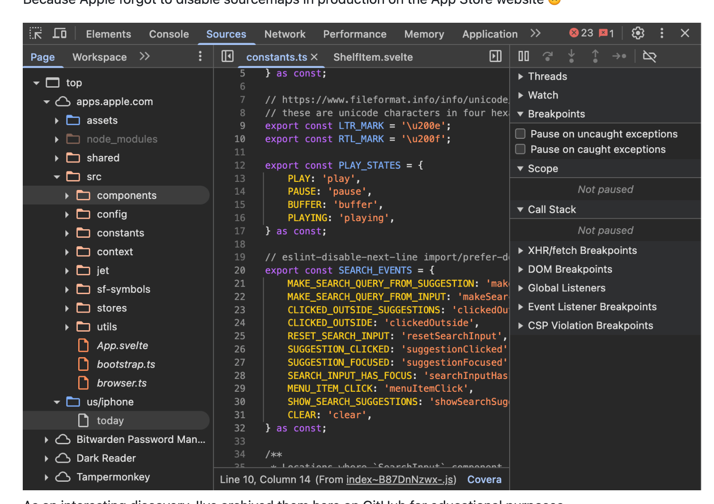
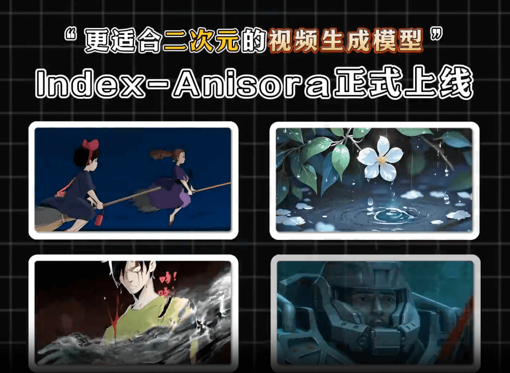

## 📖好文章

* 📄[🚫 停止在 Flutter 中使用 MediaQuery 实现响应式设计](https://juejin.cn/post/7494549596258992178)
* 📄[为什么游戏公司现在都喜欢用protobuf?](https://juejin.cn/post/7566103962497794086)
* 📄[「快递包裹」视角详解OSI七层模型](https://juejin.cn/post/7537701400458117170)
* 📄[Figma Dev Mode MCP：大人，时代变了](https://juejin.cn/post/7521001739609505801)
* 📄[Google 开发者节演讲稿《见证 Web 进化：Chrome 内置 AI》](https://juejin.cn/post/7445566634469998632)
* 📄[Flutter 里的 Layer 解析，带你了解不一样角度下的 Flutter 渲染逻辑](https://juejin.cn/post/7532332561072603179)

## 🔨好工具

**toon-format/toon**  

https://github.com/toon-format/toon

Token-Oriented Object Notation is a compact, human-readable serialization format designed for passing structured data to Large Language Models with significantly reduced token usage. It's intended for LLM input as a lossless, drop-in representation of JSON data.

**OpenCut-app/OpenCut**  

https://github.com/OpenCut-app/OpenCut
https://opencut.app/

A free, open-source video editor for web, desktop, and mobile.

 

**wysaid/magicka-intellij**  

https://github.com/wysaid/magicka-intellij

✨ Shader Code Generation Tool for Visual Effects Developers

Magicka Creator 是一款为 JetBrains 系列 IDE 开发的插件,旨在简化 Shader 开发工作流。通过集成 Magicka CLI 工具,提供自动化的 Shader 模板生成功能,支持多种文件格式,帮助开发者快速完成 Shader 配置到代码的转换。

**666ghj/BettaFish**  

https://github.com/666ghj/BettaFish

微舆：人人可用的多Agent舆情分析助手，打破信息茧房，还原舆情原貌，预测未来走向，辅助决策！从0实现，不依赖任何框架。

## 📚好资源

**rxliuli/apps.apple.com**  
https://github.com/rxliuli/apps.apple.com

Apple App Store frontend source code archive
Because Apple forgot to disable sourcemaps in production on the App Store website 🙃

**Keiyoushi**  

https://keiyoushi.github.io/

Extension repository for Mihon and variants.

## 🎈优秀开源

**bilibili/Index-anisora**  

https://github.com/bilibili/Index-anisora

本项目是哔哩哔哩献给二次元世界的礼物——Index‑AniSora，目前最强大的开源动漫视频生成模型。
它支持一键生成多种动漫风格的视频镜头，包括番剧片段、国创动画、漫画改编、VTuber 内容、动画 PV、鬼畜（MAD）等！
该项目基于我们已被 IJCAI ’25 录用的论文
AniSora: Exploring the Frontiers of Animation Video Generation in the Sora Era

**topjohnwu/libsu**  

https://github.com/topjohnwu/libsu

An Android library providing a complete solution for apps using root permissions.

libsu comes with 2 main components: the core module handles the creation of the Unix (root) shell process and wraps it with high level, robust Java APIs; the service module handles the launching, binding, and management of root services over IPC, allowing you to run Java/Kotlin and C/C++ code (via JNI) with root permissions.

