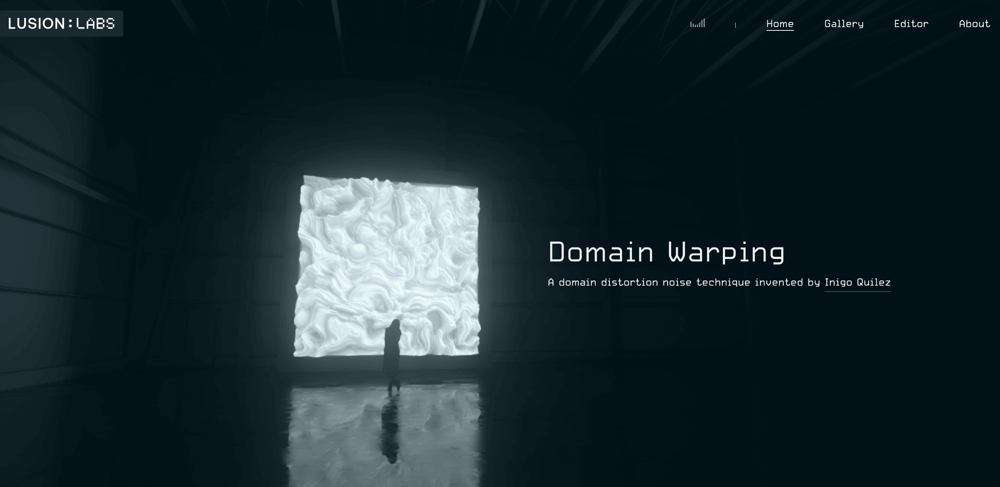
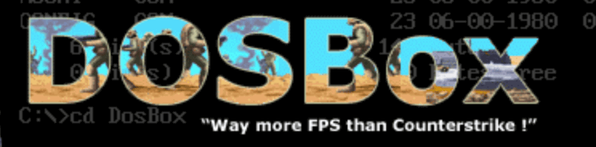
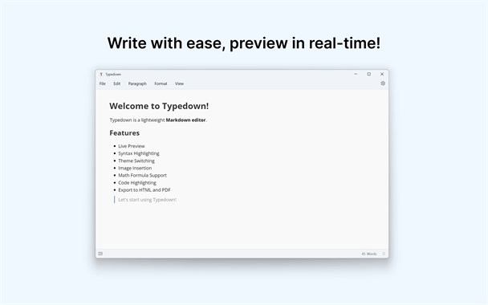
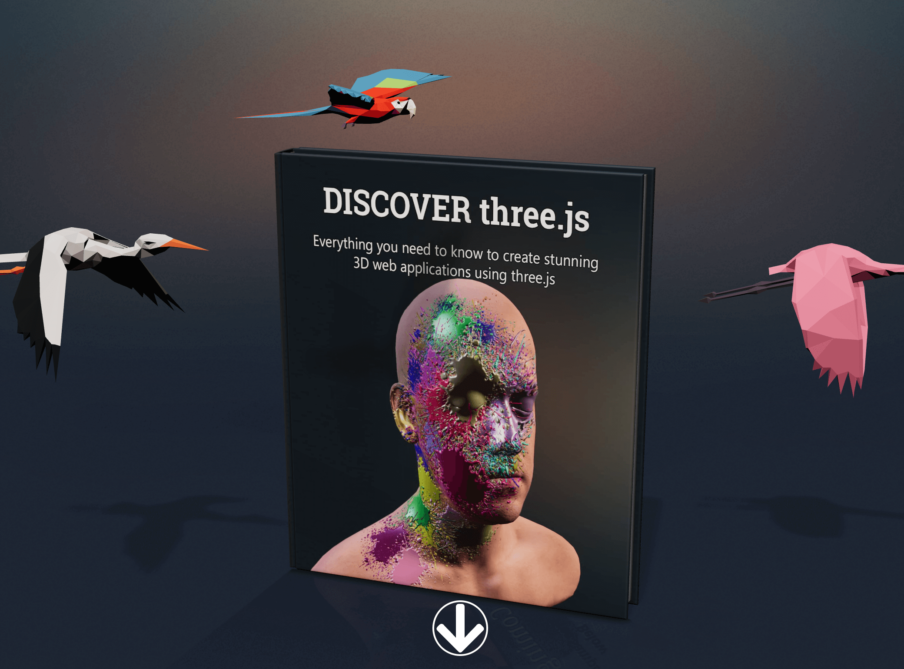
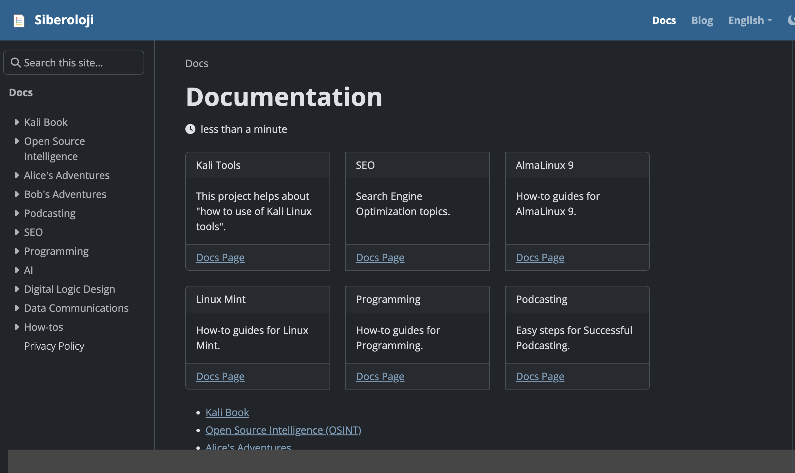
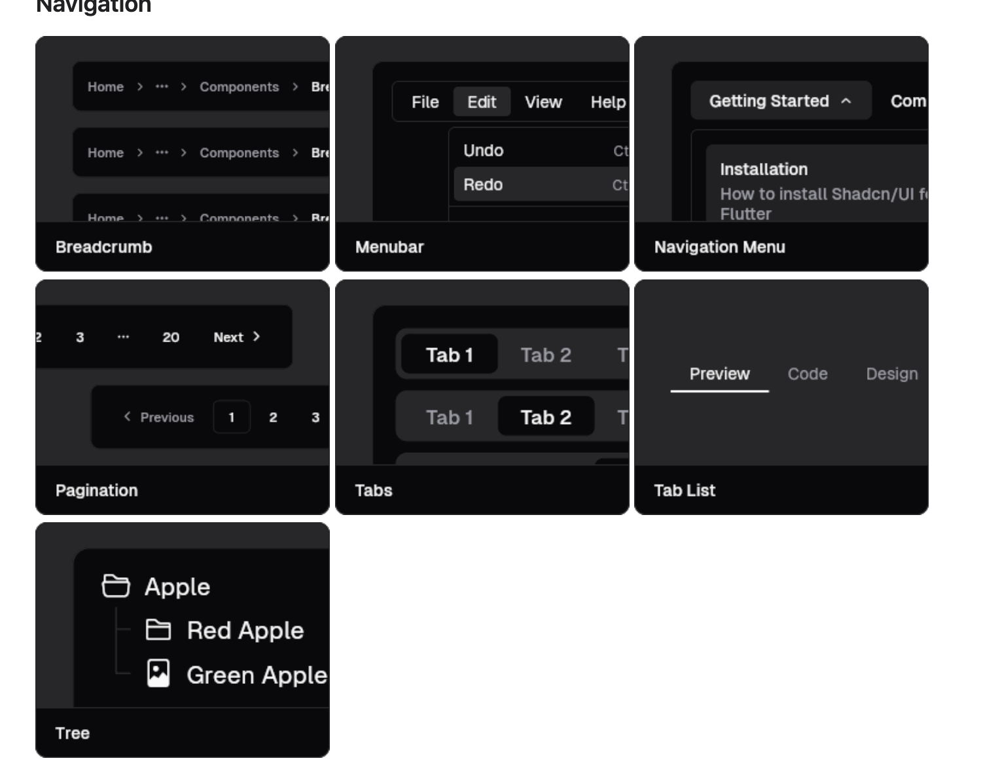
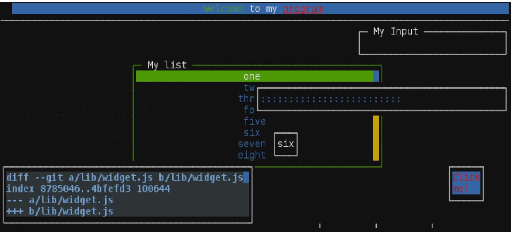

## 📖好文章
* 📄[快速掌握MCP精髓，让AI为我们提效](https://aicoding.juejin.cn/post/7568192652287246390)
* 📄[设计师必逛！44 个找灵感网站推荐：UX、网页设计、国外网站等资源 | Eagle 博客](https://cn.eagle.cool/blog/post/best-websites-designers-love-for-finding-design-inspirations)
* 📄[如何在 Mac 上编辑无损音乐的标签 - 少数派](https://sspai.com/post/40753)
* 📄[How to Use DOSBox for Beginners](https://www.instructables.com/How-to-use-DOSBox-for-Beginners/)

## 🎮好玩的

**The Greatest .GIFs Of ALL TIME**  

https://greatestgifsofalltime.tumblr.com/

**CineShader**  

https://cineshader.com/

CineShader is a real-time 3D shader visualiser. It leverages the Shadertoy.com API to bring thousands of existing shader artworks into a cinematic 3D environment.

**DOSGames**  

https://www.dosgames.com/

Free DOS game downloads - Over 2,000 games!

**DOSBox** 

https://www.dosbox.com/

an x86 emulator with DOS

## 🔨好工具

**GitHub - skylot/jadx**  
https://github.com/skylot/jadx

Dex to Java decompiler

**GitHub - sansan0/TrendRadar**  

https://github.com/sansan0/TrendRadar

最快30秒部署的热点助手 —— 告别无效刷屏，只看真正关心的新闻资讯

**tmux**  

https://github.com/tmux/tmux/wiki

tmux is a terminal multiplexer. It lets you switch easily between several programs in one terminal, detach them (they keep running in the background) and reattach them to a different terminal.

**xfqwdsj/IAmNotADeveloper**  

https://github.com/xfqwdsj/IAmNotADeveloper

一个用于隐藏Android系统开发者相关选项状态的模块。

**byxiaozhi/Typedown**  

https://github.com/byxiaozhi/Typedown

Typedown is a lightweight Markdown editor designed specifically for the Windows platform. With the WinUI framework, it provides users with a seamless interface and efficient editing experience that perfectly matches the operating system. Whether you're writing technical documents, academic papers, or blog posts, Typedown is your go-to assistant!

## 📚好资源

**iPhone 所有机型参数大全**  

http://kylebing.cn/tools/iphone/

iPhone 参数大全

**Discover three.js**  

https://discoverthreejs.com/zh/

《探索three.js》是对web作为3D图形平台的完整介绍，它使用three.js WebGL库，编写自一位核心 three.js 开发人员。

**Siberoloji**  

https://www.siberoloji.com/

Welcome to Siberoloji: A Cyber Knowledge Project!

**shadcn_flutter**  

https://sunarya-thito.github.io/shadcn_flutter/

A cohesive shadcn/ui ecosystem for Flutter—components, theming, and tooling—ready to ditch Material and Cupertino

## 🎈优秀开源

**GitHub - Snapchat/Valdi**  

https://github.com/Snapchat/Valdi

Valdi is a cross-platform UI framework that delivers native performance without sacrificing developer velocity. Write your UI once in declarative TypeScript, and it compiles directly to native views on iOS, Android, and macOS—no web views, no JavaScript bridges.

**chjj/blessed**  

https://github.com/chjj/blessed

A curses-like library with a high level terminal interface API for node.js.

