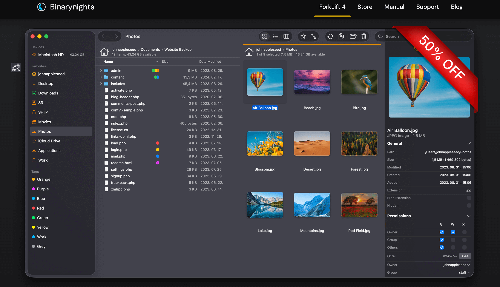
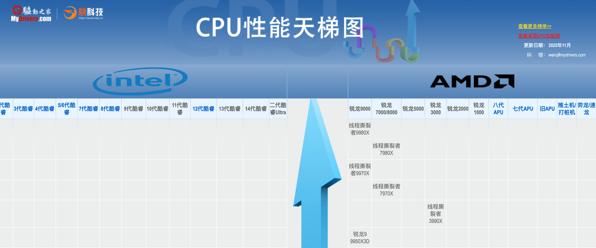

## 📖好文章
* 📄[Petrel(雨燕) 新一代 Flutter Web 热更新框架](https://juejin.cn/post/7541801054180261914)
* 📄[Coze+ComfyUI 实战：视频制作成本降10 倍](https://juejin.cn/post/7539938717806575662)

## 🎮好玩的

**Sweezy Cursors**  

https://sweezy-cursors.com/

一个免费的鼠标光标库网站

## 🔨好工具

**ForkLift 4**  

https://binarynights.com/

The most advanced dual pane file manager and file transfer client for macOS.

The most advanced dual pane file manager and file transfer client for macOS.

**Craft — Docs and Notes Editor**  

https://www.craft.do/

**表答**  

https://biaoda.me/home

将任何数据源、内容或文件转化为结构化电子表格。即刻完成分析、可视化及深度报告

**antigravity.google**

https://antigravity.google/

谷歌出品AI编辑工具

由于区域问题登录问题非常多使用门槛有点多。博主遇到的异常情况：网络问题；账号区域问题；墙的正确使用；通过不懈努力后一个个解决后终于上岸。

**CPU性能天梯图**  

https://www.mydrivers.com/zhuanti/tianti/cpu/index.html

## 📚好资源

**miiot/micam**  

https://github.com/miiot/micam

🎦 Micam 是一个专为小米摄像头设计的 RTSP 桥接服务，能够将小米摄像头的视频流本地转推为 RTSP 格式，支持接入 HomeAssistant、Go2rtc、Frigate、Scrypted、Homekit 等多种 NVR 和智能家居系统。该项目采用 Docker Compose 快速部署方案，集成了 Miloco（小米摄像头管理工具）和 Go2rtc（RTSP 流转发服务），无需 GPU 即可运行，使小米摄像头能与各类主流智能家居平台无缝集成。

**ZJ595/AndroidReverse**  
https://github.com/ZJ595/AndroidReverse

教学资源：《安卓逆向这档事》

**bobeff/open-source-games**  

https://github.com/bobeff/open-source-games

A list of open source games.

## 🎈优秀开源

**comfyanonymous/ComfyUI**  

https://github.com/comfyanonymous/ComfyUI

The most powerful and modular diffusion model GUI, api and backend with a graph/nodes interface.

**wysaid/CameraCapture**  

https://github.com/wysaid/CameraCapture

高性能、轻量级的跨平台相机捕获库，支持硬件加速的像素格式转换，提供完整的 C++ 和纯 C 语言接口。

**mrjoechen/ShowcaseApp**  

https://github.com/mrjoechen/ShowcaseApp

ShowcaseApp is an elegant application designed to transform your devices into beautiful digital photo frames.

