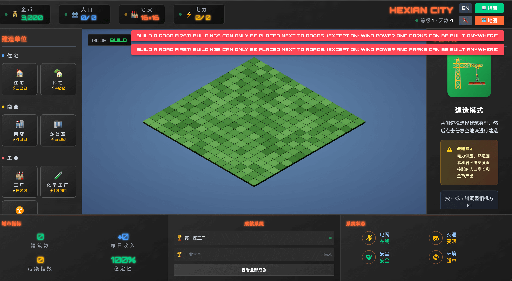

## 📖好文章
* 📄[有赞AI研发全流程落地实践](https://mp.weixin.qq.com/s/D_pgKthF9IIxOLPLHKAHyw)
* 📄[FART 脱壳某大厂 App + CodeItem 修复 dex + 反编译还原源码](https://juejin.cn/post/7512657737726722083)

* 📄[密码学系列之:1Password的加密基础PBKDF2](https://juejin.cn/post/7012801713702699021)

* 📄[SEO还没死，GEO之战已经开始](https://juejin.cn/post/7547051639740743721)

* 📄[「幽灵调用」背后的真相：一个隐藏多年的Android原生Bug](https://juejin.cn/post/7551037830702514219)

* 📄[推荐 10 个受欢迎的 OCR 开源项目](https://juejin.cn/post/7483409820243689511)

* 📄[撸一个小程序运行容器](https://juejin.cn/post/7505357994621124646)

* 📄[Android系统BUG：修改线程名目标错乱](https://juejin.cn/post/7573549302620258347)

## 🎮好玩的

**hexianWeb/CubeCity**  

https://github.com/hexianWeb/CubeCity

2.5D 卡通城市放置系统 (CubeCity)

## 🔨好工具

**LizardByte/Sunshine**  
https://github.com/LizardByte/Sunshine

Sunshine is a self-hosted game stream host for Moonlight. Offering low-latency, cloud gaming server capabilities with support for AMD, Intel, and Nvidia GPUs for hardware encoding. Software encoding is also available. You can connect to Sunshine from any Moonlight client on a variety of devices. A web UI is provided to allow configuration, and client pairing, from your favorite web browser. Pair from the local server or any mobile device.

**x-ege/ege-clion-plugin**  

https://github.com/x-ege/ege-clion-plugin

一个用于 JetBrains CLion 的 EGE C++ 图形库项目向导插件，帮助你快速创建和配置 EGE 图形程序项目。

**Moonlight Game Streaming: Play Your PC Games Remotely**  

https://moonlight-stream.org/

Moonlight allows you to play your PC games on almost any device, whether you're in another room or miles away from your gaming rig.

## 📚好资源

**MinTate/Mleaf**  

https://github.com/MinTate/Mleaf

一款基于图像识别的技术，通过植物叶片图像辨识植物种类的android App，包含客户端、服务器源码和数据库文件。

**JimmyLv/awesome-nano-banana**  

https://github.com/JimmyLv/awesome-nano-banana

This is a curated collection of Gemini-2.5-Flash-Image (also known as Nano Banana) generated images and prompts. Leveraging Google's cutting-edge image generation model, it comprehensively showcases Gemini's advanced capabilities in AI image generation and editing, while continuously exploring new possibilities for creative expression.

## 🎈优秀开源

**kane50613/takumi**  

https://github.com/kane50613/takumi

Takumi is an image rendering engine written in Rust. The design is mainly inspired by satori, but with a focus on portability and performance (2-10x compared to next/og in Image Bench).

**napi-rs/napi-rs**  

https://github.com/napi-rs/napi-rs

Seamless WebAssembly integration, safer API designs with lifetime management, and simplified cross-compilation for broader platform support.

**jiqiu2022/Zygisk-MyInjector**  
https://github.com/jiqiu2022/Zygisk-MyInjector

一个自定义注入so的脚手架,现在已经支持了界面化使用。

