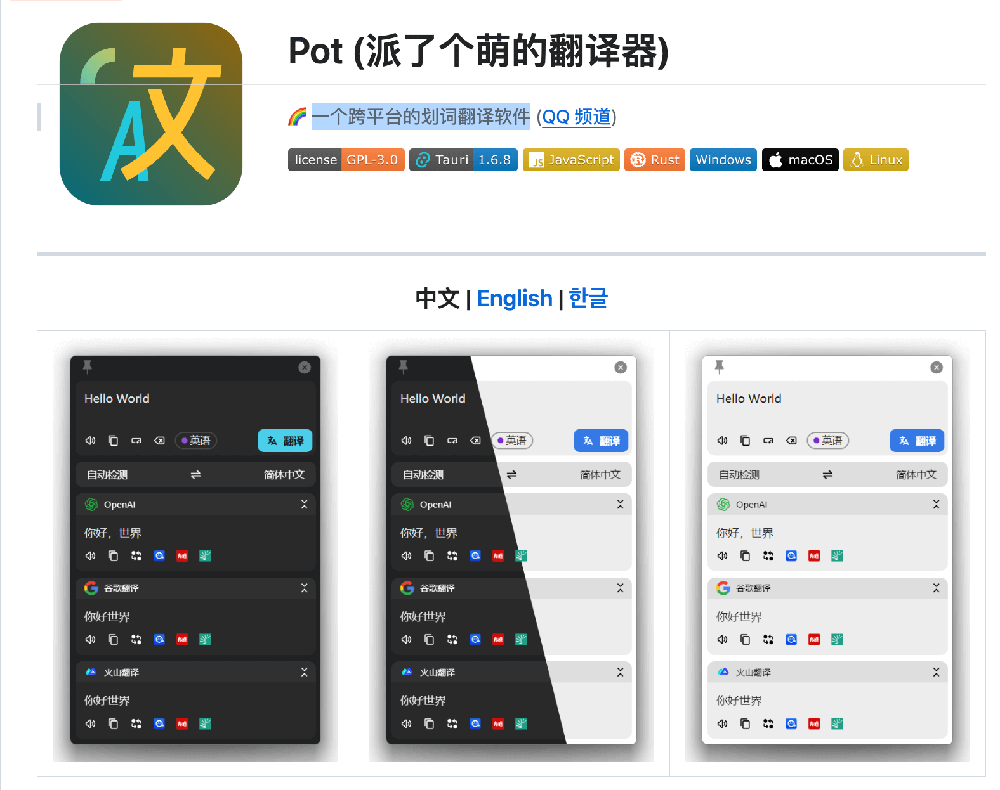
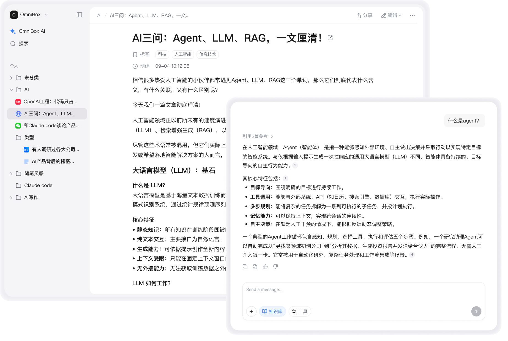

## 📖好文章

* 📄[2025年Android六边形战士开发趋势，需要掌握哪些技能可自我反省](https://juejin.cn/post/7475575836705898533)
* 📄[Android15适配16k](https://juejin.cn/post/7545289104378232873)

## 🎮好玩的

**Flashback - Vintage Camera Simulator**  

https://flashbackcamera.vercel.app/

网页版本拍立得

## 🔨好工具

**KaijuEngine/kaiju**

https://github.com/KaijuEngine/kaiju

Kaiju is a 2D/3D game engine written in Go (Golang) backed by Vulkan. The goal of the engine is to use a modern, easy, systems level programming language, with a focus on simplicity, to create a new kind of game engine.

**pot-app/pot-desktop**  

https://github.com/pot-app/pot-desktop

一个跨平台的划词翻译软件

**import-ai/omnibox**

https://github.com/import-ai/omnibox

小黑（OmniBox）是一个简单、跨平台 All in One 的 AI 知识中枢，收集、整理、应用、分享，一应俱全。

**kavishdevar/librepods**  

https://github.com/kavishdevar/librepods

LibrePods unlocks Apple's exclusive AirPods features on non-Apple devices. Get access to noise control modes, adaptive transparency, ear detection, hearing aid, customized transparency mode, battery status, and more - all the premium features you paid for but Apple locked to their ecosystem.

**hellodigua/code996**  

https://github.com/hellodigua/code996

code996 是一个分析工具，它可以统计 Git 项目的 commit 时间分布，进而推导出项目的编码工作强度。

## 📚好资源

**miantiao-me/astro-aria**  

https://github.com/miantiao-me/astro-aria

This is a personal blog, portfolio, or blog template created for Astro.

**Machine Learning Google for Developers**  
https://developers.google.com/machine-learning/intro-to-ml?hl=zh-cn

谷歌官方机器学习教程

**GAMES101-现代计算机图形学入门**

https://www.bilibili.com/video/BV1X7411F744/?spm_id_from=333.337.search-card.all.click&vd_source=8534fa07a32b32fd8a8418382f5f7c77

**Wechat-ggGitHub/Awesome-GitHub-Repo**  
https://github.com/Wechat-ggGitHub/Awesome-GitHub-Repo

Awesome GitHub Repo 会收集整理 GitHub 上高质量、有趣的开源项目，并将他们进行归类。值得注意的是，不是简单的按照编程语言来分类，而是按照更有趣的分类方式，比如：有趣项目、沙雕项目、实战项目、学习项目、实用工具等等。

**sarwarbeing-ai/Agentic_Design_Patterns**  

https://github.com/sarwarbeing-ai/Agentic_Design_Patterns

Agentic Design Patterns: A Hands-On Guide to Building Intelligent Systems by Antonio Gulli

## 🎈优秀开源

**zai-org/Open-AutoGLM**

https://github.com/zai-org/Open-AutoGLM

Phone Agent 是一个基于 AutoGLM 构建的手机端智能助理框架，它能够以多模态方式理解手机屏幕内容，并通过自动化操作帮助用户完成任务。系统通过 ADB（Android Debug Bridge）来控制设备，以视觉语言模型进行屏幕感知，再结合智能规划能力生成并执行操作流程。用户只需用自然语言描述需求，如“打开小红书搜索美食”，Phone Agent 即可自动解析意图、理解当前界面、规划下一步动作并完成整个流程。系统还内置敏感操作确认机制，并支持在登录或验证码场景下进行人工接管。同时，它提供远程 ADB 调试能力，可通过 WiFi 或网络连接设备，实现灵活的远程控制与开发。

**944095635/dm-music-flutter**  

https://github.com/944095635/dm-music-flutter

Flutter Music App

**rodydavis/signals.dart**  

https://github.com/rodydavis/signals.dart

Reactive programming made simple for Dart and Flutter

**google-research/timesfm**  

https://github.com/google-research/timesfm

TimesFM (Time Series Foundation Model) is a pretrained time-series foundation model developed by Google Research for time-series forecasting.

**Tencent/matrix**  

https://github.com/Tencent/matrix

Matrix 是一款微信研发并日常使用的应用性能接入框架，支持iOS, macOS和Android。 Matrix 通过接入各种性能监控方案，对性能监控项的异常数据进行采集和分析，输出相应的问题分析、定位与优化建议，从而帮助开发者开发出更高质量的应用。

