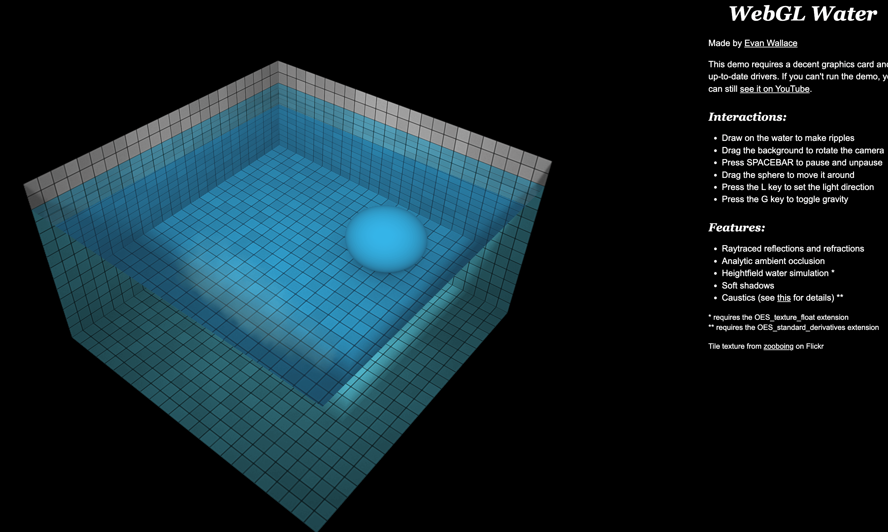
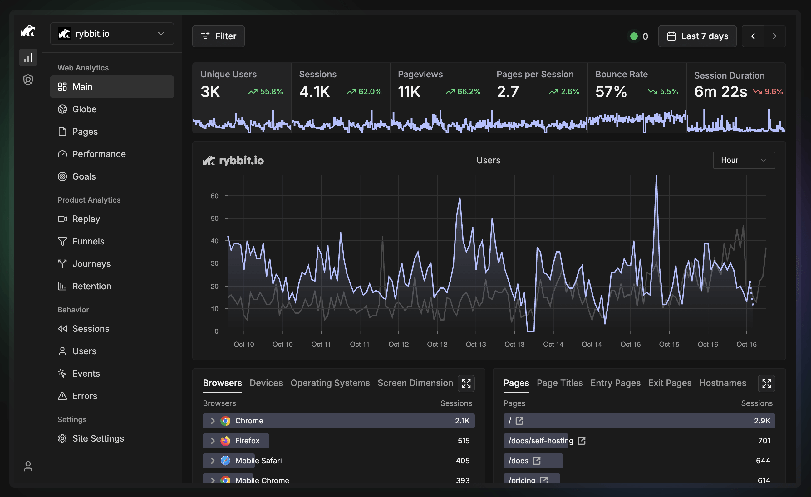
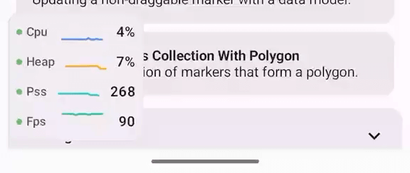
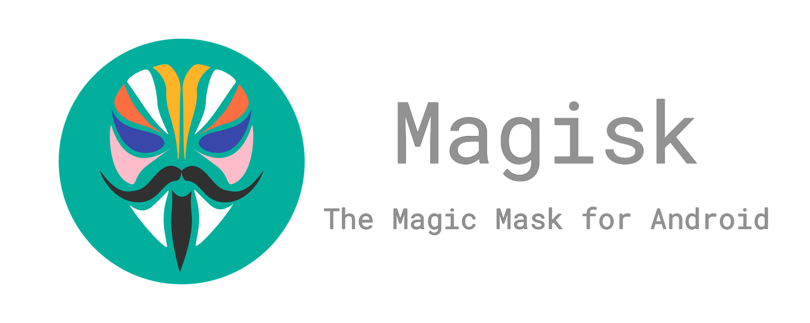
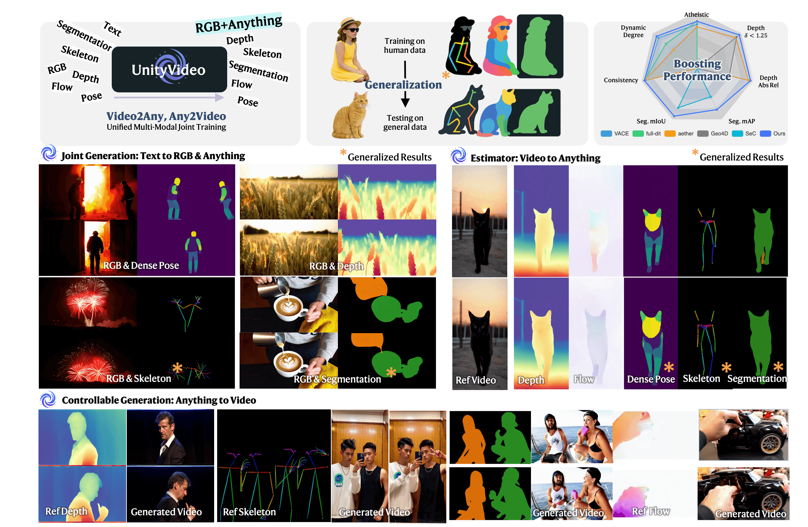

## 📖好文章
* 📄[SIGGRAPH Asia 2025 | 只用一部手机创建和渲染高质量3D数字人](https://mp.weixin.qq.com/s/cwGj-dUpJFJGSs-FXD6zew)
* 📄[Github spec-kit 的一次尝试(👎)和为什么 spce-kit 会失败](https://zhuanlan.zhihu.com/p/1983545671421302681)

* 📄[为啥现在 Android App 不用手动搞 MultiDex 了](https://juejin.cn/post/7559764319034982442)
* 📄[得物 Android Crash 治理实践](https://juejin.cn/post/7481104876887048243)
* 📄[让人头疼的AndroidStudio、Gradle、AGP傻傻分不清](https://juejin.cn/post/7570187256105287686)
* 📄[2025 复盘 | 🚀穿越AI焦虑周期，进化为 "AI全栈"🐶](https://juejin.cn/post/7581648776303755273)
* 📄[豆包手机为什么会被其他厂商抵制？它的工作原理是什么？](https://juejin.cn/post/7582469532326920228)

## 🎮好玩的

**WebGL Water**  

https://madebyevan.com/webgl-water/

This demo requires a decent graphics card and up-to-date drivers. If you can't run the demo, you can still see it on YouTube.

## 🔨好工具

**Drawnix**  

https://drawnix.com/

开源白板工具 | 思维导图 | 流程图 | 白板 | 协作白板

**PromptPilot**  

https://promptpilot.volcengine.com/

字节出品提示词优化工具：只要简单描述，即可生成可执行的高质量 Prompt。

**rybbit-io/rybbit**  

https://github.com/rybbit-io/rybbit

Rybbit is the modern open source and privacy friendly alternative to Google Analytics. It takes only a couple minutes to setup and is super intuitive to use.

**Manabu-GT/DebugOverlay-Android**

https://github.com/Manabu-GT/DebugOverlay-Android

DebugOverlay gives you always-on visibility into CPU, memory, FPS, logs, network, and UI hierarchy—right inside your app, no permissions required.

**solidSpoon/DashPlayer**  

https://github.com/solidSpoon/DashPlayer

一款专为英语学习打造的视频播放器

[No62_20251211100623.png](imgs/No62_20251211100623.png)

**ZuodaoTech/everyone-can-use-english**  
https://github.com/ZuodaoTech/everyone-can-use-english

英语学习开源工具:AI 是当今世界上最好的外语老师，Enjoy 做 AI 最好的助教

## 📚好资源

**miantiao-me/aigc-weekly**  

https://github.com/miantiao-me/aigc-weekly

一个由 Agentic AI Agent 驱动的 AIGC（人工智能生成内容）精选周刊。本项目利用最新的 AI 和 Serverless 技术，为您提供最新的资讯、工具和资源。

## 🎈优秀开源

**topjohnwu/Magisk**

https://github.com/topjohnwu/Magisk

Magisk is a suite of open source software for customizing Android, supporting devices higher than Android 6.0.(This is not an officially supported Google product)

Magisk是玩转Android最佳开源框架：搞机玩家必备软件。

**dvlab-research/UnityVideo**  

https://github.com/dvlab-research/UnityVideo

UnityVideo is a unified generalist framework for multi-task multi-modal video understanding that enables

